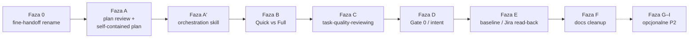

# Plan: port wybranych zmian z Copilot Collections (TSH) do Cursor Collections

**Research:** [copilot-upstream-porting.research.md](./copilot-upstream-porting.research.md)  
**Wdrożenie** po akceptacji tego planu (bramka `eversis-agent-core.mdc`).

**Upstream baseline:** `30251c6` (`main`, 2026-06-09) — bez nowych commitów na `main` (stan 2026-06-12). Istotna praca w **otwartych PR** #63, #66, #67, #68, #69, #50, #51.

---

## Task Details

| Field | Value |
| ----- | ----- |
| ID / folder | `copilot-upstream-porting` |
| Title | Selektywny port upstream TSH → Cursor (Implement, Ideate, docs) — bez 1:1 Copilot |
| Priority | Wysoka (fazy 0–B) · Średnia (C–E) · Niska / opcjonalna (F–I) |
| Scope | `.cursor/`, `website/docs/`, `documentation/`, `AGENTS.md`, `CHANGELOG.md`, MCP README (bez zmian API MCP) |

---

## Wildly Important Goal (WIG)

Ulepszyć jakość **Implement** i **Ideate** w Cursor Collections przez port sprawdzonych wzorców TSH, **bez regresji** kontraktów Cursor-only (Fine handoff, MCP skills, setup consumer, STRICT FORBIDDEN, BA Docs Word).

---

## Decyzje planowe (domyślne — override przed startem fazy)

| # | Pytanie (research) | Domyślna decyzja w planie |
| - | -------------------- | ------------------------- |
| 1 | Gate 0 obowiązkowy? | **Opcjonalny** — wymuszany gdy materiały niejednoznaczne; skip z adnotacją w `intent-brief.md` |
| 2 | Plan Review zawsze w Full? | **Tak w Full**; skip gdy istnieje `{task}.plan-review.md` z `APPROVED` i plan niezmieniony |
| 3 | Metryki TSH w `for-ctos.md` | **Poza scope** tego planu — osobna decyzja marketing |
| 4 | `eversis-role-*.mdc` vs docs | **Faza F:** naprawa linków w `website/docs/agents/*`; **nie** tworzyć pełnego zestawu role rules |
| 5 | Czekać na merge PR #63–#68? | **Nie czekać** — port pakietu z gałęzi PR TSH jako jedna faza A (+ A′); re-sync po merge do `main` TSH w osobnym PR jeśli diff |
| 6 | Faza 0 przed A? | **Tak** — rename `eversis-fine-handoff` w osobnym PR **przed** fazą A |

---

## Zasady portu (nie negocjowalne)

| Zasada | Szczegół |
| ------ | -------- |
| **Brak portu 1:1** | Mapowanie `tsh-*` → `eversis-*`; ścieżki `docs/specs/<kebab>/`; delegacja przez `@` prompty, nie `.github/agents` |
| **Nie degradować Cursor-only** | `eversis-fine-handoff`, MCP, `setup-cursor-local.sh`, BA Docs, STRICT FORBIDDEN, link validation |
| **Jeden PR = jedna faza** | Osobny merge request per faza; `npm run build` + `validate-cursor-links` w PR z docs |
| **Pakiet plan+orchestration** | Nie cherry-pickować pojedynczych plików z PR #63–#68 — port jako spójny zestaw |
| **Nie portować** | BA worker subagents, Copilot user settings, handoffs, osłabienie code review |

### Konwencje nazewnictwa (z research)

| Warstwa | Docelowe stemy |
| ------- | -------------- |
| Fine handoff | `eversis-fine-handoff` (treść outputu: nadal „QA comment”) |
| QA practice (opcjonalnie) | `eversis-qa-workflow`, `eversis-planning-tests`, … — **nie** zastępuje fine-handoff |
| Repo Docs (opcjonalnie) | `eversis-repo-docs-writer`, `eversis-writing-repo-documentation` |
| BA Docs Word | `eversis-ba-docs-*` — bez zmian |

---

## Przegląd faz



| Faza | Priorytet | Upstream źródło | Szacunek ryzyka |
| ---- | --------- | ----------------- | --------------- |
| **0** | P0 | Cursor-only rename | Niskie (breaking dla consumerów — migration note) |
| **A** | P0 | `main` + PR #63, #67, #68 | Średnie (duży diff promptów/plan template) |
| **A′** | P0 | PR #66 | Średnie (refaktor EM orchestracji) |
| **B** | P0 | PR #66 (Quick/Full) | Niskie (wchodzi w orchestration skill) |
| **C** | P1 | `main` task-quality-reviewing | Niskie (additive skill) |
| **D** | P1 | `main` + task-extracting | Średnie (nowa bramka BA) |
| **E** | P1 | analyze-materials kroki 13–14 | Niskie |
| **F** | P2 | docs + architect read-only + integration tests akapit | Niskie |
| **G** | P2 opcj. | PR #69 Repo Docs | Średnie |
| **H** | P2 opcj. | PR #50 QA skille (cherry-pick) | Średnie |
| **I** | P2 opcj. | PR #51 implementing-filters | Niskie — tylko na żądanie stacku |

---

## Current Implementation Analysis

### Cursor już ahead (utrzymać)

| Element | Ścieżka |
| ------- | ------- |
| Fine handoff (do rename) | `.cursor/skills/eversis-qa-comment/` → `eversis-fine-handoff/` |
| MCP skills | `mcp/eversis-collections-mcp/` |
| Setup consumer | `scripts/setup-cursor-local.sh` |
| BA Docs Word | `.cursor/skills/eversis-ba-docs-*` |
| DataGrid API (backend) | `.cursor/skills/eversis-implementing-backend/SKILL.md` § DataGrid |
| Code review STRICT FORBIDDEN | `.cursor/skills/eversis-code-reviewing/`, `eversis-code-reviewer.mdc` |

### Największe luki vs upstream

| Luka | Pliki docelowe |
| ---- | -------------- |
| Brak plan review | `.cursor/prompts/internal/eversis-review-plan.md`, workflow docs |
| Plan bez Technical Context | `eversis-plan.md`, `plan.example.md` |
| Orchestracja w prompcie zamiast skillu | `eversis-implement.md` (~115 linii), `eversis-engineering-manager.mdc` |
| Stub task-quality-reviewing | `.cursor/skills/eversis-task-quality-reviewing/SKILL.md` (~18 linii) |
| Brak Gate 0 | `eversis-analyze-materials.md`, `eversis-task-extracting` |

---

## Faza 0 — Rename `eversis-fine-handoff`

**Cel:** Rozdzielić semantycznie handoff po Fine od przyszłej praktyki QA (PR #50).

### Task 0.1 - [RENAME] Skill package

**Files:**

- `.cursor/skills/eversis-qa-comment/` → `.cursor/skills/eversis-fine-handoff/`
- `qa-comment.example.md` → `fine-handoff.example.md`
- Frontmatter `name: eversis-fine-handoff`
- W `SKILL.md`: pointer do przyszłego `@eversis-qa-workflow` (jedna linia)

**Definition of Done:**

- [ ] `eversis_skills_list` / `eversis_skills_get` zwraca `eversis-fine-handoff`
- [ ] Nagłówek draftu bez zmian: `Draft QA comment — review before posting to Jira`

### Task 0.2 - [MODIFY] Normatywne referencje

**Files (grep `eversis-qa-comment`, `qa-comment`):**

- `AGENTS.md`, `.cursor/rules/eversis-project-stack.mdc`
- `.cursor/prompts/public/eversis-implement.md` (krok 10)
- `.cursor/commands/eversis-implement.md` (jeśli istnieje)
- `documentation/cursor-collection.md`
- `website/docs/workflow/*.md`, `website/docs/skills/overview.md`
- `website/docs/skills/qa-comment.md` → `fine-handoff.md` (+ redirect w sidebar jeśli wymagany Docusaurus)
- `website/docs/integrations/eversis-collections.md`, `mcp/eversis-collections-mcp/README.md`
- `scripts/setup-cursor-local/templates/eversis-project-stack.example.mdc`
- `README.md`, `CHANGELOG.md` (wpis **breaking** + migration dla consumerów)

**Definition of Done:**

- [ ] `node scripts/validate-cursor-markdown-links.mjs --context=source` — pass
- [ ] `cd website && npm run build` — pass
- [ ] Brak pozostałych normatywnych odwołań do `eversis-qa-comment` (specs historyczne mogą wspomnieć rename)

**Ryzyko:** consumer repos z vendored rules — **mitigacja:** sekcja Migration w CHANGELOG.

**Stop Rule:** Nie rozpoczynać fazy A przed merge fazy 0 (uniknięcie podwójnej edycji `eversis-implement.md`).

---

## Faza A — Plan Review + self-contained plan

**Cel:** Plan validation przed kodem + plan jako SSOT dla implementora (Technical Context, WIG, Files per task).

**Źródło upstream:** `main` (`30251c6`) + gałęzie PR **#63**, **#67**, **#68** (jako jeden pakiet).

### Task A.1 - [CREATE] `eversis-review-plan`

**Files:**

- `.cursor/prompts/internal/eversis-review-plan.md` (z `tsh-review-plan.prompt.md`)
- `website/docs/agents/plan-reviewer.md`
- `website/docs/prompts/internal/review-plan.md` (via `sync-prompts` jeśli dotyczy)

**Adaptacje Cursor:**

- Prefiks skilli `eversis-*`
- Artefakt: `docs/specs/<issue-kebab>/<issue-kebab>.plan-review.md`
- Werdykt: `APPROVED` | `REVISIONS NEEDED`; max 3 iteracje z Architect

**Definition of Done:**

- [ ] Prompt ładowalny przez `@eversis-review-plan` lub ścieżkę internal
- [ ] Przykładowy szkielet `.plan-review.md` w `plan.example.md` lub osobnym `plan-review.example.md`

### Task A.2 - [CREATE] `eversis-creating-implementation-plans` (split z architecture-designing)

**Files:**

- `.cursor/skills/eversis-creating-implementation-plans/SKILL.md` (z PR #67)
- Aktualizacja `eversis-architecture-designing/SKILL.md` — usunąć duplikację planowania; cross-link
- `website/docs/skills/creating-implementation-plans.md`

**Definition of Done:**

- [ ] Architect ładuje ten skill przy tworzeniu planu (w `eversis-plan.md` / architect doc)

### Task A.3 - [MODIFY] Plan template + internal prompt plan

**Files:**

- `.cursor/prompts/internal/eversis-plan.md` — kroki persist Technical Context (upstream main + #63/#68)
- `.cursor/skills/eversis-architecture-designing/plan.example.md`:
  - Sekcja **Technical Context**
  - **Wildly Important Goal** (PR #68)
  - Per-task: `Files:`, `Clues`, `Stop Rule`, runnable command w DoD
  - *(Opcjonalnie z #63)* glossary/traps — tylko jeśli nie koliduje z lean shape #68; preferować **#68** jako SSOT

**Definition of Done:**

- [ ] Nowy plan z ticketu testowego zawiera wypełnialne sekcje Technical Context + WIG
- [ ] Każdy task ma `Files:` i co najmniej jeden runnable check w DoD

### Task A.4 - [MODIFY] `eversis-implement.md` — hook plan review (tymczasowy przed A′)

**Files:**

- `.cursor/prompts/public/eversis-implement.md` — po akceptacji planu przez human: delegacja `@eversis-review-plan` w Full flow
- Warunek skip: istniejący `.plan-review.md` + `APPROVED` + plan niezmieniony
- **Nie zmieniać** kroku Fine → `eversis-fine-handoff`

**Definition of Done:**

- [ ] `website/docs/workflow/standard-flow.md`, `frontend-flow.md` — krok plan validation
- [ ] `validate-cursor-links` + `npm run build`

**Ryzyko:** dłuższy czas przed kodem — mitigacja: skip + Quick flow w fazie B.

---

## Faza A′ — `eversis-orchestrating-implementation`

**Cel:** SSOT orchestracji EM; odchudzenie `eversis-implement.md`.

**Źródło:** PR **#66**.

### Task A′.1 - [CREATE] Orchestration skill

**Files:**

- `.cursor/skills/eversis-orchestrating-implementation/SKILL.md`
- `website/docs/skills/orchestrating-implementation.md`
- `website/docs/skills/overview.md` — nowy wiersz

**Zawartość (z upstream, adaptacja Cursor):**

- Todos per plan task
- Full vs Quick (tabela warunków; **hard exclude** Figma/UI → Full)
- Plan review loop (link do fazy A)
- UI verification gate (istniejący kontrakt Cursor)
- Routing tabela agentów (`@eversis-review`, implementers)
- **Krok końcowy:** Fine + `eversis-fine-handoff` (Cursor-only)

### Task A′.2 - [MODIFY] Odchudzenie triggerów

**Files:**

- `.cursor/prompts/public/eversis-implement.md` — trigger: load orchestration skill (MCP lub `@`)
- `.cursor/rules/eversis-engineering-manager.mdc` — skrócony pointer do skillu
- `.cursor/commands/eversis-implement.md` — jeśli istnieje

**Definition of Done:**

- [ ] `eversis-implement.md` < ~40 linii executable (WHO + attach skill + linki artefaktów)
- [ ] Manual smoke: jeden ticket Full flow i jeden Quick (po fazie B) na sucho w Agent — checklist w PR description
- [ ] Fine handoff nadal w tym samym turnie co Fine

**Ryzyko:** regresja kolejności kroków — **mitigacja:** diff checklist vs stary `eversis-implement.md` w PR.

---

## Faza B — Quick vs Full

**Cel:** Step 0 — wybór ścieżki dla małych fixów.

**Wejście:** w orchestration skill (Task A′.1) — **nie** duplikować w osobnym pliku.

### Task B.1 - [MODIFY] Quick flow w orchestration skill

**Zachowanie Quick (po potwierdzeniu usera):**

- Pomija pełny research/plan/plan-review **gdy** kryteria spełnione
- Implement → quality checks → `@eversis-review`
- **Wykluczenia:** Figma/UI tasks, nowe moduły, zmiany architektury → wymusz Full

**Definition of Done:**

- [x] Tabela kryteriów Quick vs Full w skillu
- [x] `website/docs/workflow/overview.md` — wzmianka Quick vs Full
- [x] EM pyta w czacie przed wyborem Quick
- [x] `standard-flow.md` — Quick vs Full + przykład Quick
- [x] `frontend-flow.md` — Full wymuszony dla Figma/UI

**Status:** ✅ Zaimplementowano (commit po A′).

---

## Faza C — `eversis-task-quality-reviewing` (pełny skill)

**Cel:** Zamknąć regres Ideate — prompt `eversis-analyze-materials` ma pełne wsparcie skillu.

### Task C.1 - [MODIFY] Skill + przykłady

**Files:**

- `.cursor/skills/eversis-task-quality-reviewing/SKILL.md` (port z upstream ~344 linii)
- `quality-review.example.md` w folderze skillu
- `.cursor/prompts/public/eversis-analyze-materials.md` — sync kroków Gate 1.5
- `website/docs/skills/task-quality-reviewing.md`

**Definition of Done:**

- [x] Gate 1.5 produkuje `quality-review.md` zgodny z przykładem
- [x] Lite/Full mode opisane w skillu

**Status:** ✅ Zaimplementowano.

---

## Faza D — Gate 0 + intent brief

### Task D.1 - [MODIFY] Task extracting + analyze-materials

**Files:**

- `.cursor/skills/eversis-task-extracting/SKILL.md` — source traceability, scenario AC (brakujące ~32 linie)
- `.cursor/prompts/public/eversis-analyze-materials.md` — Gate 0, artefakt `intent-brief.md`
- `website/docs/workflow/workshop-flow.md`, `website/docs/agents/business-analyst.md`

**Definition of Done:**

- [ ] Gate 0 opisany jako opcjonalny z warunkami skip
- [ ] Ścieżka artefaktu: `docs/specs/<workshop>/intent-brief.md`

### Task D.2 - [OPTIONAL] `eversis-explore-materials`

**Warunek startu:** explicit human approval — **poza domyślnym scope** planu.

**Files:** `.cursor/prompts/public/eversis-explore-materials.md`, docs page.

---

## Faza E — Task baseline + post-push verification

### Task E.1 - [MODIFY] Jira cycle

**Files:**

- `.cursor/skills/eversis-jira-task-formatting/SKILL.md`
- `.cursor/prompts/public/eversis-analyze-materials.md` — kroki read-back Jira, baseline refresh
- Konwencja: `docs/context/<project>/task-baseline.md` (nie `specifications/`)

**Definition of Done:**

- [ ] Dokumentacja opisuje baseline path i kiedy odświeżać
- [ ] Spójność z Protected Status w jira-task-formatting docs

---

## Faza F — Docs cleanup + drobne P2

### Task F.1 - [MODIFY] Architect read-only

**Files:** `eversis-architecture-designing/SKILL.md` lub `website/docs/agents/architect.md` — terminal read-only (no build/test przez Architect).

### Task F.2 - [MODIFY] Integration tests akapit

**Files:** `eversis-code-reviewing/SKILL.md` — cherry-pick nacisku na integration tests **bez** usuwania STRICT FORBIDDEN.

### Task F.3 - [MODIFY] Agents docs drift

**Files:** `website/docs/agents/*.md` — naprawa linków do rules; dodanie plan-reviewer; **nie** tworzyć `eversis-role-*.mdc` bez osobnej decyzji.

### Task F.4 - [MODIFY] Installation README adaptacja

**Files:** `website/docs/getting-started/installation.md` — „Ask Cursor Agent to run `setup-cursor-local.sh`” zamiast Copilot self-config.

**Definition of Done (faza F):**

- [ ] `validate-cursor-links` + `npm run build`

---

## Faza G — Repo Docs writer (opcjonalna, PR #69)

**Start:** tylko po explicit approval + zakończeniu F.

| Task | Deliverable |
| ---- | ----------- |
| G.1 | `.cursor/skills/eversis-writing-repo-documentation/SKILL.md` |
| G.2 | `.cursor/prompts/public/eversis-repo-docs-writer.md` |
| G.3 | `website/docs/workflow/` — rozdział Repo Docs (oddzielny od BA Docs Word) |
| G.4 | Cross-link wykluczeń: Repo writer ≠ `.docx` / BA Docs |

---

## Faza H — QA skille cherry-pick (opcjonalna, PR #50)

**Start:** po fazie 0 (fine-handoff); **nie** scalać z fine-handoff.

| Priorytet portu | Upstream → Cursor |
| --------------- | ----------------- |
| 1 | `tsh-qa-workflow` → `eversis-qa-workflow` (public prompt lub skill entry) |
| 2 | `tsh-verifying-acceptance-criteria` → `eversis-verifying-acceptance-criteria` |
| 3 | `tsh-analyzing-bugs` / functional-testing templates |
| 4 | `tsh-analyzing-regression-risk`, `tsh-accessibility-auditing` |
| 5 | Jira admin skille — jeśli zespół używa Atlassian MCP intensywnie |

**Nie portować 1:1:** cały agent QA z E2E — Cursor ma `eversis-e2e-engineer` + `eversis-e2e-testing`.

---

## Faza I — `eversis-implementing-filters` (opcjonalna, PR #51)

**Warunek:** consumer stack z DataGrid + shareable URL (React/Next).

| Task | Deliverable |
| ---- | ----------- |
| I.1 | `.cursor/skills/eversis-implementing-filters/SKILL.md` + `references/*.md` |
| I.2 | Cross-link w `eversis-implementing-backend` i `eversis-implementing-frontend` |
| I.3 | `website/docs/skills/implementing-filters.md` |

---

## Ryzyka globalne i mitigacje

| Ryzyko | Faza | Mitigacja |
| ------ | ---- | --------- |
| Regresja Fine handoff | 0, A′ | Osobny PR 0; test smoke Fine w A′ |
| Podwójna analiza codebase | A, A′ | Technical Context + conditional skip w orchestration |
| Zbyt długi Plan Review | A, B | Skip approved review; Quick flow |
| Drift docs vs `.cursor/` | wszystkie | Ten sam PR co prompty; checklist D1–D15; `sync-prompts` |
| Consumer breaking rename | 0 | CHANGELOG migration note |
| Upstream PR się zmieni | A | Po merge TSH — diff i follow-up PR |
| Scope creep (port całego upstream) | wszystkie | Fazy G–I opcjonalne; brak `.github/agents` |

---

## Documentation completeness (obowiązkowe per PR)

Każdy PR portu (fazy 0–I) **musi** zaktualizować dokumentację w **tym samym merge request** co zmiany `.cursor/`. Nie zostawiać „docs follow-up”.

### Dwie warstwy (nie mylić)

| Warstwa | Ścieżki | Rola |
| ------- | ------- | ---- |
| **Normatywna (SSOT dla Agent)** | `.cursor/skills/*/SKILL.md`, `.cursor/prompts/`, `.cursor/rules/`, `.cursor/commands/` | Procedura — MCP `eversis_skills_get`, `@` prompty |
| **Narracyjna (ludzie + onboarding)** | `website/docs/**` | *Kiedy*, *kto*, *powiązania* — **nie** pełna kopia `SKILL.md` |
| **Framework / adopcja** | `documentation/cursor-collection.md`, `AGENTS.md`, `README.md`, `CHANGELOG.md` | Maintainerzy, consumer repos |

Strona docs **nigdy** nie zastępuje `SKILL.md` w Agent — ale musi być **spójna** (nazwy, linki, fazy workflow).

### Checklist uniwersalny (każdy PR)

Odznacz w opisie PR (copy-paste sekcji). Pozycje **N/A** wymagają jednej linii uzasadnienia w PR.

| # | Obszar | Pliki / akcja | Wymagane gdy |
| - | ------ | ------------- | ------------ |
| D1 | **Nowy lub zmieniony skill** | `SKILL.md` + `website/docs/skills/<doc-id>.md` (CREATE lub MODIFY) | Dodano/znacząco zmieniono skill |
| D2 | **Katalog skilli** | `website/docs/skills/overview.md` — tabela + **Agent–Skill Matrix** + licznik skilli w nagłówku | Jakikolwiek skill dodany, usunięty, rename, zmiana „Used By” |
| D3 | **Connected skills** | W `SKILL.md` i na stronie skillu — cross-linki do powiązanych `eversis-*` | Nowy skill lub split (np. architecture ↔ creating-implementation-plans) |
| D4 | **Nowy lub zmieniony prompt** | `.cursor/prompts/` + strona w `website/docs/prompts/` (po `sync-prompts`) + `website/docs/prompts/overview.md` | Public/internal prompt nowy lub zmienia flow |
| D5 | **Agent docs** | `website/docs/agents/<role>.md` — kto ładuje co, link do promptu/skillu | Zmiana delegacji (EM, Architect, BA, Plan Reviewer, …) |
| D6 | **Workflow** | `website/docs/workflow/*.md` — krok, diagram, human gate | Zmiana SDLC (plan review, Quick/Full, Gate 0, Fine handoff, …) |
| D7 | **Framework doc** | `documentation/cursor-collection.md` — Part workflow / skills / MCP | Zmiana kontraktu widoczna dla consumerów |
| D8 | **AGENTS.md** | Skrócony pointer jeśli zmienia się obowiązkowy kontrakt (np. Fine handoff) | Tylko przy breaking lub nowym obowiązku |
| D9 | **Changelog** | `CHANGELOG.md` (root) + `website/src/pages/changelog.md` | Każdy PR user-visible; **breaking** = migration note |
| D10 | **README** | `README.md` — workflows / skills summary jeśli zmienia się publiczny obraz frameworku | Fazy 0, A, A′, C lub nowy publiczny prompt |
| D11 | **MCP / integracje** | `mcp/eversis-collections-mcp/README.md`, `website/docs/integrations/eversis-collections.md` | Nowy skill ID, zmiana listy przykładów MCP |
| D12 | **Consumer template** | `scripts/setup-cursor-local/templates/eversis-project-stack.example.mdc` | Zmiana kontraktu Fine, stack rule pointerów |
| D13 | **Commands** | `.cursor/commands/eversis-*.md` | Prompt executable się zmienia (thin command musi wskazywać SSOT) |
| D14 | **Linki** | `node scripts/validate-cursor-markdown-links.mjs --context=source` (+ `--context=agents` jeśli dotknięto agents) | Zawsze |
| D15 | **Build strony** | `cd website && npm run build` (prebuild uruchamia sync + validate synced) | Zawsze przy `website/` lub `.cursor/prompts/` |

**Po edycji promptów publicznych/internal:** uruchomić `node scripts/sync-prompts.mjs` przed buildem (lub polegać na `prebuild`).

### Sync katalogu skilli (jednorazowo + utrzymanie)

Overview **już dziś** nie wymienia wszystkich pakietów (np. `eversis-ba-docs-*`, `eversis-implementing-backend`). W **Fazie 0** lub na początku **Fazy A** (osobny commit w tym samym PR):

- [ ] Uzupełnić brakujące wiersze w tabelach i macierzy w `overview.md`
- [ ] Poprawić licznik „N skills” w nagłówku
- [ ] Dodać sekcję **Business Manager Docs** lub wiersze w Implement/Quality jeśli brak

Kolejne fazy: **D2 obowiązkowe** tylko dla skilli dotkniętych w danym PR.

### Checklist per faza (dodatkowe pozycje)

| Faza | Obowiązkowe pozycje docs (oprócz D1–D15) |
| ---- | ---------------------------------------- |
| **0** | D8, D9 (breaking rename), D10, D11, D12; `qa-comment.md` → `fine-handoff.md`; wszystkie workflow w Fine handoff |
| **A** | D4 `eversis-review-plan`; D5 `plan-reviewer.md`, `architect.md`; D6 `standard-flow`, `frontend-flow`; strona `creating-implementation-plans.md`; update `architecture-design` docs jeśli split |
| **A′** | D5 `engineering-manager.md`; D6 `overview` Implement; strona `orchestrating-implementation.md`; D7 opis SSOT orchestracji |
| **B** | D6 Quick vs Full w `workflow/overview.md` + orchestration skill page |
| **C** | D1 rozbudowa `task-quality-reviewing.md`; D5 `business-analyst.md` jeśli Gate 1.5 się zmienia |
| **D** | D6 `workshop-flow.md`; D5 `business-analyst.md`; opis `intent-brief.md` w docs (workflow lub skill page) |
| **E** | D1 `jira-task-formatting` docs + analyze-materials w workflow; baseline path w `documentation/cursor-collection.md` lub workshop-flow |
| **F** | D5 sweep `website/docs/agents/*`; D10/D7 installation; code-reviewing skill page jeśli nowy akapit integration tests |
| **G** | Nowy workflow Repo Docs; D4 `eversis-repo-docs-writer`; wykluczenie vs BA Docs w business-manager-docs |
| **H** | Strony skilli QA + `overview` Quality; **nie** mieszać z `fine-handoff` w tytułach |
| **I** | `implementing-filters.md`; cross-link w docs backend/frontend skill pages |

### Definicja „done” dla dokumentacji w PR

PR **nie jest merge-ready**, dopóki:

1. Wszystkie punkty D1–D15 mają ✅ lub **N/A** z uzasadnieniem.
2. `validate-cursor-markdown-links` — exit 0.
3. `npm run build` w `website/` — exit 0.
4. Opis PR zawiera sekcję **Documentation** z listą zmienionych ścieżek docs (bullet list).

### PR tylko docs / tylko kod

| Typ PR | Zasada |
| ------ | ------ |
| Zmiana wyłącznie w `SKILL.md` (typo, bez zmiany procedury) | D1 strona skillu — N/A; D2 — N/A |
| Zmiana kontraktu workflow | D6 + D7 **obowiązkowe** nawet jeśli kod minimalny |
| Rename skillu | D1–D3, D9, D11, D12, wszystkie grep starego stemu |

---

## Quality gates (każdy PR)

Spełnij najpierw [Documentation completeness](#documentation-completeness-obowiązkowe-per-pr), potem:

```bash
# Z root repo (po zmianach .cursor/ lub website/)
node scripts/validate-cursor-markdown-links.mjs --context=source

# Docs site
cd website && npm run build
```

Po zmianach w `scripts/` — uruchomić `scripts/setup-cursor-local.test.sh` jeśli dotknięte.

Po zmianach w `mcp/eversis-collections-mcp/` — `npm run build` w pakiecie MCP (faza 0 tylko jeśli lista skilli wymaga rebuild).

---

## Acceptance checks (całość programu P0–P1)

| # | Kryterium |
| - | --------- |
| 1 | Full Implement: research → plan → **plan-review** → code → Fine + **fine-handoff draft** |
| 2 | Plan z Technical Context pozwala EM pominąć ponowną analizę codebase |
| 3 | Quick flow działa dla prostego bugfixu po potwierdzeniu usera |
| 4 | Figma/UI wymusza Full flow |
| 5 | `eversis-task-quality-reviewing` produkuje pełny `quality-review.md` |
| 6 | Gate 0 + `intent-brief.md` dostępne w workshop flow (opcjonalne) |
| 7 | Wszystkie linki markdown pass; docs site build pass; checklist dokumentacji D1–D15 spełniony per PR |
| 8 | Brak regresji: MCP skills list, setup-cursor-local, BA Docs, STRICT FORBIDDEN |

---

## Out of scope

- Port `.github/agents`, handoffs, Copilot user settings (PR #48, #37)
- Pełny agent QA Engineer z E2E (PR #50 — tylko cherry-pick w fazie H)
- `eversis-implementing-filters` bez zapotrzebowania stacku (faza I)
- Metryki TSH w `for-ctos.md`
- Automatyczne postowanie Jira z fine-handoff (bez zmian — human gate)
- Zmiany API MCP poza ewentualnym rebuild po rename skillu

---

## Następny krok

Po **akceptacji tego planu:**

1. ~~Faza 0~~ → ~~Faza A~~ → ~~A′~~ → ~~B~~ → ~~C~~ — **zrobione lokalnie** (commity na `main`).
2. Następny PR planowy: **Faza D** (Gate 0 + intent brief).

**Status:** Plan — **Fazy 0, A, A′, B, C zaimplementowane lokalnie**. Następna: **Faza D** (Gate 0 / intent-brief).
