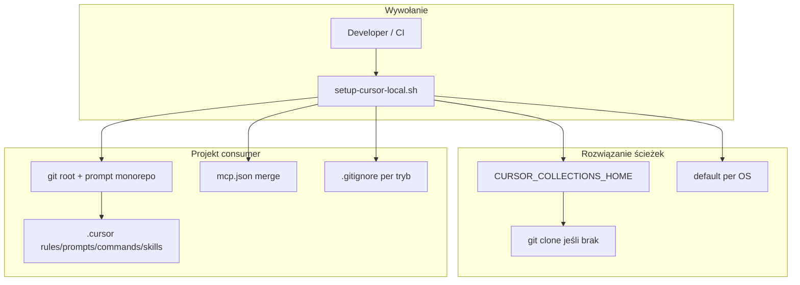

# Plan implementacji: jednokomendowy setup cursor-collections w projekcie konsumenckim

**Research:** [cursor-local-setup.research.md](./cursor-local-setup.research.md)  
**Wdrożenie** po akceptacji tego planu (bramka z `eversis-agent-core.mdc`).

**Decyzje produktowe zaakceptowane:** 2026-05-21 (patrz [Decyzje produktowe](#decyzje-produktowe)).

---

## Task Details

| Field | Value |
| ----- | ----- |
| ID / folder | `cursor-local-setup` |
| Title | `setup-cursor-local` — instalacja frameworku w projekcie (local default, opcjonalny vendor) |
| Priority | Wysoka — blokuje adopcję frameworku w istniejących repozytoriach |
| Related Research | [cursor-local-setup.research.md](./cursor-local-setup.research.md) |

## Proposed Solution

Jedna komenda (bash MVP, potem Node launcher) podłącza **cursor-collections** do projektu konsumenckiego:

1. **Local (default):** wspólny klon w `$CURSOR_COLLECTIONS_HOME`, link/copy `.cursor/*` w projekcie, `mcp.json` z absolutną ścieżką → **gitignore**.
2. **`--vendor submodule|copy`:** framework w repo, względne ścieżki MCP → **commit**.
3. **MCP:** migracja `CURSOR_COLLECTIONS_HOME` w `resolveRoot.ts`; build lokalny lub `--build-mcp`.
4. **Cross-platform:** `--link-mode auto` (symlink Unix, fallback copy Windows), domyślny HOME per OS.



**Domyślna ścieżka submodule (plan):** `vendor/cursor-collections/`  
**URL klonu (plan):** stała w skrypcie + override `CURSOR_COLLECTIONS_REPO_URL` (domyślnie origin tego repozytorium).

Skrypt jest **dodatkiem**, nie zamiennikiem — **ręczna instalacja (jak dotąd) pozostaje w pełni ważna** i nie wymaga skryptu.

---

## Ręczna instalacja (alternatywa — bez zmian merytorycznych)

Plan **nie usuwa** obecnego modelu z [documentation/cursor-collection.md](../../../documentation/cursor-collection.md) Part C i [installation.md](../../../website/docs/getting-started/installation.md). Deweloper może nadal:

| Krok (manual) | Równoważnik skryptu | Uwagi |
| ------------- | ------------------- | ----- |
| Sklonować / trzymać cursor-collections obok projektu | `CURSOR_COLLECTIONS_HOME` + clone w skrypcie | Manual: dowolna ścieżka + env |
| Skopiować / symlinkować `.cursor/rules/`, `prompts/`, `commands/` | `--link-mode symlink\|copy` (local) | Manual: `ln -s` lub `cp -R` |
| Dostosować `eversis-project-stack.mdc` | Task 1.5 — nie nadpisuje istniejącego | Zawsze ręczna edycja stacku |
| Dodać `AGENTS.md`, `docs/specs/` | Task 1.10 | Manual: copy z template |
| Skopiować / scalić `.cursor/mcp.json` | Task 1.8 | Local: absolutne ścieżki; vendor: względne |
| `cd mcp/eversis-collections-mcp && npm install && npm run build` | `--build-mcp` | Identyczne |
| Włączyć MCP w Cursor, OAuth | Next steps (stdout) | **Zawsze manual** — skrypt tego nie automatyzuje |
| Git submodule frameworku | `--vendor submodule` | Manual: `git submodule add ...` |
| Pełna kopia frameworku do repo | `--vendor copy` | Manual: copy katalogów |

**Kiedy manual ma sens:**

- Audyt / nauka — zrozumienie layoutu przed automatyzacją.
- Ograniczenia polityki (brak uruchamiania skryptów z repo).
- Częściowy bootstrap — np. tylko rules + jeden prompt, bez pełnego MCP stack.
- Projekt już skonfigurowany ręcznie — **skrypt nie jest wymagany**; re-run tylko gdy chcesz zsynchronizować (`--sync`).

**Dokumentacja (Phase 2):** Part C dostaje sekcję „Quick setup (skrypt)” **obok** istniejącego checklistu „Manual bootstrap” — **nie zastępuje** go.

---

## Current Implementation Analysis

### Already Implemented (reuse)

| Element | Ścieżka | Użycie |
| ------- | ------- | ------ |
| MCP server + `findRepoRoot` | `mcp/eversis-collections-mcp/src/resolveRoot.ts` | Rozszerzyć o `CURSOR_COLLECTIONS_HOME` |
| Wzorcowy `mcp.json` | `.cursor/mcp.json` | Fragment `eversis-collections` jako szablon merge |
| Rules / prompts / commands / skills | `.cursor/**` | Źródło link/copy/vendor |
| Szablon stack rule | `.cursor/rules/eversis-project-stack.mdc` | Kopiować do projektu (nie nadpisywać przy re-run) |
| Sync / validate scripts (wzorzec) | `scripts/sync-prompts.mjs`, `scripts/validate-cursor-markdown-links.mjs` | Wzorzec Node w Fazie 1b |

### To Be Modified

| Element | Ścieżka | Zmiana |
| ------- | ------- | ------ |
| MCP root resolution | `mcp/eversis-collections-mcp/src/resolveRoot.ts` | `CURSOR_COLLECTIONS_HOME` → fallback `EVERSIS_COLLECTIONS_ROOT` |
| MCP README | `mcp/eversis-collections-mcp/README.md` | Dokumentacja env |
| Framework docs | `documentation/cursor-collection.md` Part C | Dodać Quick setup obok manual checklist |
| Installation docs | `website/docs/getting-started/installation.md` | Local / vendor / Windows |
| README | `README.md` § consumer | Link do skryptu |
| CHANGELOG | `CHANGELOG.md` | Wpis o setup + env deprecacji |

### To Be Created

| Element | Opis |
| ------- | ---- |
| `scripts/setup-cursor-local.sh` | Główny entry point MVP |
| `scripts/lib/setup-cursor-local/` | Moduły bash (parse-args, paths, link, gitignore, mcp-merge, interactive) |
| `scripts/setup-cursor-local/templates/` | Stuby: `AGENTS.md`, `.cursorignore`, fragmenty gitignore, `mcp.json.example` |
| `scripts/setup-cursor-local.test.sh` | Smoke test (temp dir, `--non-interactive`) |
| `scripts/setup-cursor-local.mjs` | Faza 1b — canonical logika Node |
| `.github/workflows/setup-cursor-local-smoke.yml` (lub GitLab job) | macOS + Windows smoke |

---

## Decyzje produktowe

| # | Pytanie | Decyzja (2026-05-21) |
| --- | ------- | -------------------- |
| 1 | Domyślna ścieżka klonu | **TAK** — `%LOCALAPPDATA%\cursor-collections` (Win), `$HOME/.local/share/cursor-collections` (Unix) |
| 2 | `--vendor` | **submodule** lub **copy**; samo `--vendor` → pytanie interaktywne; default **off** |
| 3 | `mcp.json` w git | **Local** → gitignore; **vendor** → commit (względne ścieżki) |
| 4 | Monorepo target | Wykryj `.git`, **pytaj** root vs cwd; `--target` / `--non-interactive` omija |
| 5 | npm MCP | **Horyzont Faza 3** — nie blokuje MVP |
| 6 | Entry point Windows | **MVP bash + docs**; **Faza 1b** `.mjs` |
| 7 | `--link-mode copy` + gitignore | **TAK** — prompts/commands/skills/mcp.json gitignore; **`eversis-project-stack.mdc` commit** |
| 8 | Ścieżka submodule | **`vendor/cursor-collections/`** (plan) |

---

## Implementation Plan

### Phase 0 — MCP: `CURSOR_COLLECTIONS_HOME`

#### Task 0.1 - [MODIFY] `resolveRoot.ts`

**Description:** W `findRepoRoot()` po nieudanym walk-up: najpierw `process.env.CURSOR_COLLECTIONS_HOME`, potem legacy `EVERSIS_COLLECTIONS_ROOT`. Walidacja: katalog musi zawierać `.cursor/skills`.

**Definition of Done:**

- [ ] Test jednostkowy w `mcp/eversis-collections-mcp/` (mock env, temp dir)
- [ ] Komunikat błędu wspomina `CURSOR_COLLECTIONS_HOME`
- [ ] `npm test` w pakiecie MCP przechodzi

#### Task 0.2 - [MODIFY] Dokumentacja MCP + CHANGELOG

**Description:** README MCP — sekcja Environment z `CURSOR_COLLECTIONS_HOME`; deprecacja `EVERSIS_COLLECTIONS_ROOT` (jedna linia).

**Definition of Done:**

- [ ] README zaktualizowany
- [ ] Wpis w `CHANGELOG.md`

---

### Phase 1 — MVP: `setup-cursor-local.sh` (local + vendor)

#### Task 1.1 - [CREATE] Szkielet CLI i parse args

**Description:** `scripts/setup-cursor-local.sh` + `scripts/lib/setup-cursor-local/common.sh`:

- Flagi: `--build-mcp`, `--target DIR`, `--collections-home DIR`, `--vendor submodule|copy`, `--link-mode auto|symlink|copy`, `--sync`, `--non-interactive`, `--minimal` (stub — komunikat „not yet” lub subset plików).
- Priorytet `CURSOR_COLLECTIONS_HOME`: CLI > env > default OS.
- `--help` z przykładami.

**Definition of Done:**

- [ ] `--help` działa
- [ ] Nieznane flagi → exit 1 + komunikat
- [ ] `shellcheck` bez błędów krytycznych (jeśli dostępny lokalnie)

#### Task 1.2 - [CREATE] Rozwiązanie HOME i clone frameworku

**Description:** Funkcje `resolve_collections_home`, `ensure_framework_checkout`:

- Detekcja OS (Unix vs Windows Git Bash via `uname` / `OSTYPE`).
- Jeśli brak katalogu → `git clone` (URL z env `CURSOR_COLLECTIONS_REPO_URL` lub domyślny upstream repo).
- Opcjonalnie `git -C "$HOME" pull --ff-only` przy re-run (flaga `--update-framework` opcjonalna w MVP — minimum: komunikat „run git pull in HOME”).

**Definition of Done:**

- [ ] Clone do temp HOME w smoke test
- [ ] Istniejący HOME nie jest nadpisywany

#### Task 1.3 - [CREATE] Wykrywanie git root i prompt monorepo

**Description:** Od `cwd` lub `--target`: znajdź git root. Jeśli `cwd != git root` i brak `--target` i brak `--non-interactive` → pytanie: `(1) repo root (recommended) (2) current directory`. Domyślnie po 10s lub Enter = root.

**Definition of Done:**

- [ ] Test z mock `git rev-parse --show-toplevel` w smoke
- [ ] `--non-interactive` wybiera git root bez pytania
- [ ] `--target` omija pytanie

#### Task 1.4 - [CREATE] `--build-mcp`

**Description:** W `$CURSOR_COLLECTIONS_HOME/mcp/eversis-collections-mcp`: `npm install && npm run build` gdy `--build-mcp` lub brak `dist/index.js`. Vendor: build w ścieżce vendored `mcp/`.

**Definition of Done:**

- [ ] Po build istnieje `dist/index.js`
- [ ] Błąd npm → exit ≠ 0

#### Task 1.5 - [CREATE] Link / copy `.cursor/*` (tryb local)

**Description:** Moduł `link-framework.sh`:

- **`auto`:** symlink na Darwin/Linux; na MINGW/Windows — `cmd //c mklink /J` lub copy fallback.
- **`copy`:** `rsync -a` lub `cp -R` (bez `node_modules` jeśli przypadkowo w ścieżce).
- **Rules:** link/copy wszystkie `eversis-*.mdc` **oprócz** stack; `eversis-project-stack.mdc` — kopiuj z template tylko jeśli nie istnieje.
- **Prompts, commands, skills:** całe drzewo link/copy.
- **`--sync`:** odśwież copy (local + copy mode), nie dotykaj stack / lokalnych overrides.

**Definition of Done:**

- [ ] Re-run idempotentny
- [ ] Istniejący `eversis-project-stack.mdc` nietknięty
- [ ] `auto` na macOS tworzy symlinki; test copy na `--link-mode copy`

#### Task 1.6 - [CREATE] `--vendor submodule`

**Description:** Interaktywne lub `--vendor submodule`:

- `git submodule add <url> vendor/cursor-collections` (skip jeśli już istnieje).
- Link/copy **z** submodule path do `.cursor/` w root projektu **lub** wskazanie workspace na submodule — **decyzja implementacyjna:** symlink `.cursor/prompts` → `vendor/cursor-collections/.cursor/prompts` (mniej duplikacji) + względna ścieżka MCP przez `vendor/cursor-collections/mcp/...`.
- Usuń wpisy gitignore frameworkowe dodane przez wcześniejszy local setup.

**Definition of Done:**

- [ ] `.gitmodules` powstaje w testowym repo
- [ ] `mcp.json` używa względnej ścieżki od project root
- [ ] Brak wpisów local w `.gitignore` po vendor

#### Task 1.7 - [CREATE] `--vendor copy`

**Description:** Kopiuj `.cursor/{rules,prompts,commands,skills}` + `mcp/eversis-collections-mcp/` (bez `node_modules`, bez `.git`) do `vendor/cursor-collections/` lub bezpośrednio do `.cursor/` — **plan:** katalog `vendor/cursor-collections/` jako mirror checkoutu (spójność ze submodule layout).

**Definition of Done:**

- [ ] Struktura zgodna z submodule path (łatwa migracja submodule ↔ copy)
- [ ] `--sync` aktualizuje pliki vendored copy z `$CURSOR_COLLECTIONS_HOME`

#### Task 1.8 - [CREATE] Merge `mcp.json`

**Description:** `merge-mcp-json.sh`:

- **Local:** wpis `eversis-collections` z absolutną ścieżką do `dist/index.js` + `env.CURSOR_COLLECTIONS_HOME`.
- **Vendor:** względna ścieżka `vendor/cursor-collections/mcp/eversis-collections-mcp/dist/index.js` (lub po `--build-mcp`).
- Merge do istniejącego `.cursor/mcp.json` — **tylko** klucz `eversis-collections` (nie nadpisuj innych serwerów).
- Dostarczyć `scripts/setup-cursor-local/templates/mcp.json.example`.

**Definition of Done:**

- [ ] Istniejące serwery MCP w pliku zachowane
- [ ] JSON poprawny składniowo (`node -e "JSON.parse(...)"`)

#### Task 1.9 - [CREATE] `.gitignore` i `.cursorignore` per tryb

**Description:** Szablony w `templates/`:

**Local / link-mode copy — dopisz (marker `# cursor-collections local`):**

```gitignore
.cursor/mcp.json
.cursor/prompts/
.cursor/commands/
.cursor/skills/
.cursor/rules/eversis-agent-core.mdc
.cursor/rules/eversis-testing-and-terminal.mdc
.cursor/rules/eversis-engineering-manager.mdc
.cursor/rules/eversis-code-reviewer.mdc
# … pozostałe vendored rules oprócz eversis-project-stack.mdc
```

**Vendor — usuń sekcję marker** jeśli istnieje.

**Definition of Done:**

- [ ] `eversis-project-stack.mdc` **nigdy** w gitignore
- [ ] Ponowny run local nie duplikuje marker block
- [ ] `.cursorignore` stub (secrets, node_modules) tylko gdy brak pliku

#### Task 1.10 - [CREATE] Scaffolding projektu

**Description:** Jeśli brak: `docs/specs/README.md` (z istniejącego wzorca), `AGENTS.md` stub (link do `documentation/cursor-collection.md` lub skrócony consumer variant), `docs/context/.gitkeep` opcjonalnie.

**Definition of Done:**

- [ ] Nie nadpisuje istniejącego `AGENTS.md`
- [ ] `docs/specs/` istnieje po setup

#### Task 1.11 - [CREATE] Podsumowanie next steps

**Description:** Na końcu stdout: tryb (local/vendor), link-mode, ścieżki, przypomnienie: restart Cursor, enable MCP, edycja stack rule; Windows: Git Bash / `--link-mode copy`.

**Definition of Done:**

- [ ] Exit 0 przy sukcesie
- [ ] Czytelny blok „Next steps”

#### Task 1.12 - [REUSE] Smoke test bash

**Description:** `scripts/setup-cursor-local.test.sh` — temp project dir, fake HOME z kopią frameworku (lub `CURSOR_COLLECTIONS_HOME=$PWD` w CI tego repo), `--non-interactive --link-mode copy --build-mcp`.

**Definition of Done:**

- [ ] Test przechodzi lokalnie z repo root
- [ ] Dokumentacja uruchomienia w komentarzu skryptu

---

### Phase 1b — Node launcher + CI cross-platform

#### Task 1b.1 - [CREATE] `scripts/setup-cursor-local.mjs`

**Description:** Przenieś logikę do Node (fs, path, child_process). API CLI identyczne jak bash. Bash opcjonalnie: `exec node "$(dirname "$0")/setup-cursor-local.mjs" "$@"`.

**Definition of Done:**

- [ ] Działa na macOS i Windows (PowerShell: `node scripts/setup-cursor-local.mjs`)
- [ ] Testy jednostkowe dla path resolution i gitignore merge (min. 3 case)

#### Task 1b.2 - [CREATE] CI smoke macOS + Windows

**Description:** Workflow: checkout, Node LTS, run smoke z `--non-interactive --link-mode copy`.

**Definition of Done:**

- [ ] Job green na macOS i `windows-latest`
- [ ] Nie wymaga sekretów

---

### Phase 2 — Dokumentacja

#### Task 2.1 - [MODIFY] `documentation/cursor-collection.md` Part C

**Description:** **Uzupełnij** (nie usuwaj) checklist o sekcję „Quick setup (skrypt)” z komendą, tabelą trybów, `CURSOR_COLLECTIONS_HOME`, gitignore. Zachowaj osobną podsekcję **„Manual bootstrap”** z dotychczasowymi krokami copy/link/MCP.

**Definition of Done:**

- [ ] Link do `scripts/setup-cursor-local.sh`
- [ ] Tabela local vs vendor
- [ ] Checklist manualny Part C **nadal obecny** (ew. skrócony z linkiem „pełna lista”)

#### Task 2.2 - [MODIFY] `website/docs/getting-started/installation.md`

**Description:** Sekcje: Consumer project setup, Windows (WSL / Git Bash / copy), Environment variables.

**Definition of Done:**

- [ ] `npm run build` w `website/` przechodzi po edycji

#### Task 2.3 - [MODIFY] `README.md`

**Description:** Skrót w § „Using this framework in another repository” → setup script.

**Definition of Done:**

- [ ] Przykład komendy z `--build-mcp`

---

### Phase 3 — Horyzont: npm MCP (out of MVP scope)

#### Task 3.1 - [CREATE] Publikacja `@scope/eversis-collections-mcp` (backlog)

**Description:** Przygotować package.json do publikacji, bin entry, `npx` w generatorze `mcp.json`; flaga `--use-npm-mcp` w setup.

**Definition of Done:**

- [ ] Backlog item — **nie** w pierwszym PR MVP
- [ ] Nazwa pakietu ustalona z tech leadem

---

## Security Considerations

| Obszar | Wymaganie |
| ------ | --------- |
| Clone URL | Tylko HTTPS; override przez env — dokumentować ryzyko złośliwego URL |
| Ścieżki | Walidacja `--target` / `--collections-home` — brak `..` escape poza intent |
| `mcp.json` local | Gitignore — brak absolutnych ścieżek dev w remote |
| Submodule | Użytkownik świadomie dodaje `.gitmodules` — tylko zaufany remote |
| Skrypt | Nie wykonywać arbitrary shell z inputu użytkownika; brak `curl \| bash` w MVP |

---

## Testing Guidelines

| Poziom | Co testować |
| ------ | ----------- |
| Unit (1b) | Path defaults per OS, gitignore merge, mcp.json merge |
| Smoke | Local copy mode na czystym temp repo; vendor submodule w temp git repo |
| Manual | macOS: symlink auto; Windows Git Bash: auto → copy fallback; Cursor: `@eversis-implement`, MCP `eversis_skills_list` |
| Regression | `npm test` w MCP po Phase 0; `npm run build` w `website/` po Phase 2 |

**Komenda smoke (dev):**

```bash
./scripts/setup-cursor-local.test.sh
```

---

## Acceptance Criteria (całość MVP — Phase 0 + 1 + 2)

- [ ] Deweloper uruchamia **jedną komendę** i dostaje działający `.cursor/` w projekcie (local default).
- [ ] **`CURSOR_COLLECTIONS_HOME`** działa w setup i MCP.
- [ ] **Local:** `.cursor/mcp.json` i vendored paths w **gitignore**; **`eversis-project-stack.mdc`** w repo.
- [ ] **Vendor:** `--vendor submodule` i `--vendor copy` commitowalne; względne MCP.
- [ ] **Monorepo:** interaktywny wybór target ( lub `--non-interactive` → root ).
- [ ] **`--link-mode auto`** na Windows nie kończy się błędem (copy fallback).
- [ ] Dokumentacja installation + Part C zaktualizowana (**skrypt + manual**).
- [ ] Smoke test przechodzi lokalnie.

**Faza 1b (acceptance rozszerzone):**

- [ ] `node scripts/setup-cursor-local.mjs` na Windows (CI green).

---

## Improvements (out of scope)

| Item | Powód |
| ---- | ----- |
| Naprawa linków promptów → `website/docs/agents/` | Epic `cursor-md-link-refs` |
| Publikacja npm MCP | Faza 3 |
| `--minimal` pełna implementacja | Opcjonalny subset — po MVP |
| `CURSOR_COLLECTIONS_REF` pin wersji | Przyszłe rozszerzenie env |
| Automatyczne enable MCP w Cursor UI | Ograniczenie produktu Cursor |
| curl bootstrap one-liner z internetu | Bezpieczeństwo / maintenance |

---

## Changelog (plan)

| Data | Autor | Zmiana |
| ---- | ----- | ------ |
| 2026-05-21 | Implement (plan) | Utworzenie planu z research + decyzji produktowych |

---

## Następny krok

Po **akceptacji planu** przez human — implementacja **Phase 0 → Phase 1 → Phase 2** w jednym lub kilku PR (rekomendacja: PR1 = Phase 0 + 1.1–1.5 + test; PR2 = vendor + gitignore + docs).
