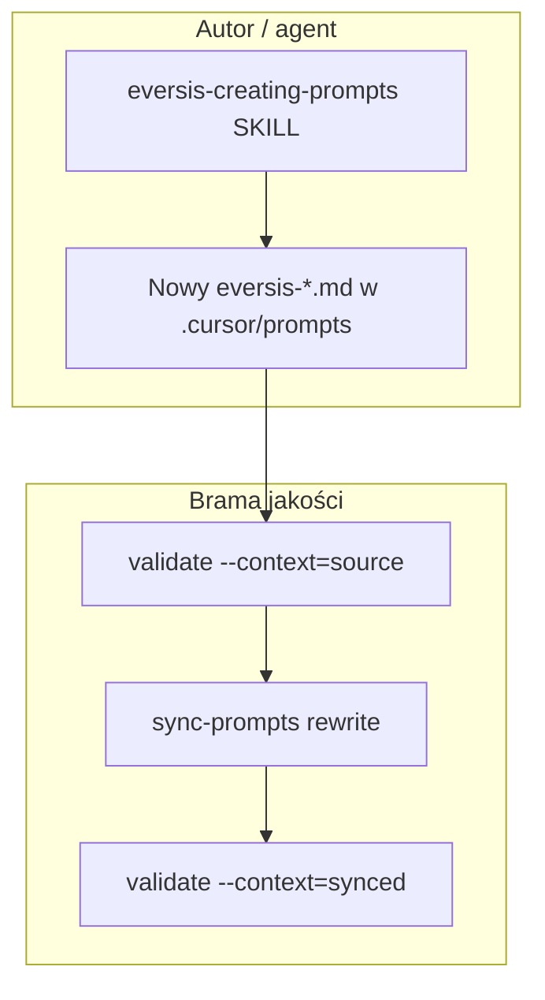

# Plan implementacji: dual-context links w `eversis-creating-prompts`

**Research:** [cursor-md-link-refs-creating-prompts-dual-context.research.md](./cursor-md-link-refs-creating-prompts-dual-context.research.md)  
**Zadanie nadrzędne:** [cursor-md-link-refs.plan.md](./cursor-md-link-refs.plan.md) (Improvements — Task 5.3)  
**Infrastruktura (gotowa):** `sync-prompts`, `prompt-link-rewrite.mjs`, `validate-cursor-markdown-links.mjs`, [documentation/cursor-collection.md](../../../documentation/cursor-collection.md) § Link conventions

**Wdrożenie** po akceptacji planu (bramka `eversis-agent-core.mdc`).

Zakres: **wyłącznie** dokumentacja proceduralna w skillu + przykład w szablonie — **bez** zmian skryptów, MCP, `website/`, promptów `eversis-*.md`.

---

## Task Details

| Field            | Value                                                                 |
| ---------------- | --------------------------------------------------------------------- |
| ID / folder      | `cursor-md-link-refs-creating-prompts-dual-context`                  |
| Title            | Skill `eversis-creating-prompts` — sekcja dual-context markdown links |
| Priority         | Niska–średnia — zapobiega regresjom przy nowych promptach             |
| Related Research | [cursor-md-link-refs-creating-prompts-dual-context.research.md](./cursor-md-link-refs-creating-prompts-dual-context.research.md) |

## Proposed Solution

Uzupełnić **`.cursor/skills/eversis-creating-prompts/SKILL.md`** o normatywną sekcję **Dual-context markdown links** (kanon w `.cursor/prompts/` vs forma po `sync-prompts`) oraz rozszerzyć **Step 8** o walidację linków. Zaktualizować przykład ścieżek w **`prompt.template.md`** (sekcja `<prerequisites>`).

Skill pozostaje **skrótem proceduralnym** — pełna tabela rewrite i szczegóły CI: plan nadrzędny + `cursor-collection.md` + `prompt-link-rewrite.mjs`.



## Current Implementation Analysis

### Already Implemented

| Element | Lokalizacja | Uwagi |
| ------- | ----------- | ----- |
| Rewrite przy sync | `scripts/lib/prompt-link-rewrite.mjs` | `rewritePromptLinksForDocusaurus`, slug map |
| Walidator | `scripts/validate-cursor-markdown-links.mjs` | `source` / `synced` / `agents` |
| Hook build | `website/package.json` | prebuild/prestart po sync |
| Konwencja frameworku | `documentation/cursor-collection.md` | § Link conventions |
| Prompty kanoniczne | `.cursor/prompts/**` | `eversis-*.md`, `website/docs/agents/*.md` |
| Skill tworzenia promptów | `.cursor/skills/eversis-creating-prompts/SKILL.md` | Steps 1–8 **bez** dual-context |

### To Be Modified

| Plik | Zmiana |
| ---- | ------ |
| `.cursor/skills/eversis-creating-prompts/SKILL.md` | Nowa sekcja + Step 8 checklist + krótki akapit w Step 7 |
| `.cursor/skills/eversis-creating-prompts/prompt.template.md` | Przykład linków w `<prerequisites>` |

### To Be Created

Brak nowych plików (świadomie **bez** `references/dual-context-links.md` na tej iteracji — research W7).

## Decyzje produktowe

| #   | Pytanie | Decyzja (plan) |
| --- | ------- | -------------- |
| 1   | Głębokość sekcji w SKILL | ~40–60 linii + 4 przykłady `href`; bez duplikacji pełnej tabeli z [cursor-md-link-refs.plan.md](./cursor-md-link-refs.plan.md) |
| 2   | Osobny `references/` w skillu? | **Nie** — skill < 500 linii po edycji |
| 3   | Czy zmieniać istniejące prompty? | **Nie** — tylko skill + template |
| 4   | Consumer repo bez `website/` | Sekcja z adnotacją: jeden kontekst, `@eversis-*` + względne `eversis-*.md` |

## Konwencja do zapisania w skillu (skrót normatywny)

| Linkujesz do… | W `.cursor/prompts/` (kanon) | Po sync (nie wpisuj ręcznie w źródle) |
| ------------- | ---------------------------- | ------------------------------------- |
| Karta agenta | `../../../website/docs/agents/<name>.md` | `../../agents/<name>` |
| Public prompt | `../public/eversis-<stem>.md` | `../public/<slug>` |
| Internal prompt (cross-tier) | `../internal/eversis-<stem>.md` | `../internal/<slug>` |
| Internal prompt (ten sam tier) | `./eversis-<stem>.md` | `./<slug>` |

**Antywzorce w źródle:** `../../agents/…`, `./implement` (slug bez prefiksu pliku), ręczna edycja `website/docs/prompts/` (gitignored, nadpisywane przez sync).

**`slug:` w frontmatter:** unikalny w obrębie `public/` lub `internal/`; kolizja → fail sync / `buildPromptSlugMaps`.

**Markdown link vs `@`:** `[]()` = nawigacja plikowa w IDE; `@eversis-*` = attachment Cursor (Executable) — oba dozwolone, skill wyjaśnia kiedy który.

---

## Implementation Plan

### Phase 1 — `SKILL.md`: sekcja dual-context

#### Task 1.1 - [MODIFY] Dodaj `## Dual-context markdown links`

**Plik:** `.cursor/skills/eversis-creating-prompts/SKILL.md`

**Description:** Wstawić sekcję **po Step 7**, **przed Step 8**, zawierającą:

1. Krótki opis problemu (dwa konteksty rozwiązywania).
2. Tabelę skróconą (jak w § Konwencja powyżej).
3. Listę antywzorców (3–4 punkty).
4. Adnotację **consumer repo** (bez `website/`).
5. Rozdzielenie rules/commands/skills (jeden kontekst, `../../` do roota) vs prompty.
6. Link do [documentation/cursor-collection.md](../../../documentation/cursor-collection.md) § Link conventions i do `scripts/lib/prompt-link-rewrite.mjs` (źródło prawdy rewrite).
7. Wyjątki walidatora: `http(s):`, `mailto:`, `#`, globy (`*`, `<`).

**Definition of Done:**

- [ ] Sekcja istnieje między Step 7 a Step 8
- [ ] Zawiera tabelę „linkujesz do → kanon w `.cursor/prompts/`”
- [ ] Jawne **Nie** dla `../../agents/` i slugów w źródle
- [ ] Odniesienie do `cursor-collection.md` (ścieżka względna z skill package lub opis „repo root”)
- [ ] Brak sprzeczności z regułami w `prompt-link-rewrite.mjs` (przegląd ręczny)

#### Task 1.2 - [MODIFY] Rozszerz Step 7 (jeden akapit)

**Description:** W Step 7 dodać zdanie: po zapisaniu promptu w monorepo z `website/`, linki muszą być w kanonie source; sync przepisze je automatycznie — patrz sekcja Dual-context.

**Definition of Done:**

- [ ] Step 7 wspomina sync + odwołanie do nowej sekcji

#### Task 1.3 - [MODIFY] Rozszerz Step 8 — checklist walidacji

**Description:** Dodać punkty checklist (monorepo z `website/`):

```bash
node scripts/validate-cursor-markdown-links.mjs --context=source
cd website && npm run sync-prompts
node ../scripts/validate-cursor-markdown-links.mjs --context=synced
```

Alternatywa skrócona: `cd website && npm run build` (jeśli hooki już wpięte).

Dodać: **nie commitować** ręcznych poprawek w `website/docs/prompts/`; przy fail synced — sprawdzić `prompt-link-rewrite.mjs` / testy, nie kopię sync.

**Definition of Done:**

- [ ] Co najmniej 3 nowe punkty w Step 8 checklist
- [ ] Komendy walidacji obecne dosłownie lub jako skrót przez `npm run build`

---

### Phase 2 — `prompt.template.md`

#### Task 2.1 - [MODIFY] Przykład `<prerequisites>`

**Plik:** `.cursor/skills/eversis-creating-prompts/prompt.template.md`

**Description:** W zakomentowanym bloku `<prerequisites>` zamienić przykład:

| Było (legacy) | Ma być |
| ------------- | ------ |
| `[eversis-implement.md](../../prompts/public/eversis-implement.md)` | `[eversis-implement.md](../public/eversis-implement.md)` (dla pliku w `internal/`) lub odpowiedni `../public/…` / `./…` zależnie od tieru w komentarzu |

Dodać jednolinijkowy komentarz HTML: „use canonical paths per Dual-context section in SKILL.md”.

**Definition of Done:**

- [ ] Brak ścieżki `../../prompts/public/…` w template
- [ ] Przykład zgodny z kanonem z Task 1.1

---

### Phase 3 — Weryfikacja i domknięcie

#### Task 3.1 - [REUSE] Spójność z automatyzacją

**Description:** Porównać treść sekcji skillu z:

- `rewritePromptLinksForDocusaurus` (3 reguły replace + agents)
- `documentation/cursor-collection.md` § Link conventions

**Definition of Done:**

- [ ] Każda reguła rewrite ma odpowiednik w skillu lub jest wyraźnie opisana jako „po sync”
- [ ] Brak nowych wymagań niewspieranych przez walidator

#### Task 3.2 - [REUSE] Przegląd docs-only

**Description:** Uruchomić walidator na całym `.cursor/` (bez zmiany promptów) — upewnić się, że edycja skillu nie wprowadza broken links w samym SKILL/template.

```bash
node scripts/validate-cursor-markdown-links.mjs --context=source
```

Opcjonalnie: `@eversis-review` na diffie (tylko `.cursor/skills/eversis-creating-prompts/`).

**Definition of Done:**

- [ ] Walidator source = 0 errors
- [ ] Brak nowych linków do nieistniejących plików w SKILL/template

#### Task 3.3 - [MODIFY] Changelog planu nadrzędnego (opcjonalnie)

**Plik:** [cursor-md-link-refs.plan.md](./cursor-md-link-refs.plan.md)

**Description:** W Improvements zamienić linię o skillu na link do tego planu; po implementacji — wpis w Changelog obu planów.

**Definition of Done:**

- [ ] Plan nadrzędny wskazuje na `cursor-md-link-refs-creating-prompts-dual-context.plan.md` (opcjonalne, jeśli utrzymujecie jeden backlog)

---

## Security Considerations

Brak — zmiany wyłącznie w markdown proceduralnym; bez sekretów, bez nowych zależności.

## Quality Assurance

### Acceptance criteria (całość zadania)

- [ ] Po przeczytaniu `SKILL.md` autor wie, który `href` wpisać w `.cursor/prompts/` dla agent / public / internal
- [ ] Step 8 wymusza walidację source (+ synced lub `npm run build`)
- [ ] Skill nie duplikuje > ~15 wierszy tabeli z planu nadrzędnego (linki zamiast copy-paste)
- [ ] `prompt.template.md` nie zawiera legacy ścieżek `../../prompts/...`
- [ ] `node scripts/validate-cursor-markdown-links.mjs --context=source` przechodzi po edycji
- [ ] Kryteria z [research](./cursor-md-link-refs-creating-prompts-dual-context.research.md) § Kryteria akceptacji — spełnione

### Komenda weryfikacji

```bash
node scripts/validate-cursor-markdown-links.mjs --context=source
```

(Nie wymaga `website build` — brak zmian w promptach; opcjonalnie `cd website && npm run build` jeśli chcesz pełną bramę monorepo.)

## Improvements (Out of Scope)

- Osobny plik `references/dual-context-links.md` w pakiecie skillu (gdy skill urośnie > ~500 linii).
- Aktualizacja `website/docs/skills/` (jeśli istnieje kopia narracyjna — osobny sync/docs task).
- Zmiana treści istniejących `eversis-*.md` promptów.
- Task `website/docs/agents/` link audit ([cursor-md-link-refs-agents.plan.md](./cursor-md-link-refs-agents.plan.md)).

## Szacunek nakładu

| Faza | Szacunek |
| ---- | -------- |
| Phase 1 (SKILL) | ~20 min |
| Phase 2 (template) | ~5 min |
| Phase 3 (weryfikacja) | ~10 min |
| **Razem** | **~35 min** |

## Kolejność wdrożenia

1. Task 1.1 → 1.2 → 1.3 (jedna edycja `SKILL.md`)
2. Task 2.1
3. Task 3.1 → 3.2 → 3.3 (opcjonalny link w planie nadrzędnym)

## Changelog

| Date       | Change Description        |
| ---------- | ------------------------- |
| 2026-05-18 | Initial plan created      |
| 2026-05-18 | Implemented: SKILL.md Dual-context section, Step 7/8, prompt.template.md; validate source OK |
