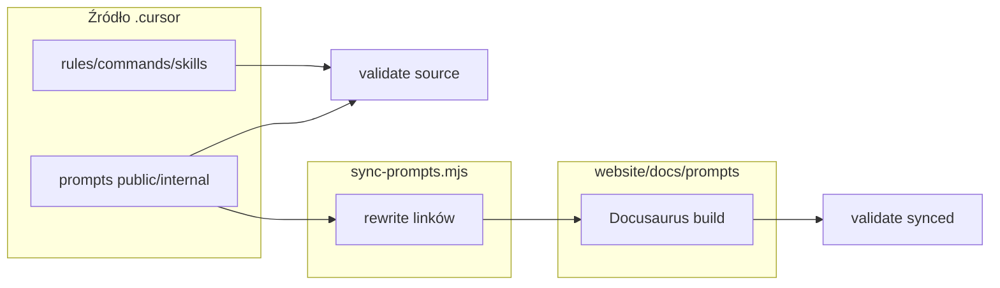

# Plan implementacji: naprawa odwołań `.md` w `.cursor/`

**Research:** [cursor-md-link-refs.research.md](./cursor-md-link-refs.research.md)  
**Normatywna konwencja linków (po wdrożeniu):** sekcja [Konwencja kanoniczna](#konwencja-kanoniczna-linków) poniżej.

**Wdrożenie** po akceptacji planu (bramka z `eversis-agent-core.mdc`). **Decyzje produktowe zaakceptowane:** 2026-05-18 (patrz [Decyzje](#decyzje-produktowe)).

Zakres: dokumentacja w `.cursor/`, skrypt sync, walidator w `prebuild` — **bez** zmian w MCP, skills MCP, zależnościach npm (walidator: tylko `node:fs` / `path`).

---

## Task Details

| Field            | Value                                                                 |
| ---------------- | --------------------------------------------------------------------- |
| ID / folder      | `cursor-md-link-refs`                                                 |
| Title            | Naprawa i walidacja odwołań markdown w `.cursor/`                     |
| Priority         | Średnia — reguły always-on i commands mają wpływ na codzienną pracę   |
| Related Research | [cursor-md-link-refs.research.md](./cursor-md-link-refs.research.md) |

## Proposed Solution

1. Ustalić **konwencję kanoniczną** linków w źródle `.cursor/` (ścieżki względne do pliku lub jawne `../../../website/docs/...`).
2. Naprawić **błędy o wysokim priorytecie** w rules, commands i skills (realnie martwe linki).
3. Rozszerzyć **`sync-prompts.mjs`** o przepisywanie linków przy kopiowaniu, aby **nie psuć** Docusaurus po sync.
4. Dodać **walidator linków** (skrypt Node) — **obowiązkowy** w `website` `prebuild` / `prestart`; **błąd walidacji = fail `npm run build`**.
5. W **syncowanej kopii** zachować **slugi Docusaurus** (`./implement`, `../public/review-ui`) — rewrite dotyczy agentów i `eversis-*.md` → slug, nie usuwania slugów z kopii www.



## Konwencja kanoniczna linków

| Typ odwołania | W `.cursor/` (kanon) | Po `sync-prompts` (rewrite →) |
| ------------- | -------------------- | ----------------------------- |
| Agent (role doc) | Z `prompts/internal/`: `../../../website/docs/agents/<slug>.md` | `../../agents/<slug>` |
| Agent (role doc) | Z `prompts/public/`: `../../../website/docs/agents/<slug>.md` | `../../agents/<slug>` |
| Inny public prompt | Z internal: `../public/eversis-<stem>.md` | `../public/<slug>` (np. `../public/implement`) — **slugi zostają w kopii sync** |
| Inny internal prompt | `./eversis-<stem>.md` | `./<slug>` (np. `./implement-ui`) — **slugi zostają w kopii sync** |
| Rule / command → root | Z `.cursor/rules/` lub `commands/`: `../../<path>` | (brak sync) |
| Rule w tym samym katalogu | `eversis-*.mdc` (bez `.cursor/rules/` prefix) | (brak sync) |
| Skill w tym samym pakiecie | `./references/foo.md`, `./*.example.md` | (brak sync) |
| Skill → inny skill | `../eversis-<package>/SKILL.md` | (brak sync) |
| `@eversis-*` w tekście | Mechanizm Cursor — bez zmiany | bez zmiany |
| Glob / placeholder | `*.mdc`, `eversis-*/` — poza walidatorem | — |

**Nie zmieniać** w tej iteracji: treści merytorycznej promptów, frontmatter Docusaurus (`slug`), procedur w Executable prompt — tylko `href` w linkach markdown i ewentualnie etykiety linków.

## Decyzje produktowe

| #   | Pytanie                                                       | Decyzja (2026-05-18)                                                                 |
| --- | ------------------------------------------------------------- | ------------------------------------------------------------------------------------ |
| 1   | Czy slugi (`./implement`) zostają w syncowanej kopii?         | **Tak** — w `website/docs/prompts/` po sync nadal slugi; rewrite tylko agentów + `eversis-*.md` → slug |
| 2   | Czy walidator ma failować build `website`?                    | **Tak** — `validate-cursor-links` w `prebuild` / `prestart` **po** `sync-prompts`; exit code ≠ 0 przerywa build |
| 3   | Czy naprawiać linki w `website/docs/agents/*.md` do promptów? | **Nie w tym tasku** — osobny backlog (patrz [Improvements](#improvements-out-of-scope)) |

---

## Implementation Plan

### Phase 0 — Konwencja i mapowanie rewrite

#### Task 0.1 - [CREATE] Tabela rewrite dla `sync-prompts`

**Description:** W `scripts/sync-prompts.mjs` (lub `scripts/lib/prompt-link-rewrite.mjs`) zdefiniować jawne reguły zamiany przy `copyFile`:

- `../../../website/docs/agents/` → `../../agents/`
- `../public/eversis-` → `../public/` + stem bez prefiksu (lub mapowanie ze slug z pliku — minimalnie: strip `eversis-` i `.md`)
- `../internal/eversis-` → `../internal/` + stem
- `./eversis-` → `./` + stem (w internal)

**Definition of Done:**

- [ ] Reguły udokumentowane w komentarzu nad skryptem
- [ ] Jednostkowy test lub suchy run na 1–2 plikach przykładowych

---

### Phase 1 — Rules i commands (wysoki priorytet)

#### Task 1.1 - [MODIFY] `.cursor/rules/eversis-agent-core.mdc`

**Description:** Poprawić linki markdown:

| Było | Ma być |
| ---- | ------ |
| `[AGENTS.md](AGENTS.md)` | `[AGENTS.md](../../AGENTS.md)` |
| `[eversis-code-reviewer.mdc](.cursor/rules/eversis-code-reviewer.mdc)` | `[eversis-code-reviewer.mdc](eversis-code-reviewer.mdc)` |

**Definition of Done:**

- [ ] Oba linki rozwiązują się do istniejących plików z katalogu `.cursor/rules/`

#### Task 1.2 - [MODIFY] `.cursor/rules/eversis-project-stack.mdc`

**Description:** Ujednolicić wszystkie linki do roota repo:

| Było | Ma być |
| ---- | ------ |
| `(documentation/cursor-collection.md)` (linia ~8) | `(../../documentation/cursor-collection.md)` |
| `(website/docs/workflow/overview.md)` | `(../../website/docs/workflow/overview.md)` |
| `(website/package.json)` | `(../../website/package.json)` |
| `(documentation/cursor-collection.md)` (linia ~38, bez `../`) | `(../../documentation/cursor-collection.md)` |
| `(.cursor/rules/eversis-engineering-manager.mdc)` | `(eversis-engineering-manager.mdc)` |

**Definition of Done:**

- [ ] Brak linków rozwiązujących się pod `.cursor/rules/website/` lub `.cursor/rules/documentation/`
- [ ] Spójność z już poprawnym `../../documentation/...` w tym samym pliku

#### Task 1.3 - [MODIFY] `.cursor/rules/eversis-code-reviewer.mdc`

**Description:** `[website/package.json](website/package.json)` → `[website/package.json](../../website/package.json)`.

**Definition of Done:**

- [ ] Link wskazuje na `website/package.json` w rootie repo

#### Task 1.4 - [MODIFY] Commands (3 pliki)

**Pliki:**

- `.cursor/commands/eversis-implement.md`
- `.cursor/commands/eversis-ba-docs-planner.md`
- `.cursor/commands/eversis-ba-docs-writer.md`

**Description:** Dodać `../../` przed `website/docs/...` i `documentation/...`.

**Definition of Done:**

- [ ] Wszystkie markdown linki w commands rozwiązują się poprawnie z `.cursor/commands/`

---

### Phase 2 — Skills: martwe cross-refs

#### Task 2.1 - [MODIFY] Multi-cloud references (4 linki)

**Pliki:**

- `.cursor/skills/eversis-designing-multi-cloud-architecture/references/multi-cloud-patterns.md`
- `.cursor/skills/eversis-designing-multi-cloud-architecture/references/service-comparison.md`

**Description:**

| Było | Ma być |
| ---- | ------ |
| `../../terraform-module-library/SKILL.md` | `../../eversis-implementing-terraform-modules/SKILL.md` |
| `../../cost-optimization/SKILL.md` | `../../eversis-optimizing-cloud-cost/SKILL.md` |

**Definition of Done:**

- [ ] Oba pliki references wskazują na istniejące `SKILL.md`

#### Task 2.2 - [MODIFY] `eversis-creating-prompts/prompt.template.md`

**Description:** Zamienić `[dependency-prompt.prompt.md](./dependency-prompt.prompt.md)` na istniejący wzorzec, np. link do `./prompt.template.md` lub `../public/eversis-implement.md` z komentarzem „prompt zależny”.

**Definition of Done:**

- [ ] Brak linku do nieistniejącego pliku w szablonie

---

### Phase 3 — Prompty: kanon `.cursor/` + sync rewrite

#### Task 3.1 - [MODIFY] Linki `../../agents/*` w promptach (~26)

**Description:** W plikach pod `.cursor/prompts/public/` i `internal/` zamienić:

```markdown
[Engineering Manager](../../agents/engineering-manager)
```

na:

```markdown
[Engineering Manager](../../../website/docs/agents/engineering-manager.md)
```

(dostosować liczbę `../` — z `public/` i `internal/` są 3 poziomy do roota).

**Pliki (lista kontrolna):** wszystkie `eversis-implement-*.md`, `eversis-plan.md`, `eversis-research.md`, `eversis-deploy-kubernetes.md`, `eversis-engineer-prompt.md`, `eversis-create-custom-{agent,instructions,prompt,skill}.md`.

**Definition of Done:**

- [ ] Grep `](../../agents/` w `.cursor/prompts/` = 0 wyników
- [ ] Każdy nowy link otwiera `website/docs/agents/<name>.md`

#### Task 3.2 - [MODIFY] Linki slug → plik w Executable / wewnętrznych odwołaniach (wybrane)

**Description:** W **tekście dla agenta** (Executable prompt, niekoniecznie w sidebar intro) preferować pełne nazwy plików tam, gdzie IDE ma czytać plik:

- `eversis-implement.md`: `./eversis-review-ui.md`, `./eversis-review.md`, `../internal/eversis-implement-ui.md`
- `eversis-implement-ui.md`, `eversis-implement-e2e.md`: analogicznie `eversis-review.md`, `eversis-implement-common-task.md`, itd.

**Uwaga:** W kanonie `.cursor/` Executable używa `eversis-*.md` (IDE). Po sync Task 0.1 **przepisuje** je na slugi (`./implement`, `../public/review`) — **slugi w kopii www są wymagane** (decyzja #1).

**Definition of Done:**

- [ ] Executable sekcje w kanonie używają ścieżek do `eversis-*.md`
- [ ] Po sync, skopiowane pliki zawierają slugi (nie pełne `eversis-*.md`) w linkach między promptami
- [ ] Walidator `--context=synced` akceptuje slugi jako poprawne cele (mapowanie slug ↔ plik źródłowy)

#### Task 3.3 - [MODIFY] `scripts/sync-prompts.mjs` — rewrite przy kopiowaniu

**Description:** Zaimplementować Task 0.1; logować liczbę zamian; nie zmieniać frontmatter YAML.

**Definition of Done:**

- [ ] `npm run sync-prompts` produkuje: `../../agents/…`, slugi promptów (`../public/implement`, `./review-ui`, itd.), bez `eversis-` w hrefach między promptami
- [ ] Celowo uszkodzony link w kopii sync powoduje **fail** walidatora przed Docusaurus build

---

### Phase 4 — Walidator i brama jakości

#### Task 4.1 - [CREATE] `scripts/validate-cursor-markdown-links.mjs`

**Description:** Skrypt:

- Skanuje `.cursor/{commands,rules,prompts,skills}/**/*.{md,mdc}`
- Parsuje `[](...)`, pomija `http(s):`, `mailto:`, globy (`*`, `<`)
- Tryb `--context=source` (domyślny): rozwiązanie względem pliku + `.md` suffix
- Tryb `--context=synced`: skan `website/docs/prompts/**` **po** sync; rozpoznaje slugi (`./implement`, `../../agents/<slug>`) jako poprawne cele względem drzewa docs
- Exit code `1` przy broken links; stdout: plik, link, oczekiwana ścieżka
- **Nie skanuje** `website/docs/agents/**` w tej iteracji (osobny task)

**Definition of Done:**

- [ ] `node scripts/validate-cursor-markdown-links.mjs` = 0 errors na zielonym drzewie po Phase 1–3
- [ ] Dokumentacja jednolinijkowa w `documentation/cursor-collection.md` lub komentarz w skrypcie

#### Task 4.2 - [MODIFY] `website/package.json` — obowiązkowy hook (fail build)

**Description:**

- Dodać `"validate-cursor-links": "node ../scripts/validate-cursor-markdown-links.mjs --context=source && node ../scripts/validate-cursor-markdown-links.mjs --context=synced"`.
- Wpiąć w **`prebuild`** i **`prestart`** **po** `sync-prompts` / `sync-docs-assets` (kolejność: sync → validate source + synced → build/start).
- Przy błędnych linkach: **exit 1** — `npm run build` i `npm start` **nie przechodzą** (decyzja #2).

**Definition of Done:**

- [ ] Świadomie wprowadzony broken link w `.cursor/prompts/` powoduje fail `cd website && npm run build`
- [ ] Po naprawie Phase 1–3, `npm run build` przechodzi z walidatorem włączonym

---

### Phase 5 — Dokumentacja i przegląd

#### Task 5.1 - [MODIFY] `documentation/cursor-collection.md`

**Description:** Krótka sekcja „Link conventions in `.cursor/`” — odwołanie do konwencji w tym planie i skryptów `sync-prompts` / `validate-cursor-markdown-links`.

**Definition of Done:**

- [ ] Deweloper wie, dlaczego prompt ma inne linki niż kopia w `website/docs/prompts/`

#### Task 5.2 - [REUSE] Przegląd spójności

**Description:** Uruchomić `@eversis-review` na diffie (docs-only) lub ręczny checklist: rules, commands, 4 skills refs, sample prompt, sync output.

**Definition of Done:**

- [ ] Brak regresji w treści workflow (tylko href)
- [ ] `website/npm run build` OK

---

## Security Considerations

- Brak — zmiany wyłącznie w markdown i skrypcie sync lokalnym; bez sekretów i bez nowych zależności (chyba że Task 4.1 bez dodatkowych pakietów — tylko `node:fs` / `path`).

## Quality Assurance

Acceptance criteria (całość zadania):

- [ ] Wszystkie linki w `.cursor/rules/` i `.cursor/commands/` rozwiązują się z poziomu pliku źródłowego
- [ ] Zero linków do `terraform-module-library` / `cost-optimization` w skills multi-cloud
- [ ] `validate-cursor-markdown-links.mjs` przechodzi (`--context=source` i `--context=synced`) na branchu po implementacji
- [ ] Po sync: slugi promptów (`./implement`, itd.) i `../../agents/*` w `website/docs/prompts/` — walidator synced OK
- [ ] `npm run build` w `website/` **failuje** przy broken links (walidator przed Docusaurus)
- [ ] Brak zmiany semantyki Executable prompt (tylko poprawne ścieżki do tych samych plików)
- [ ] `website/docs/agents/*.md` — **bez zmian** w tym tasku

**Komenda weryfikacji (repo root):**

```bash
node scripts/validate-cursor-markdown-links.mjs
cd website && npm run sync-prompts && node ../scripts/validate-cursor-markdown-links.mjs --context=synced
cd website && npm run build
```

## Improvements (Out of Scope)

### Osobny task (decyzja #3): `website/docs/agents/*.md`

- Audyt i naprawa linków z kart agentów do promptów / rules / skills.
- Ewentualnie wspólna konwencja z `website/docs/prompts/` (slugi vs pełne ścieżki).
- **Nie blokuje** zamknięcia `cursor-md-link-refs` — walidator tego katalogu nie wchodzi w Phase 4.

### Inne (później)

- Automatyczne generowanie mapy slug ↔ filename z frontmatter (wspiera walidator synced).
- Skill `eversis-creating-prompts` — rozszerzona sekcja o dual-context links (można jedną linią w Phase 5).

## Szacunek nakładu

| Faza | Szacunek |
| ---- | -------- |
| 0 + 4 (skrypty) | ~2–3 h |
| 1 (rules + commands) | ~30 min |
| 2 (skills) | ~15 min |
| 3 (prompty + sync) | ~2 h |
| 5 (docs + review) | ~30 min |
| **Razem** | **~5–6 h** |

## Kolejność wdrożenia (rekomendowana)

1. Phase 0 (spec rewrite) + Phase 4.1 (validator szkielet)
2. Phase 1 → Phase 2
3. Phase 3.1–3.2 → Phase 3.3 (sync)
4. Phase 4.2 → Phase 5

## Changelog

| Date       | Change Description                                              |
| ---------- | --------------------------------------------------------------- |
| 2026-05-18 | Initial plan created                                            |
| 2026-05-18 | Decyzje #1–#3 zaakceptowane; walidator = fail build; slugi w sync |
| 2026-05-18 | Implementacja zakończona — walidator + sync + build OK |
