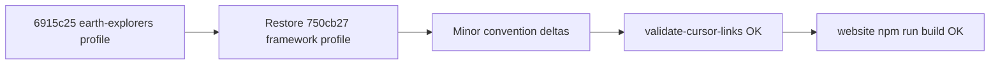

# Plan: przywrócenie profilu Cursor Collections w `eversis-project-stack.mdc` (Opcja B)

**Research:** [stack-rule-agents-link.research.md](./stack-rule-agents-link.research.md)  
**Powiązany audyt linków:** [cursor-md-link-refs.research.md](./cursor-md-link-refs.research.md) · [cursor-md-link-refs.plan.md](./cursor-md-link-refs.plan.md)  
**Decyzja:** Opcja **B** — przywrócić profil **frameworku** (Docusaurus / `website/`), usunąć przypadkowy profil **earth-explorers-3d** z upstream repo.

**Wdrożenie** po akceptacji tego planu (bramka Implement).

---

## Task Details

| Field | Value |
| ----- | ----- |
| ID / folder | `cursor-md-link-refs` |
| Title | Przywrócenie `eversis-project-stack.mdc` dla cursor-collections + odblokowanie `validate-cursor-links` |
| Priority | **Wysoka** — blokuje `website` `prebuild` / `npm run build` |
| Root cause | Commit `6915c25` podmienił stack rule na profil konsumencki z broken link `[AGENTS.md](AGENTS.md)` |

## Proposed Solution

1. **Przywrócić** treść `eversis-project-stack.mdc` opisującą **ten** monorepo (Cursor Collections, Docusaurus, MCP, `sync-prompts`).
2. **Baza:** wersja z commita **`750cb27`** (`fix: fix markdown link validation`) — wszystkie linki markdown już z prefiksem `../../` lub względne w obrębie `.cursor/rules/`.
3. **Delty** względem `750cb27` (aktualizacja konwencji, bez zmiany charakteru profilu):
   - Konwencje specs: `docs/specs/<issue-kebab>/` (`*.research.md`, `*.plan.md`) — zgodnie z bieżącą praktyką repo i [`docs/specs/README.md`](../../specs/README.md).
   - Jawna brama jakości: **`validate-cursor-links`** / `node scripts/validate-cursor-markdown-links.mjs --context=source` przy zmianach w `.cursor/`.
   - Opcjonalnie jeden link do [`AGENTS.md`](../../../AGENTS.md) w sekcji Conventions (z `../../`), jeśli warto wskazać entry point — **nie** w tabeli „Cursor framework” (tam nie ma sensu w upstream).
4. **Nie** przenosić profilu earth-explorers do tego pliku — pozostaje poza scope upstream (patrz [Improvements](#improvements-out-of-scope)).
5. Po edycji: pełna walidacja linków + build docs.



## Decyzje (2026-05-27)

| # | Pytanie | Decyzja |
| - | ------- | ------- |
| 1 | Który profil w upstream? | **Cursor Collections** (Opcja B) |
| 2 | Skąd treść? | **`750cb27`** + delty konwencji |
| 3 | Czy archiwizować earth-explorers w tym samym PR? | **Nie** — osobny backlog (template / docs consumer) |
| 4 | Czy zmieniać walidator? | **Nie** |

---

## Implementation Plan

### Phase 1 — Przywrócenie stack rule

#### Task 1.1 - [MODIFY] `.cursor/rules/eversis-project-stack.mdc`

**Description:** Zastąpić obecną treść (earth-explorers-3d) profilem frameworku.

**Frontmatter:**

```yaml
description: Per-repository stack and quality commands — Cursor Collections (Docusaurus docs site)
alwaysApply: true
```

**Sekcje do przywrócenia (z `750cb27`):**

| Sekcja | Zawartość |
| ------ | --------- |
| Nagłówek | „Project stack — this repository” + opis Cursor Collections |
| Tabela | Product, Docs site, Prompts, Skills |
| Quality commands | `website/` — `npm start`, `npm run build`, `npm run serve`; link `[website/package.json](../../website/package.json)` |
| Conventions | specs, context, template pointer → `documentation/cursor-collection.md` |
| Status: Fine → QA | Pełna sekcja z linkami `../../website/docs/...`, `../../documentation/...`, `eversis-engineering-manager.mdc` |

**Delty względem `750cb27` (edytować przy implementacji):**

| Obszar | Było (`750cb27`) | Ma być |
| ------ | ---------------- | ------ |
| Specs | `docs/specs/*.spec.md` | `docs/specs/<issue-kebab>/` — `*.research.md`, `*.plan.md`, `*.spec.md` (patrz README) |
| Quality gate | tylko `npm run build` | Dodać punkt: przed merge zmian w `.cursor/` uruchomić `node scripts/validate-cursor-markdown-links.mjs --context=source` lub `cd website && npm run validate-cursor-links` |
| Linki | już poprawne `../../` | **Zweryfikować każdy** `[text](href)` — zero hrefów typu `AGENTS.md` bez `../../` |

**Źródło do skopiowania:** `git show 750cb27:.cursor/rules/eversis-project-stack.mdc`

**Definition of Done:**

- [ ] Brak odniesień do `visuals-portal`, `earth-explorers`, `third-party/cursor-collections` w pliku
- [ ] Wszystkie markdown linki rozwiązują się z `.cursor/rules/` (walidator source)
- [ ] Sekcja Fine → QA draft bez zmian merytorycznych względem `750cb27` (linki poprawne)

---

### Phase 2 — Spójność dokumentacji (minimalna)

#### Task 2.1 - [MODIFY] [stack-rule-agents-link.research.md](./stack-rule-agents-link.research.md)

**Description:** Dodać na końcu sekcję **„Decyzja”** — wybrano Opcję B; link do tego planu.

**Definition of Done:**

- [ ] Research odzwierciedla zamkniętą decyzję produktową

#### Task 2.2 - [MODIFY] [cursor-collections-sync.research.md](../cursor-collections-sync/cursor-collections-sync.research.md)

**Description:** W §5 (wzorzec earth-explorers) — zaktualizować odwołanie: szablon stack rule **nie** jest już w upstream `.cursor/rules/eversis-project-stack.mdc`; wskazać `documentation/cursor-collection.md` § Reference lub przyszły template setup.

**Definition of Done:**

- [x] Brak mylącego linku „profil earth-explorers w upstream stack rule”

---

### Phase 3 — Weryfikacja jakości

#### Task 3.1 - [REUSE] Walidacja linków

**Commands (z root repo):**

```bash
node scripts/validate-cursor-markdown-links.mjs --context=source
node scripts/validate-cursor-markdown-links.mjs --context=synced
node scripts/validate-cursor-markdown-links.mjs --context=agents
```

Lub skrót:

```bash
cd website && npm run validate-cursor-links
```

**Definition of Done:**

- [ ] Exit code **0** dla wszystkich trzech kontekstów

#### Task 3.2 - [REUSE] Build docs

```bash
cd website && npm run build
```

**Definition of Done:**

- [ ] `prebuild` (sync + validate) przechodzi
- [ ] Docusaurus build kończy się sukcesem

---

## Acceptance Criteria

| # | Kryterium |
| - | --------- |
| AC1 | `.cursor/rules/eversis-project-stack.mdc` opisuje **Cursor Collections** (Docusaurus, `website/`, MCP, prompts, skills) |
| AC2 | `validate-cursor-markdown-links --context=source` — **0** broken links |
| AC3 | `npm run validate-cursor-links` w `website/` — exit 0 |
| AC4 | `npm run build` w `website/` — exit 0 |
| AC5 | Brak profilu konsumenckiego earth-explorers w commited stack rule upstream |

---

## Ryzyka

| Ryzyko | Mitigacja |
| ------ | --------- |
| Ktoś pracował lokalnie z earth-explorers profilem w tym checkout | To był błąd upstream; consumer trzyma własny materialised stack rule — setup **nie nadpisuje** istniejącego pliku |
| Regresja linków w sekcji Fine → QA | Skopiować linki z `750cb27` bez „upraszczania” ścieżek |
| Research sync wskazuje stary template | Task 2.2 lub follow-up |

---

## Improvements (out of scope)

| Item | Opis |
| ---- | ---- |
| **Consumer stack template** | `scripts/setup-cursor-local/templates/eversis-project-stack.example.mdc` z profilem earth-explorers (linki `../../AGENTS.md`) — seed przy `--target` zamiast kopiowania framework profile |
| **CI guard** | Job wymuszający `validate-cursor-links` na MR zmieniających `.cursor/rules/eversis-project-stack.mdc` |
| **Lint rule** | Pre-commit sprawdzający, że upstream stack rule nie zawiera ścieżek typu `visuals-portal/` |

---

## Changelog (plan)

| Data | Zmiana |
| ---- | ------ |
| 2026-05-27 | Plan utworzony — Opcja B zaakceptowana przez human |
| 2026-05-27 | Task 2.2 odłożony na follow-up; implementacja Phase 1 + 2.1 + 3 |
| 2026-05-27 | Task 2.2 — zaktualizowano `cursor-collections-sync.research.md` (§5, werdykt, SSOT) |

---

## Status implementacji

| Task | Status |
| ---- | ------ |
| 1.1 — restore `eversis-project-stack.mdc` | Done |
| 2.1 — update `stack-rule-agents-link.research.md` | Done |
| 2.2 — `cursor-collections-sync.research.md` | Done |
| 3.1 — `validate-cursor-links` | Done (source + synced + agents OK) |
| 3.2 — `website` build | Done (`npm run build` exit 0) |
