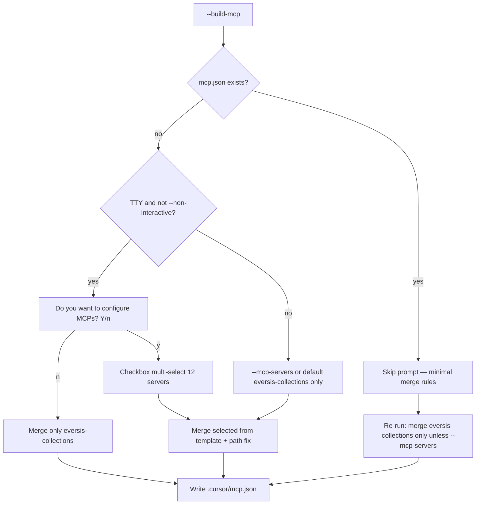

# Plan: interaktywna konfiguracja MCP przy `setup-cursor-local.sh --build-mcp`

**Research:** [setup-mcp-multi-select.research.md](./setup-mcp-multi-select.research.md)  
**Wdrożenie** po akceptacji tego planu (bramka `eversis-agent-core.mdc`).

**Decyzje produktowe (human gate):** 2026-06-12

| Pytanie | Decyzja |
| ------- | ------- |
| Gate „No” | **Opcja B** — merge tylko `eversis-collections` |
| Domyślne zaznaczenia | Pre-check **`eversis-collections`** |
| `playwright` | **Tak** — 12. pozycja |
| Re-run | Prompt **tylko gdy brak** `.cursor/mcp.json` |

---

## Task Details

| Field | Value |
| ----- | ----- |
| ID / folder | `setup-mcp-multi-select` |
| Title | MCP gate + multi-select → merge `mcp.json` z szablonu frameworku |
| Priority | Średnia |
| Scope | `mcp-prompt.mjs`, `mcp-prompt.sh`, `mcp-merge.sh`, `setup-cursor-local.sh`, smoke test, docs |

---

## Proposed Solution

### Flow



### Lista checkboxów (kolejność UI)

1. `context7`
2. `sequential-thinking`
3. `figma`
4. `atlassian`
5. `pdf-reader`
6. `awslabs.aws-api-mcp-server`
7. `awslabs.aws-documentation-mcp-server`
8. `gcp-gcloud`
9. `gcp-observability`
10. `gcp-storage`
11. `eversis-collections` ← **pre-checked**
12. `playwright`

Źródło wpisów: `${COLLECTIONS_HOME}/.cursor/mcp.json` → `mcpServers[id]`.

### Wykluczenie top-level kluczy spoza `mcpServers` (świadome)

W root `.cursor/mcp.json` frameworku jest **duplikat** wpisu `eversis-collections` **poza** `mcpServers` (absolutna ścieżka deweloperska — artefakt lokalny, nie część workspace MCP). Setup **nie może** kopiować takich kluczy do projektu konsumenckiego.

| Dozwolone top-level w wyjściowym `mcp.json` | Źródło |
| -------------------------------------------- | ------ |
| `mcpServers` | merge wybranych ID ze szablonu |
| `inputs` | z szablonu (domyślnie `[]`) jeśli brak w pliku docelowym |

| **Zabronione** — nigdy nie kopiować z szablonu | Przykład |
| ----------------------------------------------- | -------- |
| Klucze równoległe do `mcpServers` o nazwie serwera | `"eversis-collections": { … }` na root |
| Dowolne inne top-level poza `mcpServers` / `inputs` | przyszłe śmieci / override dev |

Implementacja: merge czyta **wyłącznie** `template.mcpServers` i opcjonalnie `template.inputs`; wynik = `{ …existingTopLevelExceptGarbage, mcpServers: merged, inputs }` — bez iteracji po pozostałych kluczach szablonu.

**Opcjonalnie (osobny PR, poza MVP tego tasku):** wyczyścić root `.cursor/mcp.json` w repo frameworku (usunąć top-level `"eversis-collections"`), żeby szablon nie mylił maintainerów.

### Nowe flagi CLI

| Flaga | Znaczenie |
| ----- | --------- |
| `--mcp-servers=csv` | Non-interactive: merge podanych ID (np. `context7,eversis-collections`) |
| (brak flagi, `--non-interactive`) | Merge tylko `eversis-collections` |

---

## Current Implementation Analysis

| Plik | Stan | Zmiana |
| ---- | ---- | ------ |
| `scripts/lib/setup-cursor-local/mcp-merge.sh` | Merge tylko `eversis-collections` | Przyjąć listę ID; czytać szablon; transformacja ścieżki |
| `scripts/setup-cursor-local.sh` | Brak MCP prompt | Parse `--mcp-servers`; source `mcp-prompt.sh` |
| `scripts/lib/setup-cursor-local/mcp-prompt.*` | Brak | **CREATE** gate + checkbox |
| `scripts/lib/setup-cursor-local/summary.sh` | Tylko eversis-collections | Wypisać wybrane serwery + OAuth hint |
| `scripts/setup-cursor-local.test.sh` | Brak scenariusza MCP select | **MODIFY** scenariusze L, M |

---

## Implementation Phases

### Phase 1 — Merge z szablonu (core)

#### Task 1.1 - [CREATE] `scripts/lib/setup-cursor-local/mcp-server-list.json`

**Description:** Kanoniczna lista 12 ID (kolejność UI) + `defaultChecked: ["eversis-collections"]`. Opcjonalnie walidacja w teście vs klucze w framework `mcp.json`.

**Definition of Done:**

- [ ] 12 ID zgodnych z research
- [ ] Używane przez prompt i merge

#### Task 1.2 - [MODIFY] `scripts/lib/setup-cursor-local/mcp-merge.sh`

**Description:**

1. Funkcja `merge_mcp_json_selected(selected_ids_csv)` (lub env `MCP_SELECTED_IDS`).
2. Wczytać `${COLLECTIONS_HOME}/.cursor/mcp.json`; wziąć tylko żądane klucze z `mcpServers`.
3. Zastosować istniejącą transformację `eversis-collections` (absolutna / względna + `env`).
4. `Object.assign({}, existing.mcpServers, picked)` — nie usuwać obcych serwerów.
5. Zachować `inputs` z szablonu jeśli brak w docelowym.
6. **Top-level allowlist:** zapisać tylko `mcpServers` + `inputs` (+ ewentualne klucze już obecne w **istniejącym** pliku docelowym projektu, poza zbanowanymi duplikatami serwerów). **Nie** kopiować z szablonu root `"eversis-collections"` ani innych kluczy spoza `mcpServers` / `inputs`.
7. Walidacja JSON przed zapisem.

**Definition of Done:**

- [ ] Merge 0 wybranych → błąd lub skip (≥1 gdy gate Y)
- [ ] Gate n → wywołanie z `eversis-collections` only
- [ ] Istniejący `my-custom-mcp` zachowany
- [ ] Wygenerowany `mcp.json` **nie** zawiera top-level `"eversis-collections"` (tylko pod `mcpServers`)

#### Task 1.3 - [MODIFY] `scripts/setup-cursor-local.sh`

**Description:** Parse `--mcp-servers=…` / `--mcp-servers …`; export `ARG_MCP_SERVERS`; source `mcp-prompt.sh` przed `merge_mcp_json`.

**Definition of Done:**

- [ ] `--help` dokumentuje flagę
- [ ] Nieznane ID w CSV → `die` z listą dozwolonych

---

### Phase 2 — Interaktywny prompt

#### Task 2.1 - [CREATE] `scripts/lib/setup-cursor-local/mcp-prompt.mjs`

**Description:** Node script:

- Input: ścieżka do `mcp-server-list.json`, TTY check.
- `@inquirer/prompts` via `npx -y @inquirer/prompts` (bez nowego dep w repo root).
- `confirm`: „Do you want to configure MCPs?” default `true`.
- `checkbox`: 12 pozycji, default `eversis-collections`.
- Output stdout: JSON `{ configure: bool, selected: string[] }`.

**Definition of Done:**

- [ ] Działa w repo root dev environment
- [ ] Pusty wybór po Y → exit code ≠ 0 lub komunikat (wymagaj ≥1)

#### Task 2.2 - [CREATE] `scripts/lib/setup-cursor-local/mcp-prompt.sh`

**Description:** `resolve_mcp_selection()`:

| Warunek | Wynik |
| ------- | ----- |
| `mcp.json` już istnieje | **Brak promptu**; jeśli `--mcp-servers` → merge CSV; inaczej tylko `eversis-collections` refresh |
| `--non-interactive` + `--mcp-servers` | CSV |
| `--non-interactive` bez CSV | `eversis-collections` only |
| TTY + brak `mcp.json` + `--build-mcp` | Uruchom `mcp-prompt.mjs` |
| Brak TTY / brak npx | Fallback: bash numerowany (opcjonalnie) lub `eversis-collections` only + `log_warn` |

Ustawia `MCP_SELECTED_IDS` dla `merge_mcp_json`.

**Definition of Done:**

- [ ] Gate n → `eversis-collections` only
- [ ] Re-run z istniejącym `mcp.json` → zero pytań

---

### Phase 3 — Testy i dokumentacja

#### Task 3.1 - [MODIFY] `scripts/setup-cursor-local.test.sh`

**Scenariusze:**

- **L** — `--non-interactive --build-mcp --mcp-servers=context7,eversis-collections`: 2 klucze + poprawna absolutna ścieżka `eversis-collections`.
- **M** — re-run gdy `mcp.json` istnieje: bez zmiany liczby kluczy z poprzedniego run (tylko refresh `eversis-collections` path).
- **N** (opcjonalnie) — gate n symulowany przez env `MCP_SELECTED_IDS=eversis-collections` bez pełnego TTY.
- **O** — po merge: `node -e` / `jq` — root pliku ma **wyłącznie** klucze `mcpServers` i `inputs` (brak top-level `"eversis-collections"`).

**Definition of Done:**

- [ ] `bash scripts/setup-cursor-local.test.sh` pass
- [ ] Scenariusz **O** pass

#### Task 3.2 - [MODIFY] `scripts/lib/setup-cursor-local/summary.sh`

**Description:** Po merge wypisać listę skonfigurowanych serwerów; OAuth dla `atlassian`, `figma`; `uvx` dla AWS.

**Definition of Done:**

- [ ] Czytelny blok w stdout

#### Task 3.3 - [MODIFY] `website/docs/getting-started/installation.md`

**Description:** Sekcja Quick setup — opis gate + `--mcp-servers`; re-run nie pyta ponownie.

**Definition of Done:**

- [ ] `npm run build` w `website/` pass (linki)

---

## Security Considerations

| Obszar | Wymaganie |
| ------ | --------- |
| Szablon MCP | Tylko z `COLLECTIONS_HOME` — ten sam checkout co setup |
| CSV `--mcp-servers` | Whitelist ID z `mcp-server-list.json` — odrzucenie nieznanych |
| Top-level szablonu | Kopiować tylko `mcpServers` + `inputs` — brak dev-path leak w consumer `mcp.json` |
| `npx @inquirer/prompts` | Sieć przy pierwszym prompt; dokumentować w summary |

---

## Testing Guidelines

```bash
bash scripts/setup-cursor-local.test.sh
```

Manual (TTY):

```bash
cd /tmp && mkdir mcp-setup-test && cd mcp-setup-test && git init
bash "$CURSOR_COLLECTIONS_HOME/scripts/setup-cursor-local.sh" --target . --build-mcp
# Y → wybierz kilka → sprawdź .cursor/mcp.json
bash ... # re-run → brak drugiego promptu
```

---

## Acceptance Criteria (całość)

- [ ] Pierwszy setup + `--build-mcp` + TTY: gate Y/n, potem 12 checkboxów, `eversis-collections` pre-checked.
- [ ] Gate **n**: tylko `eversis-collections` w `mcp.json`.
- [ ] Re-run gdy `mcp.json` istnieje: **bez** gate/checkbox.
- [ ] `--non-interactive --mcp-servers=playwright,figma`: merge bez promptu.
- [ ] `eversis-collections` — poprawna ścieżka local/vendor.
- [ ] Consumer `.cursor/mcp.json` — **tylko** top-level `mcpServers` + `inputs` (bez root duplikatu `eversis-collections` ze szablonu frameworku).
- [ ] Smoke test L/M/O green.

---

## Changelog

| Data | Zmiana |
| ---- | ------ |
| 2026-06-12 | Plan utworzony po zamknięciu pytań z researchu |
| 2026-06-12 | § Wykluczenie top-level śmieci; Task 1.2 / test O / AC |
| 2026-06-12 | **Implementacja zakończona** — mcp-prompt/merge, `--mcp-servers`, testy L/M/O, installation.md |

---

## Implementation status (2026-06-12)

- [x] Task 1.1 — `mcp-server-list.json`
- [x] Task 1.2 — `mcp-merge.sh` + `mcp-merge.mjs`
- [x] Task 1.3 — `--mcp-servers` w `setup-cursor-local.sh`
- [x] Task 2.1 — `mcp-prompt.mjs`
- [x] Task 2.2 — `mcp-prompt.sh`
- [x] Task 3.1 — smoke L/M/O (+ fix assert stack gitignore)
- [x] Task 3.2 — `summary.sh`
- [x] Task 3.3 — `installation.md`
