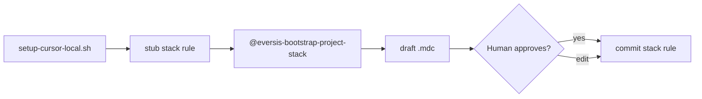

# Research: automatyczne wypełnianie `eversis-project-stack.mdc` przez Architecta przy setup

**Data:** 2026-05-29  
**Faza:** Research (`@eversis-implement`)  
**Źródło:** Out of scope w [setup-stack-rule-leak.plan.md](./setup-stack-rule-leak.plan.md) — *„Automatyczne wypełnianie stack rule przez agenta (Architect) przy setup”*  
**Kontekst po fixie leak:** consumer dostaje stub z [`eversis-project-stack.example.mdc`](../../../scripts/setup-cursor-local/templates/eversis-project-stack.example.mdc); [`print_summary`](../../../scripts/lib/setup-cursor-local/summary.sh) każe **ręcznie** customizować stack rule

---

## Cel

Ocenić **czy i jak** wypełniać `eversis-project-stack.mdc` automatycznie po `setup-cursor-local.sh`, z użyciem roli **Architect** / skilli discovery, bez powrotu do bugów typu leak (fałszywy stack, mutacja HOME) i bez obejścia **human gate**.

---

## Werdykt (TL;DR)

| Aspekt | Werdykt |
| ------ | ------- |
| Czy **wbudować LLM/Architect w bash setup**? | **Nie rekomendowane** — setup ma być deterministyczny, offline, CI-friendly; Cursor Agent nie jest dostępny w `setup-cursor-local.sh` |
| Czy problem jest realny? | **Tak** — stub z TODO = słabszy pierwszy run agenta (`alwaysApply: true` bez komend jakości) |
| Najlepszy kompromis | **Tier 2:** osobny prompt Cursor **`@eversis-bootstrap-project-stack`** (Architect + `eversis-technical-context-discovering` + fragment `eversis-codebase-analysing` Step 1–3) **po** setup, z **obowiązkową akceptacją** przed commit |
| Uzupełnienie niskiego ryzyka | **Tier 1:** opcjonalny **`--detect-quality-scripts`** — deterministyczne wstawienie skryptów z `package.json` / `Makefile` / `nx.json` **tylko** w sekcji Quality (bez zgadywania architektury) |
| Relacja do istniejącego workflow | **`@eversis-implement`** już deleguje codebase analysis do Architecta (krok 5) — bootstrap stack to **węższy, wcześniejszy** artefakt, nie duplikat pełnego planu |
| Priorytet vs leak fix | **Niższy** — leak był P0; auto-fill to **DX enhancement**, nie blocker |

**Rekomendacja produktowa:** zostawić setup bash **bez** Architecta; dodać **documented next step** + opcjonalnie prompt/skill; rozważyć Tier 1 jako flagę w przyszłym planie.

---

## Dlaczego wyłączono z planu leak (2026-05-29)

| Powód | Opis |
| ----- | ---- |
| **Scope creep** | Leak fix dotyczył izolacji pliku; auto-fill to nowy produkt |
| **Ryzyko jakości** | Zła treść w `alwaysApply: true` gorsza niż stub (patrz decyzja Q1 — odrzucony profil Earth/GIS jako seed) |
| **Determinizm setup** | [`setup-cursor-local.sh`](../../../scripts/setup-cursor-local.sh) musi działać bez Cursor IDE, API keys, sieci |
| **Human gate** | Framework wymaga akceptacji draftów (`eversis-agent-core.mdc`); pełna automatyzacja przy setup łamie ten model |
| **Chicken-and-egg** | Architect czyta m.in. `eversis-project-stack.mdc` — pusty stub nadal pozwala discovery z kodu (skill: instrukcje → codebase → docs) |

---

## Stan obecny (po fixie leak)

```text
setup-cursor-local.sh
  → seed eversis-project-stack.example.mdc (TODO)
  → print_summary: „Customise your project stack rule”

Użytkownik / zespół
  → ręczna edycja LUB pierwszy @eversis-implement (Architect discovery w trakcie feature)
```

**Istniejące punkty zaczepienia w frameworku:**

| Mechanizm | Co daje w kontekście stack rule |
| --------- | -------------------------------- |
| [`eversis-technical-context-discovering`](../../../.cursor/skills/eversis-technical-context-discovering/SKILL.md) Step 3 | „Check available scripts” — lint/test/build |
| [`eversis-codebase-analysing`](../../../.cursor/skills/eversis-codebase-analysing/SKILL.md) Steps 1–3 | Struktura repo, zależności, skrypty |
| [`@eversis-implement`](../../../.cursor/prompts/public/eversis-implement.md) krok 5 | Delegacja codebase analysis przed implementacją feature |
| Dokumentacja onboarding ([quick-wins §10](../../../website/docs/getting-started/quick-wins.md)) | `@eversis-review-codebase` → Architect (szerszy raport, nie dedykowany `.mdc`) |
| Part C Reference | Przykład wypełnionego profilu — ręczne kopiowanie |

**Luka:** brak **wąskiego**, **powtarzalnego** deliverable = gotowy szkic `eversis-project-stack.mdc` z linkami `../../` poprawnymi dla consumer.

---

## Opcje implementacji

### Opcja A — Architect wewnątrz `setup-cursor-local.sh` (bash wywołuje agenta)

**Opis:** Po Phase H scaffolding skrypt uruchamia Cursor Agent / SDK z promptem Architect.

| | |
| - | - |
| **Zalety** | „One command” UX |
| **Wady** | Wymaga Cursor CLI/SDK, auth, sieci; niereprodukowalne w CI; trudne testy smoke; długi setup; brak gwarancji jakości; **nie działa** na maszynie bez Cursor |
| **Werdykt** | **Odrzuć** jako domyślne zachowanie |

### Opcja B — Deterministyczny `--detect-quality-scripts` (bez LLM)

**Opis:** Skrypt parsuje `package.json`, `Makefile`, `nx.json`, `composer.json`, `pyproject.toml`, `go.mod` i wypełnia **tylko** sekcję Quality commands + ewentualnie jedną linię opisu z `README` / `package.json` `name`.

| | |
| - | - |
| **Zalety** | Szybkie, testowalne, offline; zero halucynacji komend |
| **Wady** | Nie opisze integracji, konwencji zespołu, monorepo layout; wiele repo bez standardowego manifestu |
| **Werdykt** | **Opcjonalna flaga** (Tier 1) — dobry pierwszy krok |

### Opcja C — Prompt `@eversis-bootstrap-project-stack` (po setup, w Cursor)

**Opis:** Nowy attachable prompt (public) + ewentualnie cienki command `/eversis-bootstrap-project-stack`. Wejście: `@` target repo po setup. Role: Architect. Skills: `eversis-technical-context-discovering`, `eversis-codebase-analysing` (Steps 1–3, 9). Wyjście: **draft** `.cursor/rules/eversis-project-stack.mdc` + **stop** na akceptację (jak Research w Implement).

**Workflow:**



| | |
| - | - |
| **Zalety** | Zgodne z Ideate→Implement gates; wykorzystuje Architect; nie psuje bash setup; można `@`-attach template + repo |
| **Wady** | Dodatkowy krok manualny (otwarcie Cursor); jakość zależy od modelu — wymaga checklisty w promptcie |
| **Werdykt** | **Rekomendowane** (Tier 2) |

### Opcja D — Rozszerzyć `@eversis-review-codebase`

**Opis:** Opcjonalny output: „proposed `eversis-project-stack.mdc`” obok raportu codebase.

| | |
| - | - |
| **Zalety** | Bez nowego promptu |
| **Wady** | review-codebase = szeroki audyt; mieszanie deliverable; dłuższy run; mniej oczywiste dla onboardingu |
| **Werdykt** | **Słabsze** niż dedykowany bootstrap prompt |

### Opcja E — Artefakt research zamiast bezpośredniej edycji `.mdc`

**Opis:** Prompt produkuje `docs/specs/project-bootstrap/project-stack.draft.mdc`; human kopiuje do `.cursor/rules/`.

| | |
| - | - |
| **Zalety** | Bezpieczniejsze (nie nadpisuje always-on rule od razu) |
| **Wady** | Dodatkowy krok kopiowania; gorszy DX |
| **Werdykt** | Tylko jeśli zespół boi się auto-write — **nie preferowane** |

---

## Wymagania jakości (jeśli kiedykolwiek auto-fill)

| # | Wymaganie |
| - | --------- |
| R1 | **Nigdy** nadpisywać istniejącego lokalnego stack rule bez `--force` / explicit human approval |
| R2 | **Nigdy** seedować z `$CURSOR_COLLECTIONS_HOME` (regresja leak) |
| R3 | Linki markdown względem `.cursor/rules/` — prefiks `../../` do `AGENTS.md`, `README.md` |
| R4 | Sekcja Fine → QA — **kopiować ze stub template**, nie generować od zera (mniej driftu) |
| R5 | Frontmatter `description` — konkretna nazwa projektu, nie generic „CUSTOMISE” |
| R6 | Human gate: output jako **Draft stack rule — review before commit** |
| R7 | Walidacja: `validate-cursor-markdown-links` nie jest w consumer bez `website/` — validator **source** na wygenerowanym pliku lub check script |

---

## Porównanie tierów (rekomendacja produktowa)

| Tier | Co | Effort | Ryzyko |
| ---- | -- | ------ | ------ |
| **0** (teraz) | Stub + summary + Part C Reference | — | Niskie |
| **1** | `--detect-quality-scripts` w setup | M | Niskie |
| **2** | Prompt `@eversis-bootstrap-project-stack` + docs Part C | M | Średnie (jakość LLM) |
| **3** | Cursor SDK w setup `--fill-stack` (opt-in) | L | Wysokie |

---

## Powiązanie z `@eversis-implement`

| Pytanie | Odpowiedź |
| ------- | --------- |
| Czy Implement zastępuje bootstrap? | **Częściowo** — pierwszy ticket i tak robi discovery, ale **bez** utrwalonego stack rule w repo |
| Czy bootstrap przed pierwszym Implement? | **Tak, zalecane** — kolejne sesje i Review mają od razu komendy jakości |
| Czy Architect w Implement duplikuje pracę? | Bootstrap = **jednorazowy** artefakt per repo; Implement = per feature |

**Propozycja copy w Part C (bez kodu):**

> Po setup uruchom `@eversis-bootstrap-project-stack` (gdy dostępny) lub uzupełnij stack rule ręcznie przed pierwszym `@eversis-implement`.

---

## Ryzyka

| Ryzyko | Severity | Mitigacja |
| ------ | -------- | --------- |
| Halucynowane komendy (`nx lint` w non-Nx repo) | Wysokie | Tier 1 dla skryptów; prompt: „only document scripts that exist in manifest” |
| Auto-fill commitowany bez review | Wysokie | Draft label + gate; nie pisać pliku w setup bash |
| Regresja leak | Średnie | Zapis **tylko** do `TARGET_DIR/.cursor/rules/` |
| Drift stub vs generator | Średnie | Generator **merge** z template (Fine→QA ze stubu) |
| Monorepo `--target` subfolder | Średnie | Prompt przyjmuje `--target`; discovery od git root |

---

## Decyzja produktowa (2026-05-29)

| # | Pytanie | Status | Decyzja |
| - | ------- | ------ | ------- |
| 1 | Czy realizować auto-fill stack rule? | **Zamknięte — odrzucone** | **Nie** — pozostajemy przy **Tier 0** (stub + ręczna edycja / `@eversis-implement` discovery) |
| 2 | Tier 1 (`--detect-quality-scripts`) | **Odrzucone** | Brak osobnego backlogu |
| 3 | Tier 2 (`@eversis-bootstrap-project-stack`) | **Odrzucone** | Brak nowego promptu |

**Uzasadnienie (human):** zgodnie z rekomendacją research — setup bash bez Architecta; akceptowalny DX stubu + istniejący workflow Implement.

---

## Następny krok (gate Implement)

**Research zamknięty; pomysł porzucony.** Brak planu implementacji. Out of scope w [setup-stack-rule-leak.plan.md](./setup-stack-rule-leak.plan.md) pozostaje aktualne.
