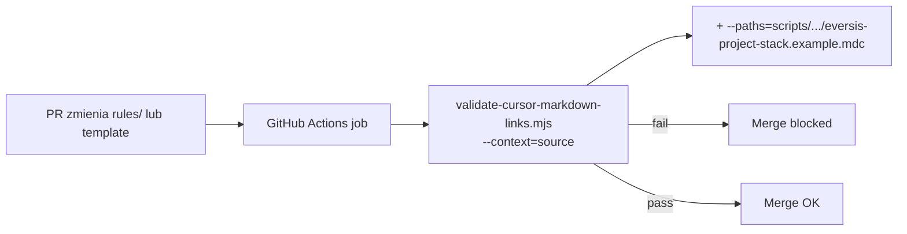

# Plan: CI guard — walidacja linków w `.cursor/rules/` + `--paths` dla szablonu stack

**Research:** [setup-stack-rule-leak-ci-guard.research.md](./setup-stack-rule-leak-ci-guard.research.md)  
**Powiązany:** [setup-stack-rule-leak.plan.md](./setup-stack-rule-leak.plan.md) (out of scope → realizacja)  
**Decyzje:** 2026-05-29 — paths **B**, content guard **backlog**, validator **`--paths`**

**Wdrożenie** po akceptacji tego planu.

---

## Task Details

| Field | Value |
| ----- | ----- |
| ID / folder | `setup-stack-rule-leak-ci-guard` |
| Title | GitHub Actions: `validate-cursor-links` na `.cursor/rules/**` + `--paths` dla consumer template |
| Priority | Średnia — zapobiega regresji upstream stack rule (incydent CERN WP) |
| Effort | **S** (~1–2h) |

## Decyzje (zamknięte)

| # | Decyzja |
| - | ------- |
| 1 | CI trigger: **`.cursor/rules/**`** (Opcja B) |
| 2 | Content guard (denylist consumer markers) | **Osobny backlog** |
| 3 | Walidacja szablonu setup | **`--paths`** w validatorze; CI woła z dodatkową ścieżką template |

---

## Proposed Solution



1. **Rozszerzyć** [`validate-cursor-markdown-links.mjs`](../../../scripts/validate-cursor-markdown-links.mjs) o opcjonalne **`--paths=<rel>[,<rel>...]`** (tylko `--context=source`): dodatkowe pliki/katalogi do skanowania (merge z domyślnymi `.cursor/*` dirs **lub** tryb „tylko extra paths” — patrz Task 1.1).
2. **Dodać** [`.github/workflows/eversis-cursor-rules-validate.yml`](../../../.github/workflows/eversis-cursor-rules-validate.yml) — path filter + validate source + template path.
3. **Udokumentować** w README / Part C + CHANGELOG.

**Domyślne zachowanie validatora bez `--paths`:** bez zmian (backward compatible).

---

## Implementation Plan

### Phase 1 — Validator `--paths`

#### Task 1.1 - [MODIFY] `scripts/validate-cursor-markdown-links.mjs`

**Semantyka `--paths`:**

| Flaga | Zachowanie |
| ----- | ---------- |
| Brak `--paths` | Jak dziś — skan `.cursor/{commands,rules,prompts,skills}/` |
| `--paths=foo.mdc` | **Dodaj** pliki/katalogi do zestawu (union z domyślnymi dirs przy `--context=source`) |
| `--paths=dir/` | Rekursywnie `.md` / `.mdc` w katalogu |
| Wiele | `--paths=a.mdc,scripts/setup-cursor-local/templates/` |

**Implementacja (szkic):**

```javascript
// parse --paths=... (comma-separated, relative to repo root)
function collectExtraPaths(specs) {
  const out = [];
  for (const spec of specs) {
    const abs = path.join(root, spec);
    if (!fs.existsSync(abs)) { /* error + exit 1 */ }
    if (fs.statSync(abs).isDirectory()) collectFiles(abs, [".md", ".mdc"], out);
    else out.push(abs);
  }
  return out;
}
// source branch: files = [...defaultDirs.flatMap(...), ...collectExtraPaths(...)]
// dedupe by realpath
```

**Usage w docstring:**

```bash
node scripts/validate-cursor-markdown-links.mjs --context=source \
  --paths=scripts/setup-cursor-local/templates/eversis-project-stack.example.mdc
```

**Definition of Done:**

- [ ] Backward compatible — bez `--paths` identyczny wynik jak przed zmianą
- [ ] Template z `[AGENTS.md](../../AGENTS.md)` — **pass** (linki rozwiązują się z katalogu template jak z `.cursor/rules/`)
- [ ] Nieistniejący path w `--paths` → exit 1 z czytelnym komunikatem
- [ ] `--paths` ignorowane (warn) dla `--context=synced|agents` lub dokumentacja „source only”

#### Task 1.2 - [CREATE] testy validatora (minimal)

**Opcje:** mały skrypt `scripts/validate-cursor-markdown-links.test.mjs` (node assert) **lub** wpis w istniejącym teście dokumentacyjnym.

**Scenariusze:**

| # | Test |
| - | ---- |
| T1 | `--context=source` bez `--paths` — exit 0 na HEAD |
| T2 | `--paths` wskazuje template — exit 0 |
| T3 | `--paths` wskazuje plik z celowo broken linkiem (temp) — exit 1 |

---

### Phase 2 — GitHub Actions workflow

#### Task 2.1 - [CREATE] `.github/workflows/eversis-cursor-rules-validate.yml`

**Wzorzec:** [`eversis-skills-validate.yml`](../../../.github/workflows/eversis-skills-validate.yml)

```yaml
name: eversis_cursor_rules_validate

on:
  push:
    branches: [main, master]
    paths:
      - ".cursor/rules/**"
      - "scripts/setup-cursor-local/templates/eversis-project-stack.example.mdc"
      - "scripts/validate-cursor-markdown-links.mjs"
      - ".github/workflows/eversis-cursor-rules-validate.yml"
  pull_request:
    paths:
      - ".cursor/rules/**"
      - "scripts/setup-cursor-local/templates/eversis-project-stack.example.mdc"
      - "scripts/validate-cursor-markdown-links.mjs"
      - ".github/workflows/eversis-cursor-rules-validate.yml"

jobs:
  validate-cursor-rules-links:
    runs-on: ubuntu-latest
    steps:
      - uses: actions/checkout@v4
      - uses: actions/setup-node@v4
        with:
          node-version: "22"
      - name: validate-cursor-markdown-links (source + template)
        run: |
          node scripts/validate-cursor-markdown-links.mjs --context=source \
            --paths=scripts/setup-cursor-local/templates/eversis-project-stack.example.mdc
```

**Uwaga:** Job waliduje **całe** `.cursor/rules/**` (domyślne dirs source) **plus** template przez `--paths`. Trigger tylko gdy zmieniono rules/template/validator/workflow.

**Definition of Done:**

- [ ] PR z broken linkiem w `eversis-project-stack.mdc` → job fail (manual smoke)
- [ ] PR bez zmian w paths → job skipped
- [ ] Czas jobu < 1 min

---

### Phase 3 — Dokumentacja

#### Task 3.1 - [MODIFY] `documentation/cursor-collection.md`

- Sekcja Contributing / quality: wspomnieć workflow **`eversis_cursor_rules_validate`** na PR zmieniające `.cursor/rules/**`.
- `--paths` dla szablonów poza `.cursor/`.

#### Task 3.2 - [MODIFY] `README.md`

- Krótki bullet przy validate-cursor-links o CI guard.

#### Task 3.3 - [MODIFY] `CHANGELOG.md`

- Added: workflow + `--paths` flag.

#### Task 3.4 - [MODIFY] [`stack-rule-restore-framework.plan.md`](../cursor-md-link-refs/stack-rule-restore-framework.plan.md) Improvements

- CI guard → **Done** (link do tego planu).

#### Task 3.5 - [MODIFY] [`setup-stack-rule-leak.plan.md`](./setup-stack-rule-leak.plan.md) out of scope

- CI guard — **w realizacji** / Done po implementacji.

---

## Out of scope (ten PR)

- **Content guard** (Opcja D) — denylist `CERN`, `visuals-portal`, …
- GitLab CI duplicate
- Pełny `website npm run build` na każdym PR
- Walidacja całego `.cursor/**` w osobnym workflow (Opcja C)

---

## Acceptance Criteria

| # | Kryterium |
| - | --------- |
| AC1 | `--paths` dodaje pliki do walidacji source bez łamania domyślnego skanu |
| AC2 | Template `eversis-project-stack.example.mdc` przechodzi validate |
| AC3 | GHA uruchamia się na PR zmieniającym `.cursor/rules/**` |
| AC4 | Broken link w stack rule → GHA fail |
| AC5 | `node scripts/validate-cursor-markdown-links.mjs --context=source` na HEAD → exit 0 |

---

## Quality gates (Implement)

```bash
node scripts/validate-cursor-markdown-links.mjs --context=source
node scripts/validate-cursor-markdown-links.mjs --context=source \
  --paths=scripts/setup-cursor-local/templates/eversis-project-stack.example.mdc
# po Task 1.2:
node scripts/validate-cursor-markdown-links.test.mjs   # jeśli dodany
```

---

## Changelog (plan)

| Data | Zmiana |
| ---- | ------ |
| 2026-05-29 | Plan utworzony — decyzje gate zaakceptowane |

---

## Status implementacji

| Task | Status |
| ---- | ------ |
| 1.1 — validator `--paths` | Done |
| 1.2 — testy validatora | Done |
| 2.1 — GHA workflow | Done |
| 3.1–3.5 — docs | Done |
