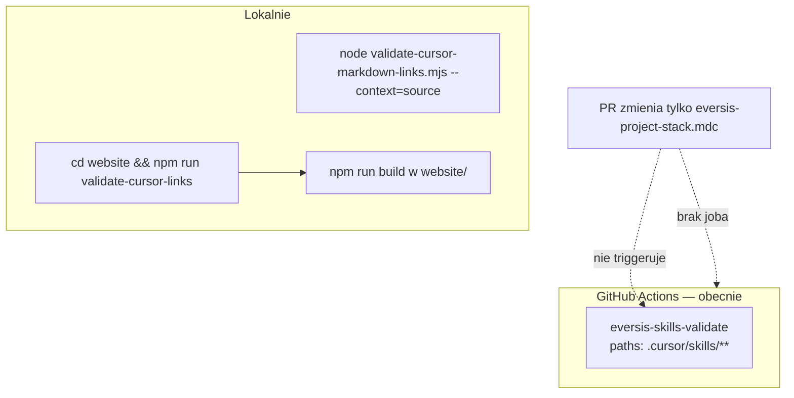

# Research: CI guard na upstream `eversis-project-stack.mdc`

**Data:** 2026-05-29  
**Faza:** Research (`@eversis-implement`)  
**Źródło:** Out of scope — [stack-rule-restore-framework.plan.md](../cursor-md-link-refs/stack-rule-restore-framework.plan.md) Improvements · [setup-stack-rule-leak.plan.md](./setup-stack-rule-leak.plan.md)  
**Powiązane:** leak fix (consumer seed z szablonu), restore HOME (`fdedb1c`)

---

## Cel

Ocenić **czy i jak** dodać job CI wymuszający walidację upstream [`.cursor/rules/eversis-project-stack.mdc`](../../../.cursor/rules/eversis-project-stack.mdc), żeby regresje typu profil konsumencki (CERN WP, earth-explorers) z broken linkami **nie wchodziły na `main`** bez uruchomienia `validate-cursor-links`.

---

## Werdykt (TL;DR)

| Pytanie | Odpowiedź |
| ------- | --------- |
| Czy problem jest realny? | **Tak** — CERN WP w working tree dało **3 broken links**; commit bez lokalnego `validate` mógłby przejść, bo **brak dedykowanego workflow CI** na zmiany w stack rule |
| Czy `website` prebuild już chroni? | **Tylko gdy ktoś buduje docs** — w repo **nie ma** GitHub Actions uruchamiającego `npm run build` / `validate-cursor-links` na każdym PR |
| Czy skills workflow wystarczy? | **Nie** — [`.github/workflows/eversis-skills-validate.yml`](../../../.github/workflows/eversis-skills-validate.yml) filtruje tylko `.cursor/skills/**` |
| Rekomendacja | **Nowy workflow** (wzorzec jak skills) + trigger `paths` na stack rule (ew. całe `.cursor/rules/**`); krok: `node scripts/validate-cursor-markdown-links.mjs --context=source` — **bez** instalacji `website/` |
| Opcjonalny dodatek | Skrypt **content guard** (consumer markers) — osobny, niski priorytet |
| Effort | **S** (1 plik YAML + 5–10 linii docs) |

---

## Incydent referencyjny (2026-05-29)

| Stan | Treść stack rule | `validate --context=source` |
| ---- | ---------------- | --------------------------- |
| HEAD `fdedb1c` | Cursor Collections | **OK** |
| Working tree (po leak) | CERN WordPress Theme | **FAIL** — `../../blocks/README.md`, `../../tests/README.md`, `../../.gitlab-ci.yml` |

**Wniosek:** sam opis „uruchom validate przed merge” w pliku stack rule **nie wystarczy** bez egzekucji w CI na PR dotykającym tego pliku.

Po fixie leak consumer **nie kopiuje** HOME stack — guard chroni **ten monorepo** (always-on rule + integralność framework profile).

---

## Stan CI / bram jakości dziś



| Mechanizm | Scope | Trigger na zmianę stack rule? |
| --------- | ----- | ------------------------------ |
| [`website/package.json` prebuild](../../../website/package.json) | source + synced + agents | Tylko przy `npm run build` / `npm start` |
| [`validate-cursor-markdown-links.mjs`](../../../scripts/validate-cursor-markdown-links.mjs) `--context=source` | `.cursor/{commands,rules,prompts,skills}/**` | Manual / prebuild |
| [`eversis-skills-validate.yml`](../../../.github/workflows/eversis-skills-validate.yml) | MCP skills validate | **Nie** (inne paths) |
| GitLab CI | — | **Brak** `.gitlab-ci.yml` w tym repo (hosting docs: GitHub + ewent. GitLab mirror — workflow w `.github/`) |

**Szablon consumer** [`eversis-project-stack.example.mdc`](../../../scripts/setup-cursor-local/templates/eversis-project-stack.example.mdc) — **poza** scope walidatora source (nie leży pod `.cursor/`).

---

## Opcje implementacji

### Opcja A — Wąski workflow (zgodny z oryginalnym Improvement)

**Plik:** `.github/workflows/eversis-stack-rule-validate.yml`

```yaml
on:
  pull_request:
    paths:
      - ".cursor/rules/eversis-project-stack.mdc"
  push:
    branches: [main, master]
    paths:
      - ".cursor/rules/eversis-project-stack.mdc"
jobs:
  validate-stack-rule-links:
    runs-on: ubuntu-latest
    steps:
      - uses: actions/checkout@v4
      - uses: actions/setup-node@v4
        with:
          node-version: "22"
      - run: node scripts/validate-cursor-markdown-links.mjs --context=source
```

| | |
| - | - |
| **Zalety** | Minimalny blast radius; szybki job (~ sekundy, bez npm w website); dokładnie adresuje incydent |
| **Wady** | Nie łapie broken linków w innych rules; nie waliduje szablonu setup |
| **Werdykt** | **Minimum viable** |

### Opcja B — Workflow na całe `.cursor/rules/**`

Ten sam job, `paths: [".cursor/rules/**"]`.

| | |
| - | - |
| **Zalety** | Spójne z audytem [cursor-md-link-refs](../cursor-md-link-refs/cursor-md-link-refs.research.md) (~6 linków w rules) |
| **Wady** | Więcej PR triggerów; nadal nie obejmuje commands/prompts |
| **Werdykt** | **Dobry kompromis** jeśli chcemy jeden job „cursor rules” |

### Opcja C — Workflow `eversis-cursor-links-validate` (szeroki)

`paths: [".cursor/**", "scripts/validate-cursor-markdown-links.mjs"]` → `--context=source`.

| | |
| - | - |
| **Zalety** | Pełna ochrona source tree `.cursor/` |
| **Wady** | Nakładanie z skills workflow; częstsze runy |
| **Werdykt** | Overkill na start; rozważyć później |

### Opcja D — Content guard (lint rule z Improvements)

Osobny skrypt / krok CI, np. fail gdy w upstream stack rule występują:

- `visuals-portal`, `earth-explorers`, `CERN WordPress`, `blocks/*`, `make setup` (CERN Docker), itd.
- lub: frontmatter `description` **nie** zawiera „Cursor Collections”

| | |
| - | - |
| **Zalety** | Łapie **semantyczną** regresję nawet gdy linki przypadkiem istnieją |
| **Wady** | Kruche heurystyki; fałszywe alarmy; utrzymanie listy markerów |
| **Werdykt** | **Opcjonalny Tier 2** — po Opcji A |

### Opcja E — Pre-commit (Husky)

Lokalny hook przed commitem — **brak** husky dla validate w repo dziś.

| | |
| - | - |
| **Werdykt** | Uzupełnienie CI, nie zamiennik; **nie wystarczy** samo (hook omijalny) |

### Opcja F — Rozszerzyć `eversis-skills-validate.yml`

Dodać paths i drugi step validate links.

| | |
| - | - |
| **Wady** | Miesza dwa concerny; skills job wymaga MCP build — **ciężki** dla samego stack rule |
| **Werdykt** | **Odrzuć** |

---

## Co waliduje `--context=source` dla stack rule

Walidator sprawdza istnienie targetów `[text](href)` względem `.cursor/rules/` ([`resolveSource`](../../../scripts/validate-cursor-markdown-links.mjs)):

- `[AGENTS.md](../../AGENTS.md)` → OK  
- `[documentation/cursor-collection.md](../../documentation/cursor-collection.md)` → OK  
- `[blocks/README.md](../../blocks/README.md)` w repo **bez** `blocks/` → **FAIL** (CERN case)

**Nie sprawdza:** czy treść opisuje właściwy produkt — stąd opcjonalny content guard (Opcja D).

---

## Propozycja docelowa (rekomendacja)

### Faza 1 (P1) — link CI guard

1. **Utworzyć** `.github/workflows/eversis-cursor-rules-validate.yml` (nazwa ogólna pod Opcję B).
2. **Trigger paths:** `.cursor/rules/**`, `scripts/validate-cursor-markdown-links.mjs`, sam workflow.
3. **Job:** checkout + Node 22 + `node scripts/validate-cursor-markdown-links.mjs --context=source`.
4. **Docs:** jedna linia w [`documentation/cursor-collection.md`](../../../documentation/cursor-collection.md) Part C / Contributing; wpis CHANGELOG.
5. **Test:** otworzyć PR zmieniający stack rule z celowo broken linkiem → job red.

### Faza 2 (P2, opcjonalna) — content guard

- `scripts/check-upstream-stack-rule.mjs` — assert frontmatter description zawiera `Cursor Collections`; denylist ścieżek konsumenckich.
- Ten sam workflow lub osobny step.

### Poza scope Fazy 1

- Walidacja `templates/eversis-project-stack.example.mdc` (wymaga rozszerzenia collectFiles lub osobnego joba).
- GitLab CI duplicate (jeśli zespół używa tylko GitHub — wystarczy Actions).

---

## Acceptance criteria (propozycja planu)

| # | Kryterium |
| - | --------- |
| AC1 | PR zmieniający tylko `eversis-project-stack.mdc` z broken linkiem → **job fail** |
| AC2 | PR bez zmian w `.cursor/rules/**` → job **nie uruchamia się** (path filter) |
| AC3 | Poprawny profil frameworku (`fdedb1c`) → job **pass** |
| AC4 | Czas jobu < 1 min (bez `website` npm ci) |
| AC5 | Dokumentacja wskazuje job jako bramkę obok lokalnego `validate-cursor-links` |

---

## Ryzyka

| Ryzyko | Severity | Mitigacja |
| ------ | -------- | --------- |
| False sense of security (treść OK, linki OK, zły produkt) | Średnie | Opcjonalny content guard; code review |
| Duplikacja z przyszłym pełnym `website` build CI | Niskie | Source validate szybszy; build nadal pełniejszy gate |
| Mirror GitLab bez GHA | Niskie | Udokumentować ręczny validate; ewent. duplicate job w GitLab później |
| Flaky sync-dependent tests | Brak | `--context=source` nie wymaga sync-prompts |

---

## Decyzje produktowe (2026-05-29)

| # | Pytanie | Decyzja |
| - | ------- | ------- |
| 1 | Zakres paths CI | **Opcja B** — `.cursor/rules/**` |
| 2 | Content guard (Opcja D) | **Osobny backlog** — nie w tym PR |
| 3 | Szablon consumer | **Tak** — rozszerzyć validator o opcjonalny **`--paths`** (CI waliduje template w tym samym PR co workflow) |

---

## Następny krok (gate Implement)

**Research zamknięty; decyzje zaakceptowane.** Plan: [`setup-stack-rule-leak-ci-guard.plan.md`](./setup-stack-rule-leak-ci-guard.plan.md).
