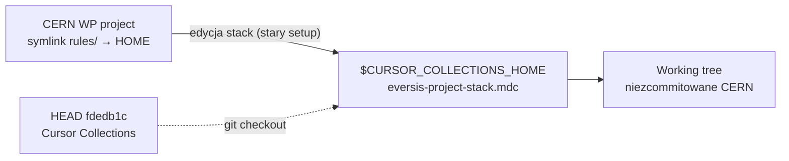

# Research: Task 5.1 — przywrócenie profilu frameworku w `$CURSOR_COLLECTIONS_HOME/.cursor/rules/eversis-project-stack.mdc`

**Data:** 2026-05-29  
**Faza:** Research (`@eversis-implement`)  
**Kontekst:** Follow-up do [setup-stack-rule-leak.plan.md](./setup-stack-rule-leak.plan.md) Task 5.1 oraz [stack-rule-restore-framework.plan.md](../cursor-md-link-refs/stack-rule-restore-framework.plan.md)  
**Powiązany fix:** [setup-stack-rule-leak.research.md](./setup-stack-rule-leak.research.md) — leak naprawiony; consumer seeduje z szablonu

---

## Werdykt (TL;DR)

| Pytanie | Odpowiedź |
| ------- | --------- |
| Czy trzeba **ponownie pisać** profil frameworku od zera? | **Nie** — commit **`fdedb1c`** (2026-05-27) już przywrócił profil Cursor Collections zgodny z planem Opcja B |
| Skąd bierze się treść **CERN WordPress Theme** w checkout? | **Niezcommitowane** zmiany w working tree — efekt **stack rule leak** (edycja w projekcie konsumenckim przez symlink `rules/` → HOME) |
| Co wystarczy do zamknięcia Task 5.1? | **`git checkout -- .cursor/rules/eversis-project-stack.mdc`** (lub `git restore`) w `$CURSOR_COLLECTIONS_HOME` — przywrócenie wersji z `fdedb1c` |
| Czy walidator pada na commited wersji? | **Nie** — `validate-cursor-markdown-links --context=source` → **OK** (103 pliki) na HEAD |
| Czy walidator pada na obecnym working tree? | **Tak** — **3 broken links** (ścieżki CERN: `blocks/README.md`, `tests/README.md`, `.gitlab-ci.yml`) |
| Czy naprawa leak wpływa na Task 5.1? | **Tak, łagodzi ryzyko recurrence** — nowe projekty nie seedują z HOME; edycja stack w consumer nie mutuje HOME. HOME nadal musi być poprawny **dla sesji w tym repo**. |

**Rekomendacja:** Task 5.1 to **operacja odzyskania working tree + weryfikacja jakości**, nie duży refactor. Opcjonalnie: krótka notka w docs Part C („po starym setupie sprawdź `git status` w HOME”).

---

## Stan repozytorium (dowody)

### Historia git (`eversis-project-stack.mdc`)

```text
fdedb1c fix: restore Cursor Collections profile in eversis-project-stack.mdc   ← HEAD, poprawny profil
6915c25 feat: add --gitignore-agent-artifacts (wprowadził profil earth-explorers)
750cb27 fix: fix markdown link validation                                      ← baza frameworku (pre-earth-explorers)
```

### HEAD (`fdedb1c`) vs working tree

| Wersja | Opis frontmatter | Walidator `--context=source` |
| ------ | ---------------- | ---------------------------- |
| **HEAD `fdedb1c`** | `Cursor Collections (Docusaurus docs site)` | **OK** |
| **Working tree (lokalnie)** | `CERN WordPress Theme` | **FAIL** — 3 broken links |

`git diff HEAD -- .cursor/rules/eversis-project-stack.mdc` — ~100 linii: zamiana profilu frameworku na CERN WP (WordPress, Gutenberg, `make setup`, itd.).

### Zgodność `fdedb1c` z planem [stack-rule-restore-framework.plan.md](../cursor-md-link-refs/stack-rule-restore-framework.plan.md)

| Kryterium planu | Stan w `fdedb1c` |
| --------------- | ---------------- |
| AC1 — opis Cursor Collections (Docusaurus, `website/`, MCP) | **Spełnione** |
| AC2 — `validate-cursor-links` source | **Spełnione** (po discard CERN diff) |
| Specs `docs/specs/<issue-kebab>/` | **Spełnione** (delta vs `750cb27`) |
| Brama `validate-cursor-links` w Quality commands | **Spełnione** |
| Link `[AGENTS.md](../../AGENTS.md)` | **Spełnione** |
| Sekcja Fine → QA | **Spełnione** (linki `../../website/docs/...`) |
| Brak earth-explorers / CERN / visuals-portal | **Spełnione** na HEAD |

Plan `stack-rule-restore-framework` oznacza Task 1.1 jako **Done** — **słusznie** względem gita; Task 5.1 w planie leak dotyczy **lokalnego driftu**, nie brakującego commita.

---

## Mechanizm zanieczyszczenia (powiązanie z leak)



Po fixie [link-framework.sh](../../../scripts/lib/setup-cursor-local/link-framework.sh) (per-file symlinks + seed z [`eversis-project-stack.example.mdc`](../../../scripts/setup-cursor-local/templates/eversis-project-stack.example.mdc)):

- Consumer **nie czyta** HOME stack przy setup.
- Edycja stack w consumer **nie zapisuje** do HOME.
- **To repo** (`cursor-collections`) nadal używa `.cursor/rules/eversis-project-stack.mdc` z **własnego** working tree / HEAD — zanieczyszczony working tree psuje agenta w tym checkout.

---

## Zakres Task 5.1 (propozycja implementacji)

### Minimalny (wystarczający)

| # | Akcja | Typ |
| - | ----- | --- |
| 1 | `git restore .cursor/rules/eversis-project-stack.mdc` w checkout HOME | Operacja / commit tylko jeśli były inne zamierzone zmiany |
| 2 | `node scripts/validate-cursor-markdown-links.mjs --context=source` | Weryfikacja |
| 3 | `cd website && npm run validate-cursor-links` (opcjonalnie pełny build) | Weryfikacja CI parity |

**Brak edycji treści** — `fdedb1c` jest kanoniczne.

### Opcjonalne (nice-to-have, nie blokuje)

| # | Akcja | Uzasadnienie |
| - | ----- | ------------ |
| 4 | Notka w `documentation/cursor-collection.md` Part C: po pracy na starym setupie sprawdź `git status` w `$CURSOR_COLLECTIONS_HOME` | Edukacja |
| 5 | Aktualizacja [setup-stack-rule-leak.research.md](./setup-stack-rule-leak.research.md) § „Obecny stan” — HEAD już poprawny, problem = WT | Spójność docs |
| 6 | CI guard na MR zmieniające stack rule upstream | Backlog z [stack-rule-restore-framework.plan.md](../cursor-md-link-refs/stack-rule-restore-framework.plan.md) Improvements |

### Poza scope

- Ponowne kopiowanie z `750cb27` (już zmergowane w `fdedb1c`)
- Zmiana szablonu consumer [`eversis-project-stack.example.mdc`](../../../scripts/setup-cursor-local/templates/eversis-project-stack.example.mdc)
- Przenoszenie profilu CERN do innego pliku (profil CERN powinien żyć **tylko** w repo CERN theme)

---

## Ryzyka

| Ryzyko | Severity | Mitigacja |
| ------ | -------- | --------- |
| `git restore` usuwa **zamierzone** lokalne edycje framework stack | Niskie | Obecna WT treść to CERN — nie jest zamierzona dla tego repo |
| Recurrence pollution na starym setup u innych devów | Średnie | Pull fix leak + komunikat „restore HOME stack” |
| Mylenie ról: HOME stack vs consumer template | Średnie | Docs: HOME = profil **cursor-collections**; consumer = szablon + własna edycja |

---

## Otwarte pytania (gate przed planem / implementacją)

1. **Czy Task 5.1 = tylko `git restore` + validate**, bez dodatkowych edycji merytorycznych w pliku? (Rekomendacja: **tak**.)
2. **Czy commitować** po restore, jeśli po restore working tree == HEAD (nic do commita)? (Rekomendacja: **nie** — brak diffu.)
3. **Czy dodać notkę edukacyjną** w Part C w tym samym PR? (Opcjonalnie.)

---

## Następny krok (gate Implement)

**Research zamknięty; Task 5.1 wykonany (2026-05-29):** `git restore .cursor/rules/eversis-project-stack.mdc` — working tree = HEAD `fdedb1c`; walidacja linków OK.
