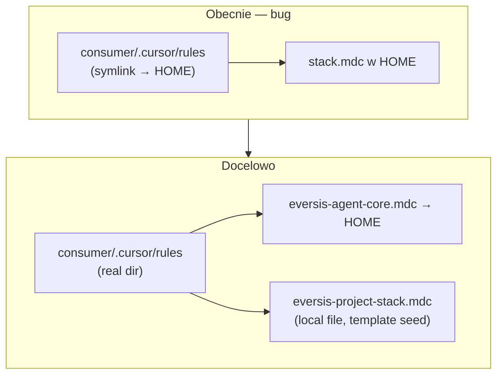

# Plan: naprawa leaku `eversis-project-stack.mdc` między projektami (`setup-cursor-local.sh`)

**Research:** [setup-stack-rule-leak.research.md](./setup-stack-rule-leak.research.md)  
**Powiązany:** [stack-rule-restore-framework.plan.md](../cursor-md-link-refs/stack-rule-restore-framework.plan.md) (przywrócenie profilu frameworku w HOME — osobny commit, nie blokuje tego planu)  
**Decyzje produktowe:** 2026-05-29 (Q1 stub, Q2 preserve on re-run, Q3 domyślny fix)

**Wdrożenie** po akceptacji tego planu (bramka Implement).

---

## Task Details

| Field | Value |
| ----- | ----- |
| ID / folder | `setup-stack-rule-leak` |
| Title | Izolacja per-projekt `eversis-project-stack.mdc` — per-file symlinks + seed z szablonu |
| Priority | **Wysoka** — ciche mutowanie `$CURSOR_COLLECTIONS_HOME` i fałszywy stack w kolejnych projektach |
| Root cause | Symlink **całego** `rules/` + wąski warunek `-L` w `_handle_stack_rule` — plik stack rule fizycznie leży w HOME |

## Decyzje produktowe (zamknięte)

| # | Decyzja |
| - | ------- |
| Q1 | Seed = **stub strukturalny** (`templates/eversis-project-stack.example.mdc`), nie profil Earth/GIS |
| Q2 | Re-run / migracja legacy: **zachowaj treść** stack rule przed materializacją |
| Q3 | Materializacja **domyślna**, bez flagi `--materialise-stack` |

---

## Proposed Solution

### Problem architektoniczny

Gdy `.cursor/rules/` w consumer to **symlink katalogu**, każdy zapis pod  
`consumer/.cursor/rules/eversis-project-stack.mdc` trafia do  
`$CURSOR_COLLECTIONS_HOME/.cursor/rules/` — materializacja przez `rm` + `echo` **nie tworzy** pliku lokalnego w repo consumer.

**Fix:** w trybie symlink `rules/` musi być **prawdziwym katalogiem** w consumer; poszczególne `eversis-*.mdc` (oprócz stack) — symlinki do HOME. Stack rule — **zwykły plik** w consumer, seedowany z szablonu.



### Semantyka `_handle_stack_rule` (po fixie)

| Scenariusz | Zachowanie |
| ---------- | ---------- |
| **Pierwszy setup** (brak lokalnego stack rule) | Skopiuj **szablon** `templates/eversis-project-stack.example.mdc` |
| **Migracja legacy** (`rules/` był symlinkiem katalogu) | Odczytaj treść stack przed `rm` katalogu-symlinku → zapisz lokalnie (**preserve**, Q2) |
| **Re-run**, lokalny stack już istnieje (inode ≠ HOME lub plik tylko w consumer) | **Nie nadpisuj** |
| **Copy mode**, po rsync | rsync **bez** `eversis-project-stack.mdc` → seed z szablonu jeśli brak |

Seed **nigdy** z `$COLLECTIONS_HOME/.cursor/rules/eversis-project-stack.mdc` (profil frameworku / przypadkowy consumer).

---

## Implementation Plan

### Phase 1 — Szablon consumer stack rule

#### Task 1.1 - [CREATE] `scripts/setup-cursor-local/templates/eversis-project-stack.example.mdc`

**Description:** Stub strukturalny — sekcje bez fikcyjnego stacku technologicznego.

**Frontmatter:**

```yaml
description: Per-repository stack and quality commands — CUSTOMISE FOR THIS REPO
alwaysApply: true
```

**Sekcje (nagłówki + TODO, wzorzec jak `AGENTS.stub.md`):**

| Sekcja | Zawartość |
| ------ | --------- |
| `# Project stack — this repository` | `<!-- TODO: one-line project description -->` |
| `## Stack` | Tabela Area / Path / Role / Stack — wiersze `<!-- TODO -->` |
| `## Quality commands` | `<!-- TODO: npm run lint, test, build — from package.json / Makefile -->` |
| `## Conventions` | Linki: [`AGENTS.md`](../../AGENTS.md), [`documentation/cursor-collection.md`](../../documentation/cursor-collection.md) (vendor: dostosować ścieżkę w komentarzu) |
| `## Reference` | Wskazówka: przykład wypełnionego profilu w Part C docs § Reference (Earth/GIS) — **kopiuj ręcznie**, nie commituj przykładu as-is |
| `## Status: Fine — QA comment` | Skrócony pointer do `eversis-qa-comment` / MCP (jak w framework stack rule, linki `../../website/docs/...` tylko jeśli vendor; w local consumer bez `website/` — komentarz „see framework docs”) |

**Linki:** wszystkie względne z `.cursor/rules/` — `[AGENTS.md](../../AGENTS.md)`; unikać `AGENTS.md` bez prefiksu.

**Definition of Done:**

- [ ] Plik istnieje, przechodzi ręczny przegląd markdown
- [ ] Brak konkretnych technologii (Angular, WordPress, Nx…) w treści seed
- [ ] `alwaysApply: true` w frontmatter

---

### Phase 2 — Refactor linkowania `rules/` (symlink mode)

#### Task 2.1 - [MODIFY] `scripts/lib/setup-cursor-local/link-framework.sh`

**Description:** Wydziel `_link_rules_dir()`; zmień pętlę `FRAMEWORK_CURSOR_DIRS` — dla `rules` w symlink mode wołaj helper zamiast symlink całego katalogu.

**`_link_rules_dir` — symlink mode:**

1. `stack_template="${COLLECTIONS_HOME}/scripts/setup-cursor-local/templates/eversis-project-stack.example.mdc"`
2. **Migracja legacy** — jeśli `${TARGET}/.cursor/rules` jest symlinkiem (`-L`):
   - `preserved="$(cat …/eversis-project-stack.mdc 2>/dev/null || true)"` (jeśli plik istnieje)
   - `rm` symlink katalogu
3. `mkdir -p "${TARGET}/.cursor/rules"`
4. Dla każdego pliku w `"${COLLECTIONS_HOME}/.cursor/rules"/eversis-*.mdc`:
   - **Pomiń** `eversis-project-stack.mdc`
   - `ln -sfn "$src" "$dst/$(basename)"`
5. Wywołaj `_seed_or_preserve_stack_rule "$preserved"`

**`_seed_or_preserve_stack_rule` (zastępuje `_handle_stack_rule`):**

```bash
# Pseudokod
stack_dst="${TARGET}/.cursor/rules/eversis-project-stack.mdc"
home_stack="${COLLECTIONS_HOME}/.cursor/rules/eversis-project-stack.mdc"

if [[ -f "$stack_dst" ]] && ! _stack_points_to_home "$stack_dst"; then
  log_info "eversis-project-stack.mdc already local — not overwritten."
  return
fi

if [[ -n "$preserved" ]]; then
  printf '%s\n' "$preserved" > "$stack_dst"
  log_ok "eversis-project-stack.mdc materialised (preserved content from legacy symlink layout)."
elif [[ ! -f "$stack_dst" ]]; then
  cp "$stack_template" "$stack_dst"
  log_ok "Created eversis-project-stack.mdc from template — customise for your project."
else
  # edge: plik istnieje ale wskazuje HOME — preserve via cat before overwrite
  ...
fi
```

**Helper `_stack_points_to_home`:** porównanie inode (`stat`) między `stack_dst` a `home_stack`; na systemach bez inode — porównanie `realpath` / canonical path.

**Copy mode (`rules` w pętli):**

- `_copy_dir` z `--exclude=eversis-project-stack.mdc` (rsync) lub usuń stack po kopiowaniu
- `_seed_or_preserve_stack_rule` z pustym `preserved`

**Symlink fallback** (gdy `ln` fail → copy całego rules): po copy usuń skopiowany stack i seed z szablonu.

**Definition of Done:**

- [ ] Po setup symlink: `rules/` **nie jest** symlinkiem (`! -L rules/`)
- [ ] `eversis-agent-core.mdc` (etc.) — symlinki do HOME
- [ ] `eversis-project-stack.mdc` — zwykły plik, inode **≠** HOME stack
- [ ] Re-run na projekcie z legacy symlink: treść stack **zachowana**
- [ ] Nowy projekt: treść = szablon, **nie** profil z HOME

---

### Phase 3 — Testy smoke

#### Task 3.1 - [MODIFY] `scripts/setup-cursor-local.test.sh`

**Scenariusze do dodać:**

| ID | Scenariusz | Asercje |
| -- | ---------- | ------- |
| F | `--link-mode symlink` (nowy projekt) | `rules/` nie symlink; stack istnieje; inode stack ≠ HOME stack; stack zawiera `CUSTOMISE` / TODO marker z szablonu |
| G | Legacy migracja | Setup starym sposobem (symulacja: ręcznie `ln -sfn HOME/rules target/rules`, wpisać unikalny string w stack) → re-run setup → ten sam string w lokalnym pliku; inode ≠ HOME |
| H | Copy mode seed | `--link-mode copy` → stack z szablonu, nie identyczny z HOME stack (gdy HOME różni się od szablonu) |
| I | Re-run idempotent | Drugi run symlink → stack nietknięty (mtime lub checksum) |

**Uwaga:** Scenariusz F wymaga `--link-mode symlink` explicite (obecne testy używają tylko `copy`).

**Helper w teście:** `_assert_not_symlink_dir`, `_assert_inode_diff` (skip na Windows / brak stat inode).

#### Task 3.2 - [CREATE] opcjonalnie `scripts/lib/setup-cursor-local/link-framework.test.sh`

Unit testy helperów `_stack_points_to_home` z mock katalogami (jeśli logika rozbudowana).

---

### Phase 4 — Dokumentacja

#### Task 4.1 - [MODIFY] `documentation/cursor-collection.md` (Part C)

- Zaktualizować opis layoutu local symlink: **per-file symlinks** w `rules/`, materialised stack.
- Quick setup: jedna linia „stack rule seedowany z szablonu, nie z HOME”.

#### Task 4.2 - [MODIFY] `docs/specs/cursor-collections-sync/cursor-collections-sync.research.md`

- Sekcja tryb symlink — diagram i werdykt zgodny z Phase 2 (real `rules/` dir).

#### Task 4.3 - [MODIFY] `scripts/setup-cursor-local.sh` `--help`

- W opisie `--link-mode symlink`: stack rule = lokalny plik w projekcie.

#### Task 4.4 - [MODIFY] `CHANGELOG.md`

- Wpis: fix stack rule leak; breaking-ish: migracja legacy `rules/` symlink → real dir (jednorazowa, automatyczna).

---

### Phase 5 — Powiązane (osobny PR / po tym fixie)

#### Task 5.1 - [REUSE] [stack-rule-restore-framework.plan.md](../cursor-md-link-refs/stack-rule-restore-framework.plan.md)

Przywrócić profil **Cursor Collections** w `$CURSOR_COLLECTIONS_HOME/.cursor/rules/eversis-project-stack.mdc` (obecnie zanieczyszczony profilem CERN WP). **Nie blokuje** Phase 1–4 — consumer i tak seeduje z szablonu.

---

## Acceptance Criteria

| # | Kryterium |
| - | --------- |
| AC1 | Dwa kolejne projekty po `setup-cursor-local.sh --build-mcp` (symlink) mają **różne** treści stack rule (domyślnie szablon; edycja w A nie zmienia pliku w B) |
| AC2 | Edycja stack w consumer **nie modyfikuje** pliku w `$CURSOR_COLLECTIONS_HOME` |
| AC3 | Re-run setup na projekcie z legacy symlink `rules/` zachowuje dotychczasową treść stack |
| AC4 | Copy mode seeduje z szablonu, nie kopiuje stack z HOME |
| AC5 | `bash scripts/setup-cursor-local.test.sh` — wszystkie scenariusze (A–I) pass |
| AC6 | `eversis-project-stack.mdc` **nigdy** w `.gitignore` consumer |

---

## Ryzyka i mitigacje

| Ryzyko | Severity | Mitigacja |
| ------ | -------- | --------- |
| Istniejące projekty z symlink `rules/` | Wysokie | Automatyczna migracja w Task 2.1 + preserve content |
| `--sync` + copy nadpisuje rules/ | Średnie | rsync exclude stack; po sync ponownie `_seed_or_preserve_stack_rule` tylko gdy brak lokalnego |
| Windows junction zamiast symlink | Średnie | Copy mode domyślny; per-file symlinks tam gdzie junction działa — fallback copy rules bez stack + template |
| Vendor mode | Niskie | Zachowaj obecną logikę: stack w repo vendor path — sprawdź że vendor flow nie regresuje (smoke E) |
| Consumer bez `website/` — broken linki w stub Fine→QA | Niskie | Stub używa komentarzy / link tylko do `AGENTS.md` + Part C; sekcja Fine skrócona |

---

## Out of scope

- Flaga `--no-materialise-stack`
- ~~Automatyczne wypełnianie stack rule przez agenta (Architect) przy setup~~ — **research 2026-05-29, odrzucone** ([auto-fill research](./setup-stack-rule-leak-auto-fill-stack.research.md)); Tier 0 (stub + ręczna edycja)
- CI guard na upstream stack rule — **Done** — [setup-stack-rule-leak-ci-guard.plan.md](./setup-stack-rule-leak-ci-guard.plan.md)

---

## Quality gates (Implement)

```bash
bash scripts/setup-cursor-local.test.sh
npm run check    # jeśli zmieniono tylko bash — opcjonalnie
# Po Task 5.1 (osobno):
node scripts/validate-cursor-markdown-links.mjs --context=source
```

---

## Changelog (plan)

| Data | Zmiana |
| ---- | ------ |
| 2026-05-29 | Plan utworzony — decyzje Q1/Q2/Q3 zaakceptowane |

---

## Status implementacji

| Task | Status |
| ---- | ------ |
| 1.1 — template stub | Done |
| 2.1 — link-framework refactor | Done |
| 3.1 — smoke tests F–I | Done |
| 3.2 — unit tests (optional) | Cancelled |
| 4.1–4.4 — docs + CHANGELOG | Done |
| 5.1 — restore HOME stack profile | Done — `git restore` → HEAD `fdedb1c`; validate source + synced + agents OK |
