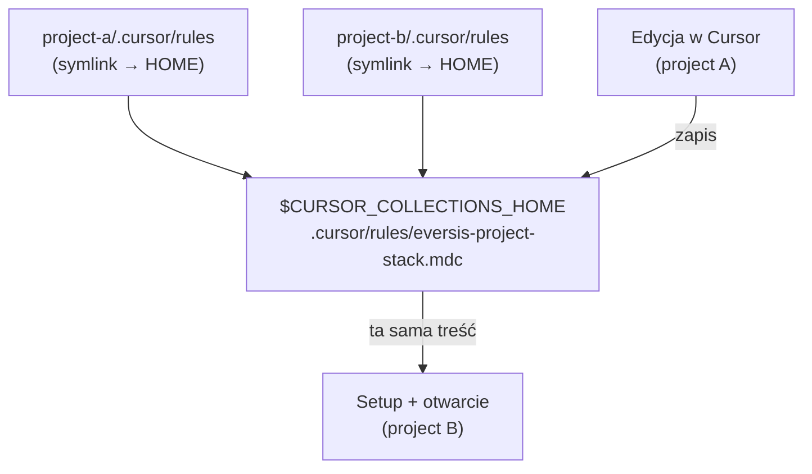

# Research: `eversis-project-stack.mdc` dziedziczy konfigurację poprzedniego projektu przy wielokrotnym `setup-cursor-local.sh`

**Data:** 2026-05-29  
**Faza:** Research (`@eversis-implement`)  
**Pytanie:** Dlaczego uruchamiając `bash "$CURSOR_COLLECTIONS_HOME/scripts/setup-cursor-local.sh" --build-mcp --gitignore-agent-artifacts` w kilku projektach po kolei, plik `eversis-project-stack.mdc` jest automatycznie wypełniony konfiguracją z poprzedniego projektu?

---

## Werdykt (TL;DR)

| Aspekt | Werdykt |
| ------ | ------- |
| Główna przyczyna | **Bug w trybie symlink (domyślny na macOS/Linux):** `_handle_stack_rule` **nie materializuje** pliku stack rule — wszystkie projekty konsumenckie współdzielą **ten sam plik fizyczny** w `$CURLECTIONS_HOME/.cursor/rules/` |
| Mechanizm | Katalog `.cursor/rules/` jest symlinkiem do checkoutu frameworku; edycja stack rule w projekcie A zapisuje się w **HOME**, projekt B widzi tę samą treść |
| Przyczyna wtórna | Brak osobnego **szablonu seed** — copy mode też kopiuje bieżącą treść z HOME (która mogła zostać zanieczyszczona przez symlink mode) |
| Dowód w tym repo | [`eversis-project-stack.mdc`](../../../.cursor/rules/eversis-project-stack.mdc) w checkout `cursor-collections` opisuje **CERN WordPress Theme**, nie profil frameworku (Docusaurus/MCP) |
| Status dokumentacji vs kod | Docs mówią o „materialised stack rule per projekt”; kod materializuje **tylko** gdy sam plik jest symlinkiem (`-L`), nie gdy symlinkowany jest **cały katalog** `rules/` |

**Rekomendacja krótkoterminowa (obejście):** po setup w każdym projekcie ręcznie nadpisać stack rule treścią projektu; w HOME frameworku przywrócić profil z gita: `git checkout .cursor/rules/eversis-project-stack.mdc`.

**Rekomendacja naprawy:** poprawić `_handle_stack_rule` + dodać `templates/eversis-project-stack.example.mdc` jako źródło seed (planowany w [`stack-rule-restore-framework.plan.md`](../cursor-md-link-refs/stack-rule-restore-framework.plan.md), niezaimplementowany).

---

## Kontekst użytkownika

Typowy flow:

```bash
cd ~/project-a
bash "$CURSOR_COLLECTIONS_HOME/scripts/setup-cursor-local.sh" --build-mcp --gitignore-agent-artifacts
# … customizacja eversis-project-stack.mdc (np. stack projektu A)

cd ~/project-b
bash "$CURSOR_COLLECTIONS_HOME/scripts/setup-cursor-local.sh" --build-mcp --gitignore-agent-artifacts
# … eversis-project-stack.mdc już zawiera stack projektu A
```

Domyślny `--link-mode auto` na macOS/Linux → **symlink**.

---

## Analiza kodu

### 1. Linkowanie katalogów frameworkowych

[`scripts/lib/setup-cursor-local/link-framework.sh`](../../../scripts/lib/setup-cursor-local/link-framework.sh):

```bash
for subdir in rules prompts commands skills; do
  # symlink mode: ln -sfn "$COLLECTIONS_HOME/.cursor/$subdir" "$TARGET/.cursor/$subdir"
done
_handle_stack_rule "$link_mode"
```

Cały katalog `rules/` staje się symlinkiem do `$CURSOR_COLLECTIONS_HOME/.cursor/rules`.

### 2. `_handle_stack_rule` — warunek materializacji jest zbyt wąski

```81:107:scripts/lib/setup-cursor-local/link-framework.sh
_handle_stack_rule() {
  local link_mode="$1"
  local stack_src="${COLLECTIONS_HOME}/.cursor/rules/eversis-project-stack.mdc"
  local stack_dst="${TARGET_DIR}/.cursor/rules/eversis-project-stack.mdc"

  if [[ "$link_mode" == "symlink" ]]; then
    if [[ -L "$stack_dst" ]]; then
      # … materialise: read content, rm symlink, write real file
    fi
    return 0   # ← wcześniejszy return gdy plik NIE jest bezpośrednim symlinkiem
  fi

  # copy mode — seed tylko gdy brak pliku
  if [[ ! -f "$stack_dst" ]]; then
    cp "$stack_src" "$stack_dst"
  fi
}
```

**Problem:** `[[ -L "$stack_dst" ]]` jest **false**, gdy:

- `rules/` to symlink katalogu, a
- `eversis-project-stack.mdc` wewnątrz to **zwykły plik** w `$COLLECTIONS_HOME` (dostępny przez symlinkowany katalog).

Funkcja kończy się `return 0` **bez** materializacji.

### 3. Weryfikacja empiryczna (macOS, symlink mode)

Setup na tymczasowym projekcie:

```text
.cursor/rules → symlink → $CURSOR_COLLECTIONS_HOME/.cursor/rules
eversis-project-stack.mdc: zwykły plik (-rw-r--r--), NIE symlink
inode consumer == inode HOME  (np. 104617476 == 104617476)
```

Brak logu `materialised` w output setup — potwierdza bug.

### 4. Tryb copy — izolacja per projekt, ale zanieczyszczony seed

W `--link-mode copy`:

- `rsync` kopiuje **cały** katalog `rules/` z HOME, w tym `eversis-project-stack.mdc`.
- `_handle_stack_rule` nie nadpisuje, bo plik już istnieje po rsync.
- Każdy projekt ma **własny inode** (izolacja OK), ale **treść seed** pochodzi z HOME.

Jeśli HOME został wcześniej zmieniony przez edycję w projekcie A (symlink mode), projekt B w copy mode dostaje **skopiowaną** zanieczyszczoną treść.

### 5. Brak dedykowanego szablonu

Istniejące szablony w [`scripts/setup-cursor-local/templates/`](../../../scripts/setup-cursor-local/templates/):

- `AGENTS.stub.md`
- `cursorignore.stub`
- `mcp.json.example`

**Brak** `eversis-project-stack.example.mdc` (wspomniany w planie, nie dodany). Seed idzie z bieżącego pliku w HOME, nie z neutralnego stubu.

---

## Diagram przepływu (symlink mode — bug)



---

## Zgodność z istniejącą dokumentacją

| Źródło | Co mówi | Rzeczywistość |
| ------ | ------- | ------------- |
| [`cursor-collections-sync.research.md`](../cursor-collections-sync/cursor-collections-sync.research.md) | „materialised plik per projekt” | **Nie** materializuje przy symlink katalogu |
| [`cursor-local-setup.research.md`](../cursor-local-setup/cursor-local-setup.research.md) | „kopiować z szablonu, nie nadpisywać przy re-run” | Brak szablonu; seed z HOME |
| [`link-framework.sh`](../../../scripts/lib/setup-cursor-local/link-framework.sh) komentarz L86–88 | Intencja: real file w target, żeby nie dotykać framework source | Warunek `-L` nie obejmuje symlink katalogu |

---

## Obecny stan tego checkoutu (dowód zanieczyszczenia)

Plik [`.cursor/rules/eversis-project-stack.mdc`](../../../.cursor/rules/eversis-project-stack.mdc) w repozytorium **cursor-collections** zawiera opis **CERN WordPress Theme** (WordPress 6.9, Gutenberg, `blocks/*`, `make setup` itd.) — to profil projektu konsumenckiego, nie monorepo frameworku (Docusaurus, `website/`, `mcp/eversis-collections-mcp/`).

Git status na początku sesji: `M .cursor/rules/eversis-project-stack.mdc` — plik zmodyfikowany lokalnie w checkout HOME.

---

## Obecne obejścia (bez zmian w kodzie)

1. **Przywróć HOME przed każdym setupem nowego projektu:**
   ```bash
   cd "$CURSOR_COLLECTIONS_HOME"
   git checkout -- .cursor/rules/eversis-project-stack.mdc
   ```

2. **Po setup — ręcznie nadpisz stack rule** treścią właściwego projektu (nie polegaj na auto-seed).

3. **Tymczasowo `--link-mode copy`** — izoluje pliki między projektami, ale nadal seed z HOME; łączy z krokiem 1.

4. **Sprawdź inode po setup** (Unix):
   ```bash
   stat -f "%i" .cursor/rules/eversis-project-stack.mdc
   stat -f "%i" "$CURSOR_COLLECTIONS_HOME/.cursor/rules/eversis-project-stack.mdc"
   ```
   Jeśli identyczne → edycje w consumer modyfikują HOME.

---

## Proponowany kierunek naprawy (do planu — nie implementować bez akceptacji)

| # | Zmiana | Priorytet |
| - | ------ | --------- |
| 1 | **`_handle_stack_rule` (symlink):** materializuj gdy `rules/` jest symlinkiem **lub** gdy inode `stack_dst` == inode `stack_src` | P0 |
| 2 | **Szablon** `scripts/setup-cursor-local/templates/eversis-project-stack.example.mdc` — neutralny stub z linkami `../../AGENTS.md` | P0 |
| 3 | **Seed z szablonu**, nie z `$COLLECTIONS_HOME/.cursor/rules/eversis-project-stack.mdc` (copy i symlink) | P0 |
| 4 | **Ostrzeżenie w `print_summary`** gdy stack rule wskazuje ten sam inode co HOME | P1 |
| 5 | **Test smoke** symlink mode: assert różne inode consumer vs HOME po setup | P1 |
| 6 | **Przywrócić** profil frameworku w upstream `eversis-project-stack.mdc` (osobny task — [`stack-rule-restore-framework.plan.md`](../cursor-md-link-refs/stack-rule-restore-framework.plan.md)) | P1 |

---

## Ryzyka

| Ryzyko | Severity | Uwagi |
| ------ | -------- | ----- |
| Istniejące projekty z „współdzielonym” stack rule w HOME | Wysokie | Po fixie nowe setupy OK; istniejące mogą wymagać jednorazowej materializacji / ręcznej edycji |
| `--sync` + copy mode nadpisuje rules/ rsync | Średnie | Stack rule chroniony (nie nadpisywany jeśli istnieje), ale pierwszy seed nadal z HOME |
| Zespoły edytujące stack w IDE bez commit | Średnie | Symlink mode silently mutates HOME |

---

## Decyzje produktowe (gate przed planem)

| # | Pytanie | Status | Decyzja |
| - | ------- | ------ | ------- |
| 1 | Seed: pusty stub vs profil przykładowy (§ Reference) | **Zamknięte** | **Tak** — stub strukturalny + TODO (szablon `eversis-project-stack.example.mdc`) |
| 2 | Re-run symlink: auto-materializacja przy inode match | **Zamknięte** | **Tak** — wykryj leak, materializuj, **zachowaj bieżącą treść** |
| 3 | Flaga `--materialise-stack` vs fix domyślny | **Zamknięte** | **Tak** — fix domyślny, bez flagi |

### Q1 — Seed: pusty stub vs profil przykładowy

| | **Pusty stub (TODO + struktura sekcji)** | **Profil przykładowy (§ Reference — Earth/GIS)** |
| - | ---------------------------------------- | ----------------------------------------------- |
| **Zalety** | Brak fałszywych komend stacku — agent nie uruchomi `nx lint` w projekcie WordPress; neutralny dla każdego stacku; spójny wzorzec z `AGENTS.stub.md`; mniejszy plik, mniej driftu z docs; wymusza świadomą customizację | Pokazuje **oczekiwany kształt** pełnej reguły (sekcje, tabele, Fine→QA); niższy próg — „podmień wartości” zamiast pisać od zera; spójność narracji z Part C docs |
| **Wady** | Gorszy DX pierwszej sesji agenta (brak komend jakości do czasu edycji); użytkownik może zostawić puste placeholdery; `alwaysApply: true` nadal ładuje minimalną regułę | **Wprowadza w błąd** — Angular/Nx/Payload w repozytorium o innym stacku (ta sama klasa bugu co leak); agent może wykonać złe komendy z always-on rule; § Reference to lista punktów, nie pełny `.mdc` — trzeba rozbudować i utrzymywać osobno; ryzyko commitu przykładu „as-is” |
| **Rekomendacja** | **Preferowane** — stub ze **szkieletem sekcji** (Stack, Quality commands, Conventions, Fine→QA pointer) i `<!-- TODO -->`, bez fikcyjnego stacku technologicznego | Użyteczne tylko jako **osobny plik docs**, nie jako seed commitowany do consumer |

**Propozycja kompromisu (do akceptacji):** `eversis-project-stack.example.mdc` = stub strukturalny (nagłówki + TODO + linki `../../AGENTS.md`, `../../documentation/cursor-collection.md` § Reference jako „przykład do skopiowania ręcznie”).

### Q3 — Flaga `--materialise-stack` vs naprawa domyślna

| | **Fix domyślny (bez flagi)** | **Flaga `--materialise-stack` (+ ewentualnie domyślnie off)** |
| - | ---------------------------- | ------------------------------------------------------------- |
| **Zalety** | Naprawia bug dla 100% użytkowników bez dodatkowej dokumentacji; zgodne z **zamierzoną** semantyką setup (stack per repo); zero obciążenia CLI; re-run z inode match naprawia istniejące leaky projekty (zgodnie z Q2); jedna ścieżka kodu do testów | Jawna kontrola dla power userów; możliwość stopniowego rolloutu (flaga → domyślnie on); łatwiejszy rollback przy problemach w polu |
| **Wady** | Re-run materializuje plik w repo (nowy commit do review — akceptowalne); teoretycznie brak opt-out (edge case: ktoś chciałby współdzielić HOME — sprzeczne z designem) | **Większość nie użyje flagi** — leak zostaje w domyślnym flow; dwa tryby = więcej testów i docs; flaga opisuje **oczekiwane** zachowanie, które powinno być invariantem |
| **Rekomendacja** | **Preferowane** — materializacja jako **domyślne, nieopcjonalne** zachowanie w symlink mode (first setup + re-run przy inode match) | Flaga tylko jako **tymczasowy** `--no-materialise-stack` do debug — nie jako główny interfejs |

---

## Następny krok (gate Implement)

**Research zamknięty; decyzje Q1–Q3 zaakceptowane.** Plan: [`setup-stack-rule-leak.plan.md`](./setup-stack-rule-leak.plan.md) — **czeka na akceptację przed implementacją**.
