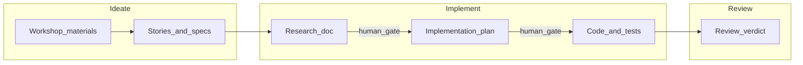

# Cursor-native framework (Eversis port of Copilot Collections)

This guide migrates the ideas behind [Copilot Collections](https://copilot-collections.tsh.io/) and its [Workflow Overview](https://copilot-collections.tsh.io/docs/workflow/overview) from **GitHub Copilot** (passive instructions and Copilot-native agents) to **Cursor** (rules, Agent mode, indexed docs, MCP, and terminal-backed verification). It is written so you can **reuse the same workflow in many repositories**; only the per-project stack file and optional wiki sync need customization.

**Naming:** Upstream artifacts use the `tsh-` prefix. In Cursor, this framework uses **`eversis-`** for prompts, rule packs, and skill names so ports are easy to spot and do not collide with upstream filenames. Maintain a **1:1 mental map** from `tsh-*` to `eversis-*` (see [Artifact mapping](#artifact-mapping-tsh--eversis)).

---

## Part A — Workflow parity (Ideate → Implement → Review)

The product lifecycle matches [Copilot Collections — Workflow Overview](https://copilot-collections.tsh.io/docs/workflow/overview):

| Phase | Primary role (conceptual) | Cursor entry (use prompt library) | Upstream Copilot prompt |
| ----- | ------------------------- | --------------------------------- | ----------------------- |
| **Ideate** | Business Analyst | `/eversis-analyze-materials` | `/tsh-analyze-materials` |
| **Implement** | Engineering Manager (orchestrates research → plan → code) | `/eversis-implement` | `/tsh-implement` |
| **Review** | Code Reviewer | `/eversis-review` | `/tsh-review` |
| **Review (UI)** | UI Reviewer | `/eversis-review-ui` | `/tsh-review-ui` |

**Relay race:** Each phase produces a **named artifact** (transcript cleanup, Jira-ready stories, research doc, implementation plan, diffs, review with PASS / BLOCKER / SUGGESTION). The next phase must not start until a human has **reviewed and approved** the previous artifact. AI output is always a draft until you say otherwise.

**Implement internals** (same semantics as Copilot): Engineering Manager delegates **Research** (Context Engineer) → **Plan** (Architect) → **Implement** (Software / DevOps / E2E / Prompt Engineer by task). **Pause for human confirmation** after research and after the plan, before large code changes.

### Workflow handoff (batons and gates)



### How to “run” a prompt in Cursor

Copilot **slash commands** do not exist in Cursor. Instead:

1. User-facing prompt bodies live under **`website/docs/prompts/public/`** as Markdown files (same layout as Copilot Collections docs: `public` vs `internal`), e.g. `website/docs/prompts/public/eversis-implement.md`. Internal (orchestration-only) prompts live under **`website/docs/prompts/internal/`**.
2. In **Chat** or **Agent**, attach the prompt with `@website/docs/prompts/public/eversis-implement.md` (full path from repo root).
3. Attach context: ticket text, `@docs/specs/...`, `@docs/context/...`, and indexed **Docs** for your stack.
4. Send a one-line instruction, e.g. “Execute this prompt for PROJ-123.”

Port the *content* of the upstream `.github/prompts/*.prompt.md` files into these Markdown files; keep intent and workflow identical. Adjust **invocation** (attach with `@`) and replace Copilot-only tools (e.g. `vscode/askQuestions`, `runSubagent`) with Cursor-native instructions (chat confirmation, `@` rules/prompts, Agent mode).

---

## Artifact mapping (`tsh-` → `eversis-`)

### Prompts (public / user-facing)

| Upstream (`/tsh-…`) | Cursor prompt file (in this repo) |
| ------------------- | --------------------------------- |
| `/tsh-analyze-materials` | `website/docs/prompts/public/eversis-analyze-materials.md` |
| `/tsh-implement` | `website/docs/prompts/public/eversis-implement.md` |
| `/tsh-review` | `website/docs/prompts/public/eversis-review.md` |
| `/tsh-review-ui` | `website/docs/prompts/public/eversis-review-ui.md` |
| `/tsh-review-codebase` | `website/docs/prompts/public/eversis-review-codebase.md` |
| `/tsh-audit-infrastructure` | `website/docs/prompts/public/eversis-audit-infrastructure.md` |
| `/tsh-analyze-aws-costs` | `website/docs/prompts/public/eversis-analyze-aws-costs.md` |
| `/tsh-analyze-gcp-costs` | `website/docs/prompts/public/eversis-analyze-gcp-costs.md` |
| `/tsh-create-custom-agent` | `website/docs/prompts/public/eversis-create-custom-agent.md` |
| `/tsh-create-custom-skill` | `website/docs/prompts/public/eversis-create-custom-skill.md` |
| `/tsh-create-custom-prompt` | `website/docs/prompts/public/eversis-create-custom-prompt.md` |
| `/tsh-create-custom-instructions` | `website/docs/prompts/public/eversis-create-custom-instructions.md` |

**Deprecated upstream (no separate Cursor file):** `/tsh-clean-transcript` and `/tsh-create-jira-tasks` were removed from Copilot Collections; their behavior is covered by `/tsh-analyze-materials` (see [CHANGELOG.md](../CHANGELOG.md)). Use `eversis-analyze-materials` for the full ideate flow.

Internal prompts (e.g. `tsh-implement-ui`, `tsh-deploy-kubernetes`) stay referenced **from** `website/docs/prompts/public/eversis-implement.md` the same way they are composed upstream; store them under **`website/docs/prompts/internal/`** (mirrors `.github/internal-prompts/`).

### Agents (Copilot `.agent.md` → Cursor)

| Upstream agent file | Cursor equivalent |
| ------------------- | ----------------- |
| `tsh-business-analyst.agent.md` | `.cursor/rules/eversis-role-business-analyst.mdc` (or Agent Skill) |
| `tsh-context-engineer.agent.md` | `.cursor/rules/eversis-role-context-engineer.mdc` |
| `tsh-architect.agent.md` | `.cursor/rules/eversis-role-architect.mdc` |
| `tsh-engineering-manager.agent.md` | `.cursor/rules/eversis-role-engineering-manager.mdc` + orchestration steps |
| `tsh-software-engineer.agent.md` | `.cursor/rules/eversis-role-software-engineer.mdc` |
| `tsh-prompt-engineer.agent.md` | `.cursor/rules/eversis-role-prompt-engineer.mdc` |
| `tsh-devops-engineer.agent.md` | `.cursor/rules/eversis-role-devops-engineer.mdc` |
| `tsh-code-reviewer.agent.md` | `.cursor/rules/eversis-role-code-reviewer.mdc` |
| `tsh-ui-reviewer.agent.md` | `.cursor/rules/eversis-role-ui-reviewer.mdc` |
| `tsh-e2e-engineer.agent.md` | `.cursor/rules/eversis-role-e2e-engineer.mdc` |
| `tsh-copilot-engineer.agent.md` | `.cursor/rules/eversis-role-cursor-customization.mdc` (optional) |

You do not need every role as a separate file on day one: start with **`eversis-agent-core.mdc`**, **`eversis-engineering-manager.mdc`** (orchestration), and **`eversis-code-reviewer.mdc`**, then split as prompts grow.

### Skills (Copilot `.github/skills/` → Cursor Agent Skills)

Upstream **skills** are procedural packages. In Cursor, mirror each as a **Skill** (`SKILL.md` with frontmatter) in the user or project skills directory, named `eversis-<concern>` and wired from the matching rule. Copy methodology from `.github/skills/tsh-*` and rename consistently (`tsh-code-reviewing` → `eversis-code-reviewing`, etc.).

### MCP

Reuse the same MCP servers (Atlassian, Figma, Playwright, Context7, etc.) in **Cursor Settings → MCP**. List **required** integrations per workflow variant below.

---

## Workflow variants (playbooks)

Use the same variant as in the [README lifecycle](../README.md); only **invocation** and **artifact paths** change.

### Standard flow (backend / full-stack)

- **Prompts:** `/eversis-analyze-materials` → `/eversis-implement` → `/eversis-review`.
- **MCP:** Atlassian as needed; Context7 for framework docs.
- **Attachments:** Jira ticket or pasted description, `@docs/specs/`, `@docs/context/`.

### Frontend flow (Figma)

- **Prompts:** `/eversis-implement` (orchestrates UI) and `/eversis-review-ui` in a loop until PASS or escalation; then `/eversis-review`.
- **MCP:** Figma Dev Mode, Playwright, Context7.
- **Attachments:** Figma links in research/plan, design tokens, component paths.

### E2E testing flow

- **Prompts:** `/eversis-implement` with a task that includes E2E work; EM delegates to E2E patterns in rules/skills.
- **MCP:** Playwright, repo test config.

### Workshop analysis only (ideate)

- **Prompts:** `/eversis-analyze-materials` only; respect **multi-gate** review between transcript cleanup, extracted tasks, and Jira formatting.
- **MCP:** PDF Reader, Figma, Atlassian as needed.

---

## Part B — Generic Cursor packaging (any repository)

Replace Copilot-only locations (e.g. `.github/copilot-instructions.md`) with a layout optimized for **RAG + Agent** in Cursor:

```text
/ (root)
├── AGENTS.md                      # Optional: pointers to this doc and rule layout
├── .cursorignore                  # Exclude secrets from indexing (like .gitignore)
├── .cursor/
│   └── rules/
│       ├── eversis-agent-core.mdc           # Always-on behaviors + relay workflow
│       ├── eversis-testing-and-terminal.mdc # Lint / test discipline
│       ├── eversis-accessibility.mdc        # UI-facing globs (optional)
│       ├── eversis-project-stack.mdc        # EDIT PER PROJECT: stack + conventions
│       ├── eversis-engineering-manager.mdc  # Optional: attach for eversis-implement
│       └── eversis-code-reviewer.mdc        # Optional: attach for eversis-review
├── documentation/
│   └── cursor-collection.md       # This framework (can be symlinked or copied)
├── website/
│   └── docs/
│       └── prompts/
│           ├── public/            # eversis-*.md user-facing (catalog + attachable bodies)
│           └── internal/          # composed / EM-delegated
├── docs/
│   ├── specs/                     # *.spec.md — spec-driven requirements
│   └── context/                   # Internal knowledge (wiki sync, architecture dumps)
├── scripts/
│   └── sync-internal-wiki.js      # Optional: generic name; Confluence is one backend
└── .gitlab-ci.yml                 # Or .github/workflows/ — optional scheduled sync
```

**This repository:** The **canonical** Cursor prompt library is [website/docs/prompts/](../website/docs/prompts/) — `public/` and `internal/` **`eversis-*.md`** files are both the **Docusaurus** catalog and the **attachable** prompt bodies (use `@website/docs/prompts/...` in Chat or Agent).

**Rules format:** Prefer **`.cursor/rules/*.mdc`** with YAML frontmatter (`description`, `globs`, `alwaysApply`) instead of a single giant `.cursorrules` file. Keep each rule **short and single-purpose**; see the bundled examples under [`.cursor/rules/`](../.cursor/rules/).

**Indexed documentation:** Add official framework docs via Cursor’s **Docs** feature (add URLs once per workspace). In prompts, reference them with `@` **when the UI supports it** for your Cursor version. Prefer stable paths and repo-local `docs/context` for internal truth.

---

## Part C — Per-project bootstrap checklist

- [ ] Copy `.cursor/rules/` templates; **edit `eversis-project-stack.mdc`** for this repo’s stack and quality commands.
- [ ] Create **`website/docs/prompts/public/`** (and **`website/docs/prompts/internal/`** as needed) and port critical `tsh-*` prompts to `eversis-*.md` (start with analyze / implement / review).
- [ ] Add `docs/specs/` and `docs/context/`; seed context with architecture or run wiki sync.
- [ ] Configure **MCP** for the workflow variants you use (Jira, Figma, Playwright, …).
- [ ] Add **`.cursorignore`**: `.env*`, keys, certificates, large secrets, vendor dumps you do not want indexed.
- [ ] Document **lint / test / typecheck** commands for this repo in `eversis-project-stack.mdc` (or `CONTRIBUTING.md`).
- [ ] Enable **Privacy mode** org-wide if required by policy (Cursor Settings → General → Privacy).

---

## Part D — Internal knowledge sync (generic pattern + examples)

**Pattern (any CI, any wiki):**

1. Export selected wiki pages to Markdown (or HTML → Markdown) on a schedule.
2. Write files under `docs/context/` with clear filenames.
3. Commit and push (bot account + token); use `[skip ci]` or equivalent if your pipeline supports it.
4. Keep a **config file** (JSON/YAML) listing page IDs or URLs instead of hardcoding in the script.

### Example: Confluence + GitLab (scheduled)

Dependencies in CI: `npm install axios turndown` (or commit a minimal `package.json` in `scripts/`).

```javascript
const axios = require('axios');
const TurndownService = require('turndown');
const fs = require('fs');
const path = require('path');

const CONFLUENCE_DOMAIN = process.env.CONFLUENCE_DOMAIN;
const EMAIL = process.env.CONFLUENCE_EMAIL;
const API_TOKEN = process.env.CONFLUENCE_API_TOKEN;

const PAGES_TO_SYNC = [
  { id: '12345678', filename: 'frontend-architecture.md' },
  { id: '87654321', filename: 'gis-data-standards.md' },
];

const turndownService = new TurndownService({ headingStyle: 'atx', codeBlockStyle: 'fenced' });

async function syncPages() {
  const authHeader = Buffer.from(`${EMAIL}:${API_TOKEN}`).toString('base64');

  for (const page of PAGES_TO_SYNC) {
    try {
      const response = await axios.get(
        `https://${CONFLUENCE_DOMAIN}/wiki/rest/api/content/${page.id}?expand=body.export_view`,
        { headers: { Authorization: `Basic ${authHeader}`, Accept: 'application/json' } },
      );

      const markdownContent = turndownService.turndown(response.data.body.export_view.value);
      const finalContent = `---\ntitle: ${response.data.title}\nsource: Confluence\n---\n\n${markdownContent}`;

      fs.writeFileSync(path.join(__dirname, '../docs/context', page.filename), finalContent);
    } catch (error) {
      console.error(`Error fetching page ${page.id}:`, error.message);
    }
  }
}

syncPages();
```

**GitLab schedule (excerpt):**

```yaml
sync_cursor_context:
  stage: maintenance
  image: node:20-alpine
  rules:
    - if: '$CI_PIPELINE_SOURCE == "schedule"'
  before_script:
    - npm install axios turndown
  script:
    - node scripts/sync-internal-wiki.js
    - git config --global user.email "bot-context@example.com"
    - git config --global user.name "Context Sync Bot"
    - git remote set-url origin "https://oauth2:${PROJECT_ACCESS_TOKEN}@${CI_SERVER_HOST}/${CI_PROJECT_PATH}.git"
    - git add docs/context/
    - git commit -m "chore(ai-context): auto-sync internal wiki [skip ci]" || echo "No changes to commit"
    - git push origin HEAD:${CI_DEFAULT_BRANCH}
```

### Example: GitHub Actions (outline)

Use `on: schedule` with `actions/checkout`, Node setup, same script, and `GITHUB_TOKEN` or a PAT with `contents: write` to push updates to `docs/context/`. Mirror the GitLab steps; adjust auth and remote URL for GitHub.

---

## Reference: Eversis stack example (fill in `eversis-project-stack.mdc`)

The following is **one** filled-in profile (Earth observation / GIS web). Other projects should replace it in **`eversis-project-stack.mdc`** only.

- **Frontend:** Angular (zoneless, Signals), Standalone components.
- **Workspace:** Nx monorepo (if applicable).
- **Styling:** Tailwind CSS v4.
- **Backend / BFF:** Node.js, Payload CMS v3 (example).
- **GIS:** OpenLayers, MapLibre.
- **Database:** PostgreSQL with PGVector.
- **Quality:** Use this repo’s Nx targets or npm scripts (e.g. `npx nx lint <project>`, `npx nx test <project>`) **only when** this is an Nx workspace; otherwise use the commands documented in `package.json`.

---

## Security checklist (tech lead)

- [ ] **Privacy mode:** Cursor Settings → General → Privacy — align with company policy for code and internal docs.
- [ ] **`.cursorignore`:** Secrets, keys, `.env`, sensitive certificates, and large PII exports.
- [ ] **Models:** Prefer your org’s approved defaults; revisit periodically as Cursor ships new models — avoid hard-coding version names in runbooks.

---

## Spec-driven development (under **Implement**)

1. Author `docs/specs/<feature>.spec.md` with acceptance criteria and links to context.
2. In Agent, attach `@<feature>.spec.md`, relevant `@docs/context/`, and `@website/docs/prompts/public/eversis-implement.md`.
3. Ask for implementation **per** `.cursor/rules` and project stack.
4. After code changes, run the repo’s **documented** quality commands; fix failures before handoff.
5. Run **`/eversis-review`** (attach the same spec and diff context).

This nests cleanly under **Implement → Review**; **Ideate** remains the entry for workshop-to-backlog work.
