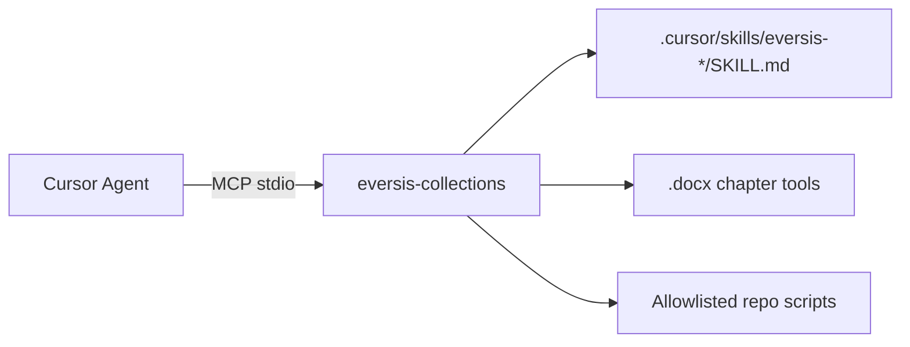

<p align="center">
  <a href="https://cursor.com">
    
  </a>
</p>

<h1 align="center">🔌 eversis-collections MCP</h1>

<p align="center">
  Local <strong>Model Context Protocol</strong> server for <a href="https://github.com/PiotrNie-Eversis/cursor-collections">Cursor Collections</a>. It connects <strong>Cursor Agent</strong> to procedural <strong>skills</strong> (<code>.cursor/skills/</code>) and <strong>Word <code>.docx</code> chapter tools</strong> (Business Manager Docs).
</p>

<p align="center">
  <em>Skills in Agent + Business Manager Docs — one server, not published to npm.</em>
</p>

<p align="center">
  Use <strong>only</strong> the <strong><code>eversis-collections</code></strong> entry in <a href="../../.cursor/mcp.json"><code>.cursor/mcp.json</code></a> for skills and Word tools together.
</p>

---

## What this server unlocks

| Category | MCP tools | You use it when… |
| -------- | --------- | ---------------- |
| **Skills in Agent** | `eversis_skills_list`, `eversis_skills_get`, `eversis_skills_validate`, `eversis_skill_run_script` | Running `@eversis-implement`, `@eversis-review`, or any workflow that needs procedural `SKILL.md` packages |
| **BA Docs (Word)** | `generate_summary_map`, `read_chapter`, `append_chapter`, `update_chapter`, `update_table_cell`, … | Running `@eversis-ba-docs-planner` / `@eversis-ba-docs-writer` on release documentation |
| **Repo automation** | `eversis_repo_run_script`, `eversis_skills_validate` | CI validation, `sync-prompts`, or `sync-framework-doc` from Agent |

---

## Where it fits

This package is the **local MCP bridge** — not the whole framework. Cursor Collections covers **Ideate → Implement → Review** with rules, prompts, and skills; see the [root README](../../README.md) and [cursor-collection.md](../../documentation/cursor-collection.md) for the full lifecycle.

---

## How it works



Walk-up detection finds `.cursor/skills` from the repo root; set **`CURSOR_COLLECTIONS_HOME`** when the framework lives outside your workspace (see [Environment](#environment)).

---

## Supported workflows

> **Human gates:** AI output is always a draft until you review and approve it.

### Implement with skills

```text
🛠 IMPLEMENT
  @eversis-implement <ticket>
    ↳ Agent calls eversis_skills_list / eversis_skills_get (e.g. eversis-fine-handoff on Fine)
    ↳ 📖 You review research, plan, and code at human gates
    ↳ ✅ Approve before the next phase
```

### Business Manager Docs

```text
📄 BA DOCS
  @eversis-ba-docs-planner → plan with chapter_ids and content types
  @eversis-ba-docs-writer
    ↳ backup_docx → inspect_document → list_section_elements
    ↳ TEXT-SAFE → append_chapter or read_chapter + update_chapter
    ↳ TABLE-CONTAINS → update_table_cell
    ↳ ⚠ update_chapter replaces body — prefer append_chapter when adding content
```

### Contributor validation

```text
  npm run validate          # CLI
  eversis_skills_validate   # same checks via MCP (use --strict in CI)
```

---

## Prerequisites

- **[Cursor](https://cursor.com/)** with MCP enabled
- **Node.js** ≥ 18
- A **cursor-collections** checkout (this monorepo or `$CURSOR_COLLECTIONS_HOME`)

---

## Installation

This package is **not published to npm**. Build it from a clone of the repository.

### Option 1 — Workspace (this repository)

1. Build the server:

```bash
cd mcp/eversis-collections-mcp
npm install
npm run build
```

2. Open this repo in Cursor and enable **`eversis-collections`** from [`.cursor/mcp.json`](../../.cursor/mcp.json).
3. Restart Cursor.

### Option 2 — Consumer project (shared install)

1. Clone the framework once, e.g. to `$HOME/.local/share/cursor-collections`.
2. Add to your shell profile: `export CURSOR_COLLECTIONS_HOME="$HOME/.local/share/cursor-collections"`.
3. Bootstrap your project: `bash "$CURSOR_COLLECTIONS_HOME/scripts/setup-cursor-local.sh" --build-mcp` — see [installation docs](../../website/docs/getting-started/installation.md).
4. Enable **`eversis-collections`** in **Cursor Settings → MCP** and restart.

### Verify

After restart, Agent should expose tools such as **`eversis_skills_list`**. For Atlassian, Figma, Playwright, and other third-party MCPs, see [MCP setup (docs site)](../../website/docs/getting-started/mcp-setup.md).

---

## Tools at a glance

Per-tool **Focus / How to use / Outcome** on the docs site: [Cursor Collections MCP — Tool reference](../../website/docs/integrations/eversis-collections.md#tool-reference).

| Tool | Group |
| ---- | ----- |
| `eversis_skills_list` | Skills |
| `eversis_skills_get` | Skills |
| `eversis_skills_validate` | Skills |
| `eversis_skill_run_script` | Skills |
| `eversis_repo_run_script` | Repo |
| `generate_summary_map` | Word |
| `read_chapter` | Word |
| `append_chapter` | Word |
| `update_chapter` | Word |
| `update_table_cell` | Word |
| `list_section_elements` | Word |
| `inspect_document` | Word |
| `backup_docx` | Word |
| `upload_to_sharepoint` | Word (stub) |

Implementation: skills in `src/`; Word tools in `src/docx/` (JSZip + `@xmldom/xmldom`). See [Document compatibility](#document-compatibility).

---

## Tool reference

Each entry: **Focus** (goal), **How to use** (when Agent calls it), **Outcome** (what you get back).

### Skills

#### `eversis_skills_list`

- **Focus:** Discover all `eversis-*` skill packages under `.cursor/skills/`.
- **How to use:** Enabled MCP; Agent calls at the start of implement/review when `eversis-agent-core` instructs skill discovery.
- **Outcome:** JSON list of `{ name, description }` from each `SKILL.md` frontmatter.

#### `eversis_skills_get`

- **Focus:** Load procedural content from a skill folder.
- **How to use:** Agent passes `skillId` (folder name) and optional `relativePath` (`SKILL.md`, `references/…`, `assets/…`); optional `startLine` / `endLine` for partial reads.
- **Outcome:** JSON with resolved file path and full or ranged text content.

#### `eversis_skills_validate`

- **Focus:** CI-quality validation of every skill package.
- **How to use:** Call from Agent or run `npm run validate` / `node dist/cli.js validate`; set `treatWarningsAsErrors: true` (or `--strict`) in CI.
- **Outcome:** JSON report of errors and warnings (frontmatter, directory name match, `SKILL.md` presence, length hints).

#### `eversis_skill_run_script`

- **Focus:** Run deterministic, allowlisted scripts bundled under `.cursor/skills/eversis-*/scripts/`.
- **How to use:** Agent passes a script key from the MCP allowlist (e.g. stats helpers for skill authoring).
- **Outcome:** JSON with `exitCode`, `stdout`, and `stderr`.

#### `eversis_repo_run_script`

- **Focus:** Run allowlisted maintenance scripts at the repository root.
- **How to use:** Agent passes `script`: `sync-prompts` or `sync-framework-doc`.
- **Outcome:** JSON with `exitCode`, `stdout`, and `stderr`.

### Word (Business Manager Docs)

#### `generate_summary_map`

- **Focus:** Map `.docx` headings to stable `chapter_id` values (`sec-0`, `sec-1`, …).
- **How to use:** First step when onboarding a document; pass `docx_path` and optional `output_md_path`.
- **Outcome:** Writes `*.summary.md` next to the doc (unless `output_md_path` is set) with section table including `hasTables` / `hasImages` flags. Locale-aware heading detection (Polish `Nagwek*`, French `Titre*`, etc.).

#### `read_chapter`

- **Focus:** Read current body text for one section before editing.
- **How to use:** Pass `docx_path` and `chapter_id` from the summary map.
- **Outcome:** Plain-text section body (heading line excluded).

#### `append_chapter`

- **Focus:** Add new paragraphs **without** removing existing content, tables, or images.
- **How to use:** Preferred for additive edits on **TEXT-SAFE** or **IMAGE-CONTAINS** sections; pass `new_content` with `\n\n` between paragraphs; optional `requires_graphics_review`.
- **Outcome:** Saved `.docx` with appended paragraphs; confirmation message with paragraph count.

#### `update_chapter`

- **Focus:** **Replace** entire section body with new plain text.
- **How to use:** Only on **TEXT-SAFE** sections with no tables/images; read with `read_chapter` first if merging existing text. See [Editing guidance](#editing-guidance).
- **Outcome:** Saved `.docx` with replaced body; optional graphics-review placeholder paragraph.

#### `update_table_cell`

- **Focus:** Edit cells inside Word tables within a section.
- **How to use:** After `list_section_elements` confirms **TABLE-CONTAINS**; update one cell (`row`, `col`, `new_content`) or append a row (`action: append_row`, `row_values`).
- **Outcome:** Saved `.docx`; message describing the cell or row change.

#### `list_section_elements`

- **Focus:** Classify a section before choosing an edit tool.
- **How to use:** Call per `chapter_id` before `append_chapter`, `update_chapter`, or `update_table_cell`.
- **Outcome:** JSON with `content_type` (`TEXT-SAFE`, `TABLE-CONTAINS`, `IMAGE-CONTAINS`, `MIXED`), counts, and character total.

#### `inspect_document`

- **Focus:** Pre-flight analysis of an entire `.docx` before the first edit session.
- **How to use:** Especially when plan status is UNVERIFIED; pass `docx_path` only.
- **Outcome:** JSON with BOM flag, heading locale, per-section `content_type` summary, warnings, and `READY` / `WARNINGS` / `ERROR` status.

#### `backup_docx`

- **Focus:** Timestamped binary backup before any modification.
- **How to use:** **Always** call before the first write in a BA Docs session; optional `backup_dir` (defaults to `backups/` beside the file).
- **Outcome:** Path to the backup copy on disk.

#### `upload_to_sharepoint`

- **Focus:** Publish finished documentation to SharePoint.
- **How to use:** Stub only — validates that `docx_path` exists.
- **Outcome:** Message that upload is not implemented; publish manually or extend this MCP for your tenant.

**Security:** `eversis_skill_run_script` and `eversis_repo_run_script` only run paths on a fixed allowlist in this package. New scripts require a PR that adds the file and the key in `src/skillScripts.ts` or `src/repoScripts.ts`. Tools that call external APIs (e.g. cloud cost APIs) are not bundled here by default; add them only with explicit env/credential requirements and review.

---

## Document compatibility

### BOM handling

`loadDocx` automatically strips a leading UTF-8 BOM (`\uFEFF`) from `word/document.xml` and `word/styles.xml` before parsing. Some versions of MS Office — particularly on Windows with a non-English locale — write a BOM before `<?xml>` which would otherwise cause a fatal parse error.

### Locale-aware heading styles

`generate_summary_map`, `read_chapter`, `update_chapter`, and related tools resolve paragraph style IDs through `word/styles.xml` before detecting headings. The `w:name` attribute in that file always contains the canonical English name (e.g. `"heading 1"`) regardless of the Word UI language, so Polish (`Nagwek1`–`Nagwek4`), French (`Titre1`–`Titre4`), and other locale variants are correctly recognised. If `word/styles.xml` is absent the legacy English-only fallback is used.

### Section content-type flags

Every `Section` returned by the internal `buildSections` helper carries three metadata fields:

| Field | Type | Meaning |
| --- | --- | --- |
| `hasTables` | `boolean` | Section body contains at least one `w:tbl` (Word table) |
| `hasImages` | `boolean` | Section body contains at least one `w:drawing` (inline or anchored image) |
| `tableCount` | `number` | Number of direct-body `w:tbl` nodes within the section |

These are surfaced in `generate_summary_map` output and via `list_section_elements` / `inspect_document`.

---

## Editing guidance

**Prefer `append_chapter`** for additive edits — it preserves tables, images, and existing paragraphs.

**`update_chapter` is a replace operation:** it removes all existing paragraphs in the section body and inserts new plain-text paragraphs. This means:

- **Inline images** (`w:drawing` inside `w:p`) are lost — the `w:p` nodes that contain them are removed.
- **Tables** (`w:tbl`) are direct body siblings (not tracked in the paragraph index) — they survive paragraph removal but become structurally orphaned when surrounding paragraphs are replaced with unstyled text.
- **Paragraph styles** are not preserved — new paragraphs use bare `w:p` elements without `w:pPr`.

**Rule of thumb:** use `update_chapter` only on **TEXT-SAFE** sections (no tables, no images). For table edits, use `update_table_cell`. For additive text, use `append_chapter` (or merge existing text into `new_content` after `read_chapter`). Full append-mode and table tooling details live in the BA Docs skills and [Business Manager Docs workflow](../../website/docs/workflow/business-manager-docs.md).

Always call **`backup_docx`** before the first modification in a session.

---

## Environment

| Variable | Status | Description |
| -------- | ------ | ----------- |
| **`CURSOR_COLLECTIONS_HOME`** | **Canonical** | Absolute path to a `cursor-collections` checkout containing `.cursor/skills`. Takes priority when walk-up auto-detection fails. |
| `EVERSIS_COLLECTIONS_ROOT` | **Deprecated** | Legacy alias for the same purpose. Checked as fallback when `CURSOR_COLLECTIONS_HOME` is not set. Will be removed in a future release — migrate to `CURSOR_COLLECTIONS_HOME`. |

Walk-up auto-detection (climbing parent directories until `.cursor/skills` is found) is attempted first; environment variables are only used when that fails.

---

## Tests and CLI

```bash
npm test
```

Validate skills (CI):

```bash
npm run validate
# or
node dist/cli.js validate
```

- **`--strict`** — treat length warnings as failures (same as `EVERSIS_SKILLS_VALIDATE_STRICT=1`).

---

## Related documentation

- [Root README](../../README.md) — full Ideate → Implement → Review overview
- [cursor-collection.md](../../documentation/cursor-collection.md) — authoritative Cursor framework guide
- [MCP setup (docs site)](../../website/docs/getting-started/mcp-setup.md) — workspace vs user MCP, third-party servers
- [Cursor Collections MCP (docs site)](../../website/docs/integrations/eversis-collections.md) — integration page: capabilities, tool groups, **tool reference**, consumer setup
- [Business Manager Docs workflow](../../website/docs/workflow/business-manager-docs.md) — planner/writer playbook
- [AGENTS.md](../../AGENTS.md) — agent instructions for this repository
